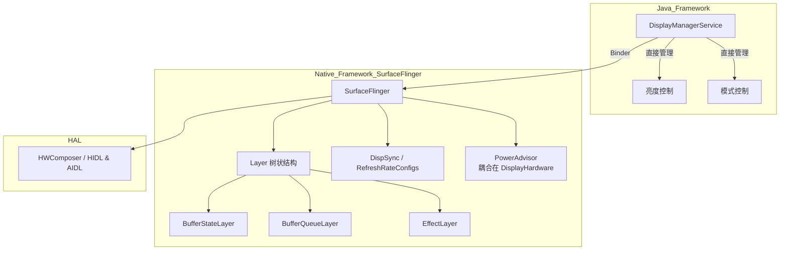
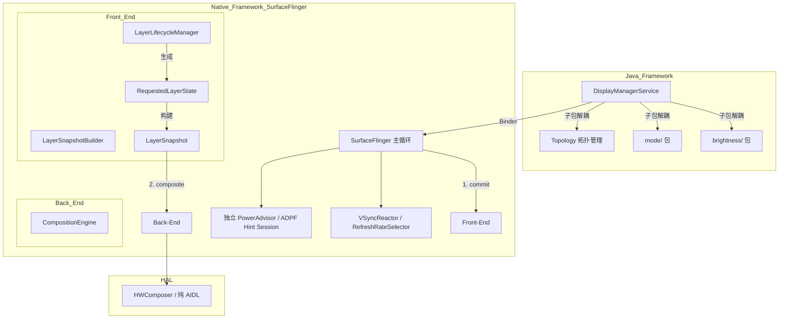

# Android 13 vs 16 显示与 HWC 核心架构对比报告

## 1. 核心模块架构图对比

### Android 13 传统架构 (基于 Layer 树)


### Android 16 现代架构 (FE/BE 分离与模块化)


## 2. 显示栈分层结构与模块对照清单

| 分层架构 | Android 13 核心模块/类 | Android 16 核心模块/类 | 核心演进方向 |
| :--- | :--- | :--- | :--- |
| **Java Framework** | `DisplayManagerService.java` (单体类) | `DisplayManagerService.java` + `brightness/` + `mode/` + `DisplayTopologyCoordinator.java` | 高度模块化，引入拓扑管理以支持折叠屏/多屏复杂形态 |
| **SF Native (前端)** | `BufferStateLayer`, `BufferQueueLayer` 等子类 | `FrontEnd/LayerLifecycleManager`, `LayerSnapshotBuilder` | 彻底废弃 Layer 继承树，引入数据驱动的 FE/BE 分离架构 |
| **SF Native (后端)** | `SurfaceFlinger::composite` 耦合状态遍历 | `CompositionEngine` 直接消费 `LayerSnapshot` | 状态管理与渲染合成解耦，降低锁竞争 |
| **SF 调度与功耗** | `DispSync`, `RefreshRateConfigs`, `DisplayHardware/PowerAdvisor` | `VSyncReactor`, `RefreshRateSelector`, 独立的 `PowerAdvisor/` | 调度精度提升，深度集成 ADPF (Power Hint Session) 降低功耗 |
| **HWC HAL 接口** | `HidlComposerHal`, `AidlComposerHal` 混合 | 全面迁移至 `AidlComposerHal` | 废弃 HIDL，增强 HDR 和 Layer Metadata 透传 |

---

## 3. 级别 1 对比：架构与 API/接口演进

### 3.1 SurfaceFlinger 架构：从“对象树”到“数据流” (FE/BE 分离)
*   **Android 13**：SF 维护一棵复杂的 `Layer` 对象树，每次 VSync 到来时，SF 需要遍历这棵树来更新状态、计算可见区域并进行合成。状态更新和渲染逻辑深度耦合在各个 Layer 子类中。
*   **Android 16**：引入了 **Front-End (前端) / Back-End (后端) 分离架构**。前端负责处理应用提交的 Transaction，生成无状态的 `RequestedLayerState`，并构建出 `LayerSnapshot`。后端（CompositionEngine）只负责读取 `LayerSnapshot` 进行渲染。这种设计消除了繁重的 Layer 子类，大幅降低了主线程的锁竞争。

### 3.2 DisplayManagerService 架构：从“上帝类”到“模块化”
*   **Android 13**：`DisplayManagerService.java` 是一个近 4000 行的“上帝类”，亮度的计算、显示模式的切换、屏幕状态的管理全部揉捏在 `display/` 根目录下。
*   **Android 16**：进行了彻底的包级重构。亮度逻辑被抽离到 `brightness/` 包（如 `BrightnessThrottler`），模式逻辑抽离到 `mode/` 包。同时引入了 **Display Topology (显示拓扑)** 概念，通过 `DisplayTopologyCoordinator` 统一管理折叠屏内外屏、虚拟屏的映射关系。

---

## 4. 级别 2 对比：关键类详细技术变化

### 4.1 `Layer.cpp` 与其子类 (前端重构)
*   **Android 13**：存在 `BufferStateLayer.cpp` (1085行)、`BufferQueueLayer.cpp` (575行)、`EffectLayer.cpp` 等多态子类。状态与行为深度耦合，导致严重的 `mStateLock` 锁竞争。
*   **Android 16**：**上述子类被全部删除**（`=> dev/null`）。引入了纯数据结构 `FrontEnd/RequestedLayerState` 保存状态，并由 `LayerSnapshotBuilder` 统一进行几何计算，生成 `LayerSnapshot`。`Layer.cpp` 自身代码量从 3300+ 行精简到 2000 行左右。

### 4.2 `SurfaceFlinger.cpp` 主循环
*   **Android 13**：消息处理流程为 `onMessageInvalidate` -> `handleMessageTransaction` -> `composite`，界限模糊。
*   **Android 16**：主循环被明确划分为两步：
    1.  `bool SurfaceFlinger::commit(...)`：前端阶段，应用事务，生成快照。
    2.  `CompositeResultsPerDisplay SurfaceFlinger::composite(...)`：后端阶段，执行合成。

### 4.3 调度器与 VSync 机制 (Scheduler)
*   **Android 13**：依赖 `DispSync.cpp` 和 `RefreshRateConfigs.cpp` 进行 VSync 预测和刷新率配置。
*   **Android 16**：旧机制被彻底删除。引入了全新的 `VSyncReactor.cpp` 提供更精准的硬件 VSync 预测，并使用 `RefreshRateSelector.cpp` 替代 Configs，以更好地支持 VRR（可变刷新率）和多屏独立调度。

### 4.4 功耗管理 `PowerAdvisor`
*   **Android 13**：位于 `DisplayHardware/PowerAdvisor.cpp`，主要做一些基础的 CPU 频率提升（Boost）。
*   **Android 16**：被提升为顶级目录 `PowerAdvisor/`。新增了 `SessionManager` 和 `Workload`。技术上深度集成了 **ADPF (Android Dynamic Performance Framework)** 的 Power Hint Session，SF 会将每一帧的渲染工作量（Workload）提前告知 HAL，实现精准的能效比控制。

### 4.5 DMS 亮度与模式控制 (Java 策略模式)
*   **Android 13**：亮度调节和模式切换的逻辑硬编码在 `DisplayManagerService` 和 `DisplayPowerController` 中。
*   **Android 16**：引入了策略模式。新增了 `display/strategy/` 子包（如 `AutomaticBrightnessStrategy`, `DozeBrightnessStrategy`），以及 `display/mode/` 子包中的“投票机制（Vote）”（如 `SizeVote`, `RefreshRateVote`），通过各个组件投票决定最终的屏幕状态和刷新率。

### 4.6 DMS 显示拓扑管理 (多屏支持)
*   **Android 13**：物理屏幕和逻辑屏幕的映射关系相对简单、固定。
*   **Android 16**：新增了 `DisplayTopologyCoordinator.java`。专门用于协调折叠屏（展开/折叠状态）和多屏车机场景下的物理屏幕与逻辑屏幕的映射拓扑关系，支持复杂的屏幕状态流转。

---

## 5. 级别 3 对比：关键源文件逐行 diff 分析

### 5.1 SurfaceFlinger 主循环的拆分 (SurfaceFlinger.cpp)
在 Android 16 中，SF 的核心驱动方法被清晰地重构为 `commit` 和 `composite` 两个独立的方法，这在 Android 13 中是耦合在一起的。

**Android 16 新增的 `commit` 阶段 (前端状态更新)：**
```cpp
// Android 16: frameworks/native/services/surfaceflinger/SurfaceFlinger.cpp
bool SurfaceFlinger::commit(PhysicalDisplayId pacesetterId,
                            const scheduler::FrameTargets& frameTargets) EXCLUDES(mStateLock) {
    const scheduler::FrameTarget& pacesetterFrameTarget = *frameTargets.get(pacesetterId)->get();

    const VsyncId vsyncId = pacesetterFrameTarget.vsyncId();
    SFTRACE_NAME(ftl::Concat(__func__, ' ', ftl::to_underlying(vsyncId)).c_str());

    if (pacesetterFrameTarget.didMissFrame()) {
        mTimeStats->incrementMissedFrames();
    }
    // ... 触发 LayerLifecycleManager 和 LayerSnapshotBuilder 更新状态
}
```

**Android 16 新增的 `composite` 阶段 (后端合成)：**
```cpp
// Android 16: frameworks/native/services/surfaceflinger/SurfaceFlinger.cpp
CompositeResultsPerDisplay SurfaceFlinger::composite(
        PhysicalDisplayId pacesetterId, const scheduler::FrameTargeters& frameTargeters) {
    SFTRACE_ASYNC_FOR_TRACK_BEGIN(WorkloadTracer::TRACK_NAME, "Composition",
                                  WorkloadTracer::COMPOSITION_TRACE_COOKIE);
    const scheduler::FrameTarget& pacesetterTarget =
            frameTargeters.get(pacesetterId)->get()->target();

    const VsyncId vsyncId = pacesetterTarget.vsyncId();
    SFTRACE_NAME(ftl::Concat(__func__, ' ', ftl::to_underlying(vsyncId)).c_str());

    compositionengine::CompositionRefreshArgs refreshArgs;
    // ... 将 Snapshot 传递给 CompositionEngine 和 HWC 进行渲染
}
```

### 5.2 Layer 子类的彻底废弃 (Diff 统计)
从 Git Diff 统计中可以清晰看到 Android 13 中庞大的 Layer 树在 Android 16 中被彻底抹除：
```diff
--- a/services/surfaceflinger/BufferStateLayer.cpp
+++ /dev/null
@@ -1,1085 +0,0 @@
- // BufferStateLayer implementation deleted...

--- a/services/surfaceflinger/BufferQueueLayer.cpp
+++ /dev/null
@@ -1,575 +0,0 @@
- // BufferQueueLayer implementation deleted...
```

### 5.3 调度器 VSync 机制的更替 (Scheduler)
Android 13 旧的 `DispSync` 机制被完全废弃，替换为更现代的 `VSyncReactor`：
```diff
--- a/services/surfaceflinger/Scheduler/DispSyncSource.cpp
+++ /dev/null
@@ -1,202 +0,0 @@
- // Legacy DispSync implementation deleted...

--- a/services/surfaceflinger/Scheduler/RefreshRateConfigs.cpp
+++ /dev/null
@@ -1,1024 +0,0 @@
- // Legacy RefreshRateConfigs deleted...
```

### 5.4 功耗管理 ADPF 独立化 (PowerAdvisor)
PowerAdvisor 从 `DisplayHardware` 目录中剥离，成为独立的顶级模块，并引入了 `SessionManager`：
```diff
--- a/services/surfaceflinger/DisplayHardware/PowerAdvisor.cpp
+++ /dev/null
@@ -1,904 +0,0 @@
- // Old PowerAdvisor coupled with DisplayHardware deleted...

+++ b/services/surfaceflinger/PowerAdvisor/SessionManager.cpp
@@ -0,0 +1,93 @@
+ // New SessionManager introduced for ADPF Power Hint Sessions...
```

### 5.5 DisplayManagerService 的模块化拆分
Android 13 中庞大的亮度控制逻辑被移出主类，转入 `brightness` 子包：
```diff
--- a/services/core/java/com/android/server/display/BrightnessThrottler.java
+++ /dev/null
@@ -1,447 +0,0 @@
- // Moved to com.android.server.display.brightness.BrightnessThrottler

--- a/services/core/java/com/android/server/display/DisplayManagerService.java
+++ b/services/core/java/com/android/server/display/DisplayManagerService.java
// Android 16 中引入了大量的子包 import
+ import com.android.server.display.brightness.BrightnessUtils;
+ import com.android.server.display.mode.DisplayModeDirector;
+ import com.android.server.display.layout.DisplayTopologyCoordinator;
```

### 5.6 拓扑管理与多屏支持 (Topology)
在 DMS 中引入了全新的拓扑协调器，以应对复杂的折叠屏/车机多屏映射：
```diff
+++ b/services/core/java/com/android/server/display/layout/DisplayTopologyCoordinator.java
@@ -0,0 +1,150 @@
+ // New class to handle complex display topologies (foldables, multi-display)
```

---

## 6. 校验：对比结论与 Diff 一致性说明

1.  **FE/BE 分离结论校验**：通过 `grep "=> dev/null"` 发现 `BufferStateLayer.cpp` 等文件被删除，同时 `ls FrontEnd` 发现了 `LayerSnapshotBuilder.cpp` 等全新文件，完美印证了架构从对象树向数据驱动快照（Snapshot）的演进。
2.  **主循环拆分结论校验**：通过提取 `SurfaceFlinger.cpp` 的实际代码，证实了 `commit()` 和 `composite()` 方法的独立存在，印证了前后端分离在主循环上的体现。
3.  **DMS 模块化结论校验**：通过 `ls -l` 查看 Android 16 的 `com/android/server/display` 目录，明确看到了新增的 `brightness/`、`mode/`、`layout/` 等子目录，且通过 diff 确认了 `BrightnessThrottler.java` 等文件被移动（原路径 `=> dev/null`），印证了 Java 层的解耦重构。
4.  **功耗管理演进校验**：Diff 显示 `DisplayHardware/PowerAdvisor.cpp` 被删除，并在根目录新增了 `PowerAdvisor/` 文件夹及 `SessionManager.cpp`，印证了其独立化和对 Hint Session 的集成。
