# Mali kbase GPU 驱动架构分析

> 分析对象：本仓库 `midgard/` 目录下的 **ARM Mali Kernel Base（kbase）** 内核驱动源码，DDK 版本 `r48p0-01eac0`（`Kbuild:72`），对应 Android `android-13.0.0_r0.127` 分支。共 367 个 `.c/.h`，约 16.8 万行。
> 辅助材料：`ioctl-call-hierarchy.html`（单条 ioctl 的函数级调用树）、`GRAPH_REPORT.md` / `graph.html`（graphify 生成的全库调用图与社区划分）、`sample-call-hierarchy-job-submit.html`。
> 文中所有 `文件:行号` 均指 `midgard/` 下的路径，已逐条对照源码核实；凡本树内无法核实的数值（如 uapi 头文件里的常量值）只给符号名不给数值。

---

## 0. 阅读指南

这份文档回答三个层次的问题，建议按需跳读：

| 你想知道 | 读哪里 |
|---|---|
| kbase 整体长什么样、模块怎么分、JM/CSF 是什么关系 | 第 1、2 章 |
| 一个对象（设备 / 上下文 / 内存区域 / 作业）从生到死经历了什么 | 第 3、4、6、9、10 章 |
| 一次 ioctl / 一次中断 / 一次掉电 / 一次复位到底走了哪些函数、在哪里排队、在哪里等 | 第 5、7、8、11 章及第 15 章"关键路径串讲" |
| 出了问题去哪儿看（debugfs、sysfs、trace、计数器） | 第 12 章 |
| 多线程为什么不会踩坏数据（锁与工作队列） | 第 14 章 |

几个贯穿全文的约定：

- **kbdev** = `struct kbase_device`，一块物理 GPU；**kctx** = `struct kbase_context`，一个用户进程打开设备后拥有的 GPU 世界；**kfile** = `struct kbase_file`，一次 `open()` 得到的文件对象。
- **JM** = Job Manager 后端（Midgard / Bifrost 及早期 Valhall），CPU 把 *atom* 直接写进硬件 Job Slot；**CSF** = Command Stream Frontend 后端（后期 Valhall / 5th Gen），CPU 只负责把 *queue* 绑到 *queue group* 并调度到 CSG slot，命令流由 GPU 内的 MCU 固件消费。二者由编译期宏 `MALI_USE_CSF` 二选一，**一份 `mali_kbase.ko` 只包含其中一套**。
- 图中的 mermaid 流程图/时序图都是"事实上的调用顺序"，不是示意；每个节点在正文里都能找到对应函数名。

---

## 1. 概述与源码地图

### 1.1 kbase 在系统中的位置

kbase 是一个 Linux **platform driver**（`kbase_platform_driver`，`mali_kbase_core_linux.c:6255`），通过设备树 compatible `arm,malit6xx` / `arm,mali-midgard` / `arm,mali-bifrost` / `arm,mali-valhall` 匹配（`:6247-6252`）。它把 GPU 暴露为 misc 字符设备 `/dev/mali0`（设备名模板 `"mali%d"`，`device/mali_kbase_device.c:376`），用户态 DDK（libmali：GLES / Vulkan / OpenCL 的用户态部分）通过 **ioctl / mmap / poll / read** 四种系统调用与之交互。kbase 不做任何 shader 编译、命令生成，那些全在用户态；kbase 只做四件事：

1. **管理 GPU 地址空间**：为每个进程建 GPU 页表、分配 / 导入 / 映射物理页；
2. **把工作送进 GPU**：JM 下是 atom 依赖图 → job slot，CSF 下是 queue group → CSG slot + MCU 固件；
3. **管电和管频**：L2 / shader / MCU 的上下电状态机、devfreq、功耗模型、runtime PM；
4. **兜底与观测**：MMU fault、GPU fault、超时、复位、硬件计数器、timeline、debugfs。

### 1.2 两套后端：JM 与 CSF

| | JM（Job Manager） | CSF（Command Stream Frontend） |
|---|---|---|
| 典型 GPU | Midgard（T6xx–T8xx）、Bifrost（G31/G51/G52/G71/G72/G76）、Valhall 早期（G57/G77/G78） | Valhall 后期（G310/G510/G610/G710）、5th Gen（G615/G715/Immortalis-G720…） |
| 用户提交单位 | `base_jd_atom`（一个 job chain 的描述 + 最多 2 个依赖） | GPU 可见的 **command stream ring buffer** + 门铃（doorbell） |
| 内核调度单位 | atom → 三个 Job Slot（`BASE_JM_MAX_NR_SLOTS`=3，`mali_kbase_defs.h:87`） | `kbase_queue_group`（CSG）→ 最多 31 个硬件 CSG slot（`MAX_SUPPORTED_CSGS`=31，`csf/mali_kbase_csf_firmware.h:77`） |
| 谁在真正调度 | 内核 Job Scheduler（`mali_kbase_js.c`）逐 atom 决定何时上槽 | 内核只调度"组"到 slot；组内各 queue 的命令由 MCU 固件拉取执行 |
| 完成通知 | JOB IRQ → `kbase_job_done()` → 事件 → 用户 `read()` | JOB IRQ → `kbase_csf_interrupt()`；用户主要靠轮询 CS 输出页 / sync object，内核事件只报错误与特殊通知 |
| CPU 侧同步 | soft job（fence wait/trigger、event、JIT…） | KCPU queue（fence、CQS、JIT、import…） |
| 相关源码 | `mali_kbase_jd.c` `js.c` `jm.c` `softjobs.c` `jm/`、`backend/gpu/mali_kbase_jm_*.c` `js_backend.c` | `csf/`（61 个文件、3.8 万行，最大子系统） |

选择由 Kconfig `CONFIG_MALI_CSF_SUPPORT` 决定：`Kbuild:86-91` 把它翻译成 `MALI_USE_CSF=1/0` 并作为 `-DMALI_USE_CSF=` 传给所有编译单元（`Kbuild:114`）；`Kbuild:197` 起在 `!CSF` 时编入 JM 对象，`Kbuild:228` 起在 `CSF` 时编入 `csf/`。因此源码中大量 `#if MALI_USE_CSF ... #else ... #endif`，以及每个模块目录下成对出现的 `*_jm.c` / `*_csf.c`。

### 1.3 源码目录对照

```
midgard/                                       367 个 .c/.h，约 16.8 万行
├── mali_kbase_core_linux.c      Linux 接口层：platform_driver、file_operations、全部 ioctl 分发、sysfs、debugfs 根
├── mali_kbase_defs.h            核心结构：kbase_device / kbase_context / kbase_file / kbase_as
├── mali_kbase.h                 内部总头文件（几乎所有 .c 都 include）
├── mali_kbase_mem.c / mem_linux.c / mem_pool*.c / reg_track.c / mem_migrate.c
│                                GPU 内存：VA zone、va_region、物理页池、mmap、import、JIT、evict、迁移
├── mali_kbase_jd.c / js.c / js_ctx_attr.c / jm.c / softjobs.c / event.c / fence*.c / sync_*.c
│                                JM 前端：Job Dispatcher、Job Scheduler、soft job、fence、事件队列
├── mali_kbase_pm.c              电源管理前端（active_count、system suspend）
├── mali_kbase_ctx_sched.c       Context Scheduler：把 kctx 绑到 16 个硬件 Address Space
├── mali_kbase_gpuprops.c / hw.c / mali_base_hwconfig_*.h
│                                GPU 属性探测、按 GPU_ID 选 HW feature / errata 表
├── mali_kbase_config*.{c,h}     平台配置接口与默认参数（超时、周期、阈值）
├── mali_kbase_*_debugfs.c       各种 debugfs 节点
├── mali_kbase_native_mgm.c / pbha.c / gwt.c / smc.c / dummy_job_wa.c / cache_policy.c / ccswe.c / gpu_metrics.c
│                                杂项：memory group manager、PBHA、GPU 写跟踪、SMC、dummy job 补丁、cache 策略、周期估计、Android 工作周期
├── device/                      kbase_device 生命周期，dev_init[] 表；backend/ 下 JM/CSF 各一份
├── context/                     kbase_context 生命周期，context_init[] 表；backend/ 下 JM/CSF 各一份
├── backend/gpu/   (45 文件)     真正碰硬件：PM 状态机（pm_driver/backend/policy/ca/metrics）、IRQ、JM ringbuffer + job slot、
│                                devfreq、instr（JM 计数器）、time、model_dummy（无硬件仿真）、l2_mmu_config、clk_rate_trace_mgr
├── csf/           (61 文件)     CSF 后端：firmware 加载与接口、queue/group、scheduler、KCPU、tiler heap、reset、event、
│                                trace buffer、tl_reader、protected memory、mcu_shared_reg、fault/debugfs；ipa_control/ 计数器控制
├── jm/                          JM 专用类型：kbase_jd_atom、kbasep_js_device_data、kbasep_js_kctx_info
├── mmu/                         页表（AArch64 4 级）、插入/拆除/刷新、AS 编程、page/bus fault；backend/ 下 JM/CSF fault 差异
├── hw_access/                   寄存器读写抽象 + JM/CSF 两套 regmap（新式枚举式 + legacy 宏）；backend/ 真硬件 vs 软件模型
├── hwcnt/         (22 文件)     硬件性能计数器：backend(jm/csf) → context → accumulator → virtualizer → 客户端；watchdog
├── ipa/                         功耗模型（simple 温度模型 + 各 GPU 的 counter 模型）；backend/ 下 JM/CSF 各一份
├── tl/                          Timeline / tracepoints 二进制流（供 Streamline、Perfetto 等）；backend/ 下 JM/CSF 摘要
├── debug/                       ktrace（ring buffer / ftrace）；backend/ 下 JM/CSF 事件码；coresight（CSF）
├── gpu/                         fault 码 → 可读字符串；backend/ 下 JM/CSF 异常表
├── arbiter/                     虚拟化：多个 VM 分时占用一块 GPU 的仲裁客户端与状态机
├── platform/                    SoC 适配：devicetree（默认）、meson、vexpress×3；clock/regulator/runtime PM 回调
├── tests/                       KUTF 内核单元测试框架 + irq / clk_rate_trace / mgm 三个测试
├── thirdparty/                  mmap 辅助（get_unmapped_area）
└── Kbuild / Kconfig / Mconfig / Makefile / build.bp   构建
```

各目录规模（`.c/.h` 文件数 / 行数）：根目录 118/51.9k、csf 61/38.0k、backend/gpu 45/18.8k、hwcnt 22/11.2k、tl 11/10.5k、hw_access 14/8.0k、mmu 8/6.4k、tests 18/5.3k、debug 18/4.1k、ipa 12/3.8k、device 8/2.4k、jm 3/2.3k、arbiter 5/1.8k、platform 13/1.2k、context 5/1.1k。

### 1.4 编译期与运行期的"三层选择"

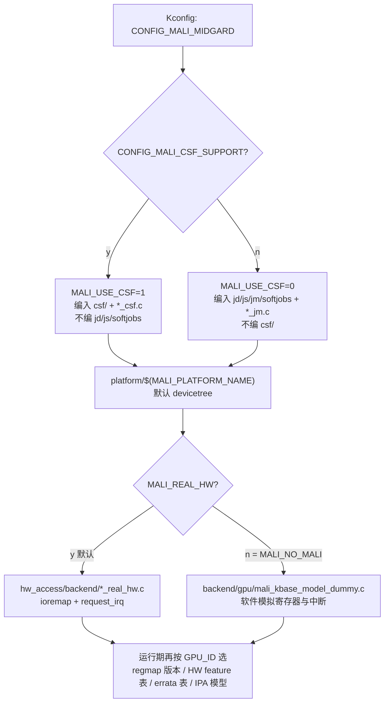

也就是说，"这块 GPU 是什么"分三步确定：**编译期**定 JM/CSF 与平台；**probe 早期**读 `GPU_ID` 寄存器决定寄存器布局（`kbase_regmap_init`）、硬件特性掩码（`kbase_hw_set_features_mask`）、勘误掩码（`kbase_hw_set_issues_mask`）——三者都在 `kbase_device_early_init()`（`device/mali_kbase_device.c:483-556`）里按此顺序完成；**运行期**再由 devfreq / IPA / PM policy 决定行为。

其余重要构建开关（完整表见附录 B）：`MALI_DEVFREQ`（默认 y，走 Linux devfreq）、`MALI_MIDGARD_DVFS`（默认 n，遗留 DVFS 回调）、`MALI_GATOR_SUPPORT`（默认 y，Streamline）、`MALI_MIDGARD_ENABLE_TRACE`（ktrace，默认仅 debug 开）、`MALI_ARBITER_SUPPORT` / `MALI_ARBITRATION`（虚拟化）、`LARGE_PAGE_SUPPORT`（默认 y，2MB 页池）、`PAGE_MIGRATION_SUPPORT`（默认 y，Android 下 n）、`MALI_PRFCNT_SET_*`（计数器集）、`MALI_CORESIGHT`、`MALI_TRACE_POWER_GPU_WORK_PERIOD`（默认 y，Android GPU 工作周期 tracepoint）。

---

## 2. 分层架构

### 2.1 五层模型

kbase 内部是清晰的"接口 → 生命周期 → 策略 → 作业策略 → 硬件后端"五层，**依赖只能向下**：上层调用下层导出函数，下层通过回调 / 工作队列 / 事件把结果向上传，绝不反向 include。

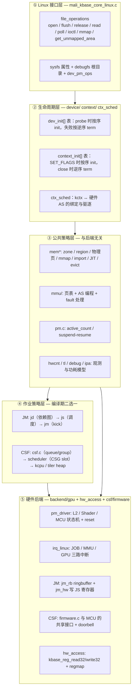

几个体现"分层"的具体证据：

- 前端 PM 的 `kbase_pm_powerup()` 只是调用后端 `kbase_hwaccess_pm_powerup()`；上层从不直接写 `PWRON` 寄存器。
- JM 的 `kbase_jd_submit()`（前端）→ `kbasep_js_add_job()`（策略）→ `kbase_jm_kick()` → `kbase_backend_run_atom()`（后端）→ `kbase_job_hw_submit()`（写寄存器）。
- CSF 的 `kbase_csf_queue_kick()`（前端）→ `kbase_csf_scheduler_queue_start()`（策略）→ `program_cs()` / `kbase_csf_ring_cs_kernel_doorbell()`（后端，写 MCU 共享页与 doorbell 寄存器）。
- 所有 MMIO 都过 `hw_access/`：真硬件与 `MALI_NO_MALI` 软件模型在这一层切换，上层无感。

### 2.2 一次 ioctl 穿过各层

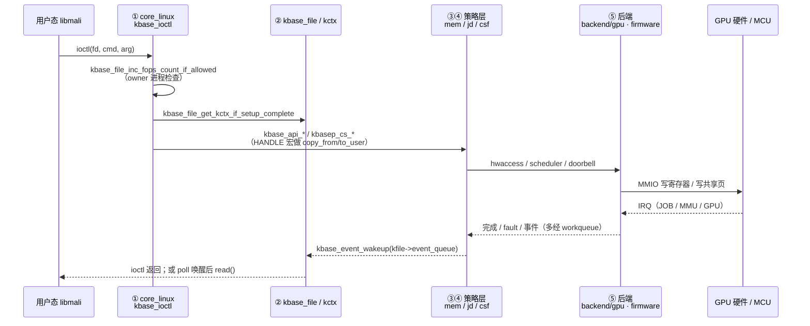

关键差异要先建立直觉：**JM 的 `JOB_SUBMIT` 可能在同一条调用栈里把 atom 写进 job slot**（`kbase_jd_submit → kbasep_js_add_job → kbase_js_sched_all → kbase_jm_kick → kbase_job_hw_submit`）；**CSF 的 `CS_QUEUE_KICK` 只是"声明这条 queue 有活"**，ioctl 很快返回，真正把 group 放上 CSG slot 是 scheduler 在自己的 workqueue（tick / tock）里做的。这决定了两条路径的锁模型、延迟特性和排障方式都不同（第 9、10 章）。

### 2.3 三条"横切"机制

有三样东西不属于任何一层，而是横穿全部：

1. **`hwaccess_lock`**（`kbdev->hwaccess_lock`，spinlock，`device/mali_kbase_device.c:~500` 初始化）：保护"硬件正在做什么"的全部状态——PM 状态机、AS 绑定、JM ringbuffer、CSF slot 状态；IRQ handler 与提交路径都在它下面。
2. **复位框架**：任何一层发现不可恢复错误都可以 `kbase_prepare_to_reset_gpu()` + `kbase_reset_gpu()`，复位 worker 会自顶向下把作业子系统清空、重初始化硬件、恢复 AS（第 11 章）。
3. **观测点**：几乎每个子系统都埋了 `KBASE_KTRACE_ADD`（内核环形缓冲）和 `KBASE_TLSTREAM_*`（用户可读 timeline），所以 `GRAPH_REPORT.md` 里 `mali_kbase_tracepoints.c` 是连通度最高的枢纽——这是打点导致的，不代表它是架构中心。

---

## 3. 设备与上下文生命周期

本章回答"设备怎么被创建、进程怎么拿到 kctx、关闭时怎么拆"。核心机制是两张**表驱动的初始化序列**：`dev_init[]`（设备）与 `context_init[]`（上下文），两者结构完全同构——正序 init，任何一步失败就对**已成功的前 i 项**逆序 term（`kbase_device_term_partial`，`device/backend/mali_kbase_device_jm.c:284-290`；`kbase_context_term_partial`），正常销毁则是全量逆序 term。理解这两张表，就理解了 kbase 的对象依赖顺序。

### 3.1 关键对象与它们的关系

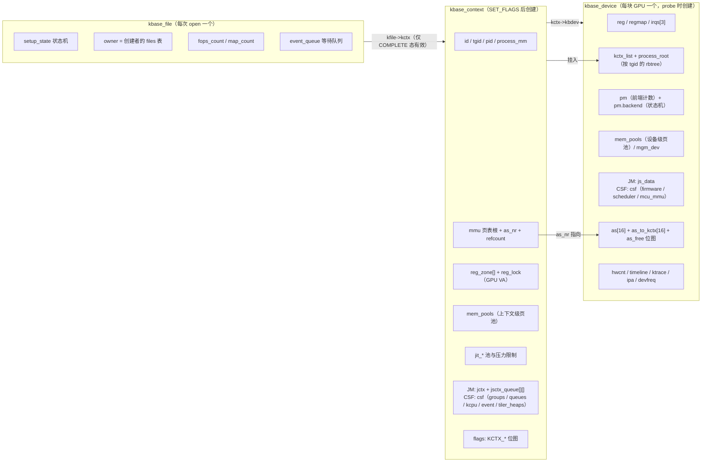

- **`kbase_device`**（`mali_kbase_defs.h:1071` 起）：寄存器窗口与 regmap；`irqs[3]`（JOB / MMU / GPU）；`as[BASE_MAX_NR_AS]`（16 个硬件地址空间，`mali_kbase_defs.h:95`）与 `as_to_kctx[]`、`as_free` 位图；`pm`；设备级 `mem_pools`、`memdev`、`mmu_mode`、`mgm_dev`；`gpu_props` + `hw_issues_mask[]` + `hw_features_mask[]`；hwcnt 一整套（`hwcnt_gpu_iface` / `hwcnt_gpu_ctx` / `hwcnt_gpu_virt` / `kinstr_prfcnt_ctx`）；`timeline`、`ktrace`；`kctx_list` + `kctx_list_lock` + `ctx_num` + `process_root`；`ipa`；`protected_ops` / `protected_dev` / `protected_mode`；`hwaccess_lock`、`mmu_hw_mutex`；JM 的 `js_data` 或 CSF 的 `csf`；`arb`、`dummy_job_wa`、`mem_migrate`、`gpu_metrics`。
- **`kbase_file`**（`mali_kbase_defs.h:1453-1468`）：`kbdev`、`filp`、`owner`（创建 fd 的进程的 `files_struct`，用来拒绝跨进程使用同一个 fd）、`kctx`、`api_version`、`setup_state`（atomic）、`destroy_kctx_work`、`lock`、`fops_count`、`map_count`、`event_queue`。
- **`kbase_context`**（`mali_kbase_defs.h:1913` 起）：按子系统分组见上图；`flags` 是 `KCTX_*` 位图（`mali_kbase_defs.h:1536-1554`），重要位：`KCTX_COMPAT`（32 位进程）、`KCTX_FORCE_SAME_VA`（64 位默认开，GPU VA == CPU VA）、`KCTX_SUBMIT_DISABLED`、`KCTX_PRIVILEGED`（独占一个 AS）、`KCTX_SCHEDULED`（JM：在 runpool 中）、`KCTX_DYING`、`KCTX_AS_DISABLED_ON_FAULT`（未处理 fault 后 AS 被禁）、`KCTX_PULLED_SINCE_ACTIVE_JS0/1/2`、`KCTX_PAGE_FAULT_REPORT_SKIP`、`KCTX_JPL_ENABLED`（JIT 物理限制）。
- **`kbase_as`**（JM `jm/mali_kbase_jm_defs.h:852-861`；CSF `csf/mali_kbase_csf_defs.h:1768-1778`）：`number`、`pf_wq`（每 AS 一个 fault workqueue）、`work_pagefault` / `work_busfault` 与对应 `pf_data` / `bf_data`（`kbase_fault`）、`current_setup`；**CSF 多一组 `work_gpufault` + `gf_data`**。

### 3.2 Probe：`dev_init[]` 表

`kbase_platform_device_probe()`（`mali_kbase_core_linux.c:5987-6049`）：`kbase_device_alloc()` → `dev_set_drvdata` → `kbase_device_init()`（失败时 `-EPROBE_DEFER` 只打 info，否则 `kbase_device_free`）→ 成功后 `kbase_increment_device_id()`，arbiter 模式下再发 `KBASE_VM_GPU_INITIALIZED_EVT`。

`kbase_device_init()`（JM `device/backend/mali_kbase_device_jm.c:299`；CSF `mali_kbase_device_csf.c:363`）先打印 `"Kernel DDK version %s"`、`kbase_device_id_init()`、`kbase_disjoint_init()`，然后**顺序遍历 `dev_init[]`**。CSF 表（`mali_kbase_device_csf.c:277-347`）与 JM 表（`mali_kbase_device_jm.c:215-282`）合并展示如下（★ 为 CSF 独有，☆ 为 JM 独有）：

| # | init 函数 | 做什么 | 备注 |
|---|---|---|---|
| 1 | `kbase_get_irqs` + `registers_map`（真硬件）/ `kbase_gpu_device_create`（NO_MALI） | 从 DT 取 `"JOB"/"MMU"/"GPU"` 三个 IRQ（`core_linux.c:548-584`）；`ioremap` 寄存器 | |
| 2 | `kbase_gpu_metrics_init` | Android 工作周期 tracepoint（`CONFIG_MALI_TRACE_POWER_GPU_WORK_PERIOD`） | |
| 3 | `kbase_device_io_history_init` | 寄存器访问历史（debug） | |
| 4 | ★`power_control_init` / ☆`kbase_device_pm_init` | 取 regulator / clock / OPP 表；arbiter 探测 | CSF 表多一个 `power_control_init`（`:287`） |
| 5 | `kbase_device_early_init` | 见下文 3.2.1，**在这里读 GPU_ID、建 regmap、装中断** | |
| 6 | `kbase_backend_time_init` | GPU 时间戳与超时换算表 | |
| 7 | `kbase_device_misc_init` | 杂项：`hwaccess_lock` 等 | |
| 8 | `kbase_device_pcm_dev_init` | priority control manager 设备 | |
| 9 | `kbase_ctx_sched_init` | `as_free = as_present`（`mali_kbase_ctx_sched.c:46-57`） | |
| 10 | ★`kbase_csf_protected_memory_init` | protected memory allocator | |
| 11 | `kbase_mem_init` | 设备级页池、mgm | |
| 12 | `kbase_device_coherency_init` | 读 DT `system-coherency`，配 ACE / ACE-Lite / NONE | |
| 13 | `kbase_protected_mode_init` | protected mode ops（默认 `kbasep_native_protected_ops`） | |
| 14 | `kbase_device_list_init` | 加入全局设备链表 | |
| 15 | ☆`kbasep_js_devdata_init` | JM Job Scheduler 设备数据 | |
| 16 | `kbase_device_timeline_init` | tlstream | |
| 17 | `kbase_clk_rate_trace_manager_init` | 时钟频率跟踪管理器 | |
| 18 | ☆`kbase_instr_backend_init` | JM 计数器 dump 后端 | |
| 19 | hwcnt 一组：☆`watchdog_if_init` + `backend_jm_init` + `backend_jm_watchdog_init` + `context_init` + `virtualizer_init` + `kinstr_prfcnt_init`；★`backend_csf_if_init` + `backend_csf_init` | 计数器栈 | CSF 的 virtualizer / kinstr_prfcnt **推迟到固件加载后**（见 3.3） |
| 20 | ★`kbase_csf_early_init` | 准备 scheduler、doorbell、共享 MMU；**不加载固件** | |
| 21 | `kbase_backend_late_init` | 见 3.2.2：PM 初始化、GPU 首次复位与上电、devfreq | |
| 22 | ★`kbase_csf_late_init` | | |
| 23 | ☆`kbase_debug_job_fault_dev_init` / ★`kbase_debug_csf_fault_init` | fault debugfs | |
| 24 | `kbase_device_debugfs_init` | `/sys/kernel/debug/mali0/` 树 | |
| 25 | `kbase_sysfs_init` | **必须在 misc_register 前**，避免 udev 竞态（`device_jm.c:263-274` 注释） | |
| 26 | `kbase_device_misc_register` | `misc_register(&kbdev->mdev)` → `/dev/mali0` 出现 | 从这一刻起用户可以 open |
| 27 | `kbase_gpuprops_populate_user_buffer` | 序列化 GET_GPUPROPS 用的属性缓冲 | |
| 28 | `kbase_device_late_init` | `kbasep_platform_device_late_init` | |
| 29 | ★`kbase_debug_coresight_csf_init`（`CONFIG_MALI_CORESIGHT`） | | |

`kbase_device_term()` 全量逆序 term 后，JM 额外 `kbasep_js_devdata_halt` + `kbase_mem_halt`，CSF 只 `kbase_mem_halt`。

#### 3.2.1 `kbase_device_early_init`（`device/mali_kbase_device.c:483-556`）

顺序：`kbase_ktrace_init` → `kbasep_platform_device_init`（平台回调） → `kbase_pm_runtime_init` → `spin_lock_init(&hwaccess_lock)` → `kbase_pm_register_access_enable`（**临时上电，只为读寄存器**） → `kbase_gpuprops_parse_gpu_id`（读 `GPU_ID`） → `kbase_regmap_init`（按 arch 选寄存器表） → `kbase_hw_set_features_mask` → `kbase_gpuprops_init`（dump 全部属性寄存器） → `kbase_hw_set_issues_mask` → `kbase_pm_register_access_disable` → `kbase_install_interrupts`（arbiter 下改为 `kbase_arbiter_pm_install_interrupts`）。

`kbase_hw_set_features_mask`（`mali_kbase_hw.c:32-109`）按 `gpu_id.product_model` 选 `base_hw_features_tMIx` / `tTIx` / `tKRx` / `generic` 等表逐位置入 `hw_features_mask`；`kbase_hw_set_issues_mask`（`:344`）按 `product_model + GPU_ID_VERSION_MAKE(major,minor,status)` 精确选 `base_hw_issues_tMIx_r0p0`、`base_hw_issues_tHEx_r0p2` 这样的表（软件模型用 `base_hw_issues_model_*`）。之后全驱动用 `kbase_hw_has_issue(kbdev, X)` / `kbase_hw_has_feature(kbdev, Y)`（`mali_kbase_hw.h:36,43`，即 `test_bit`）做勘误分支——这就是同一份驱动能跑几十款 GPU 的机制。

#### 3.2.2 `kbase_backend_late_init`（JM `device_jm.c:56-154`；CSF `device_csf.c:72-154`）

`kbase_hwaccess_pm_init` → `kbase_reset_gpu_init` → **`kbase_hwaccess_pm_powerup(PM_HW_ISSUES_DETECT)`**（第一次真正上电 + 软复位 + 探测勘误寄存器）→ ☆`kbase_backend_timer_init` + `kbase_job_slot_init` / ★`kbase_ipa_control_init` + `kbasep_pm_metrics_init` → `kbase_backend_devfreq_init` → `kbase_gpuprops_update_l2_features`（如需改 L2 配置会关 L2 再开）→ `init_waitqueue_head(reset_wait)` → **`kbase_pm_context_idle`**（probe 结束时 GPU 可按策略掉电）→ `mutex_init(fw_load_lock)`。

### 3.3 open：`kbase_file` 状态机与延迟加载

`kbase_open()`（`core_linux.c:783-820`）：按 minor 找 kbdev → **`kbase_device_firmware_init_once()`** → `kbase_file_new()`（`setup_state = KBASE_FILE_NEED_VSN`，`owner = current->files`）→ `filp->private_data = kfile`。

`kbase_device_firmware_init_once()` 是"为 Android GKI 把重活从 probe 挪到第一次 open"的钩子（`device_csf.c:471-500`）：在 `fw_load_lock` 下，如果 `!csf.firmware_inited`：`kbase_pm_context_active` → `kbase_csf_firmware_load_init()`（加载 `mali_csffw.bin`、建 MCU 页表、启动 MCU、全局初始化）→ 成功后 `mcu_state = KBASE_MCU_ON`、`firmware_inited = true` → `kbase_device_hwcnt_csf_deferred_init()`（`hwcnt_backend_csf_metadata_init` → `virtualizer_init` → `kinstr_prfcnt_init`）→ CSF debugfs → `kbase_pm_context_idle`。JM 版本（`device_jm.c:325-340`）在同一钩子里加载 dummy job workaround 固件 `kbase_dummy_job_wa_load()`。

`kbase_file` 的 `setup_state` 状态机（`mali_kbase_defs.h:1400-1407`，全部用 `atomic_cmpxchg` 推进）：

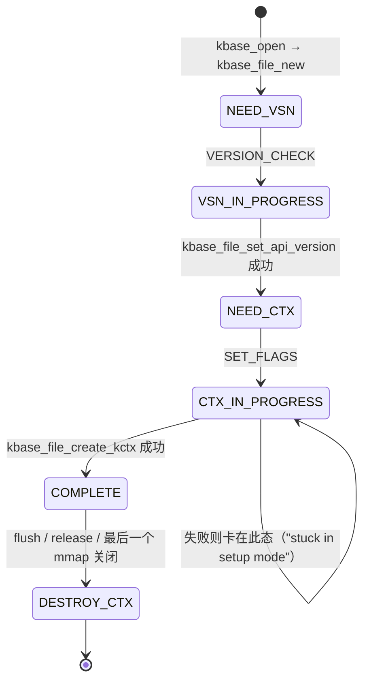

设计意图：**`VERSION_CHECK` 和 `GET_GPUPROPS` 可以在 kctx 存在之前调用**（第一个 switch，`core_linux.c:1854-1895`），DDK 先协商版本、读属性再决定用什么 flags 创建 kctx。`kbase_file_get_kctx_if_setup_complete()`（`:364-371`）只在 `COMPLETE` 返回 kctx，其它命令拿不到就 `-EPERM`。

`owner` / `fops_count` / `map_count` 三个字段（`mali_kbase.h:817-910`）解决"fd 被 fork 或 SCM_RIGHTS 传给别的进程"的问题：每个 fop 入口先 `kbase_file_inc_fops_count_if_allowed()`——`owner != current->files` 直接拒绝（`core_linux.c:337-347`）；`dec` 时若 `!fops_count && !owner && !map_count` 才把 `destroy_kctx_work` 排进 `system_wq`。

### 3.4 SET_FLAGS：`context_init[]` 表

`kbase_api_set_flags()`（`core_linux.c:862-909`）校验 `create_flags ⊆ BASEP_CONTEXT_CREATE_KERNEL_FLAGS` → `kbase_file_create_kctx()`（`:724-781`）→ `kbase_create_context(kbdev, in_compat_syscall(), flags, api_version, kfile)` → 按 `context_init[]` 走完 → 建 debugfs `ctx/<tgid>_<id>/` → `setup_state = COMPLETE`。

JM 表（`context/backend/mali_kbase_context_jm.c:127-159`）与 CSF 表（`mali_kbase_context_csf.c:88-107`）：

| 阶段 | 函数 | JM | CSF | 说明 |
|---|---|---|---|---|
| 公共 | `kbase_context_common_init` | ✓ | ✓ | `tgid/pid`、`get_task_struct`、`mmgrab(current->mm)`、`reg_lock`、cookies 位图、`id = atomic_add_return(&ctx_num)`、挂入 `process_root`（`context/mali_kbase_context.c:132-205`） |
| | `kbase_context_mem_pool_group_init` | ✓ | ✓ | 上下文级页池（4K + 2MB × 每个 memory group） |
| | `kbase_mem_evictable_init` | ✓ | ✓ | evict 链表 + shrinker |
| | `kbase_ctx_sched_init_ctx` | ✓ | ✓ | `as_nr = KBASEP_AS_NR_INVALID` |
| | `kbase_context_mmu_init` | ✓ | ✓ | `kbase_mmu_init(&kctx->mmu, group_id)`：分配 L0 页表 |
| | `kbase_context_mem_alloc_page` | ✓ | ✓ | aliasing sink page |
| | `kbase_region_tracker_init` | ✓ | ✓ | 建 GPU VA zone（第 6 章） |
| | `kbase_sticky_resource_init` | ✓ | ✓ | 外部资源 sticky 表 |
| | `kbase_jit_init` | ✓ | ✓ | JIT 三条链表 |
| JM 专属 | `kinstr_jm_init` → `timer_setup`（soft job 超时）→ `kbase_event_init` → `kbasep_js_kctx_init` → `kbase_jd_init` → `kbase_context_submit_check` → `debug_job_fault_context_init` → `kbasep_platform_context_init` | ✓ | | atom 数组、事件队列、per-slot 队列 |
| CSF 专属 | `kbase_csf_ctx_init` | | ✓ | groups / queues / kcpu / event / tiler heap / user_reg（第 10 章） |
| 收尾 | `kbase_context_add_to_dev_list` | ✓ | ✓ | 挂入 `kbdev->kctx_list`；`kbase_timeline_post_kbase_context_create` |

CSF 表明显更短：作业相关的所有东西都收进 `kbase_csf_ctx_init` 一项。

### 3.5 close：逆序拆除，且要"先停作业再拆内存"

`kbase_flush()`（每个 fd 副本关闭都调）只有 `owner == id` 时才 `kbase_file_destroy_kctx_on_flush()`（`core_linux.c:418-441`）：置 `owner = NULL`，若已经没有在途 fop 和 mapping 就立刻 `kbase_file_destroy_kctx()`，否则等最后一个引用释放时由 `destroy_kctx_work` 异步销毁。`kbase_release()` → `kbase_file_delete()`（`:450-471`）：`cancel_work_sync(destroy_kctx_work)` → `kbase_file_destroy_kctx()` → `kfree(kfile)`。

`kbase_destroy_context()`（JM `context_jm.c:224-269`；CSF `context_csf.c:174-218`）先做两件保护：循环 `kbase_pm_context_active_handle_suspend(DONT_INCREASE)`，若系统正在 suspend 则等 `pm.resume_wait`；`kbase_mem_pool_group_mark_dying()`。然后 `kbase_context_term_partial(kctx, ARRAY_SIZE(context_init))` **逆序**执行。逆序展开后的关键顺序：

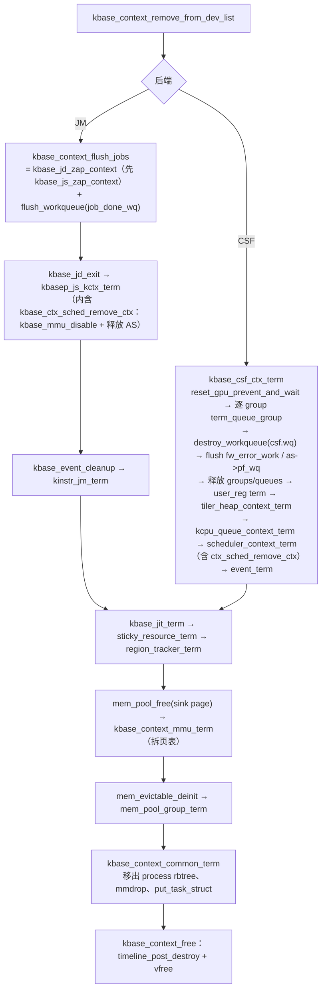

顺序的因果：**必须先让 GPU 不再引用这个 kctx（zap 作业、释放 AS、禁 MMU），再拆 region 与页表，最后放进程引用**——反过来会让在途作业踩到已释放的页表。

### 3.6 Context Scheduler：kctx ↔ 硬件 AS

kbdev 上可以同时存在很多 kctx，但硬件只有 `nr_hw_address_spaces` 个 AS（≤16）。`mali_kbase_ctx_sched.c` 用**引用计数 + 惰性驱逐**把 kctx 绑到 AS：

- `kbase_ctx_sched_retain_ctx()`（`:107-151`，需持 `mmu_hw_mutex` + `hwaccess_lock`）：`refcount` 0→1 时找 AS：优先复用 `kctx->as_nr` 上次用过且仍空闲的那个；否则 `ffs(as_free)-1` 取最低位空闲 AS（`kbasep_ctx_sched_find_as_for_ctx`，`:86-105`）。若拿到的 AS 上还挂着别的 kctx（`as_to_kctx[free_as]`，其 refcount 必为 0）——这就是**驱逐**：`kbase_mmu_disable(prev_kctx)`、`prev_kctx->as_nr = INVALID`（`:124-133`）。然后 `as_to_kctx[free_as] = kctx`、`kbase_mmu_update(&kctx->mmu, as_nr)` 把页表根写进 `AS_TRANSTAB` 等寄存器。找不到空闲 AS 则回滚 refcount 返回 INVALID。
- `kbase_ctx_sched_release_ctx()`（`:179-203`）：refcount 归零时把 AS 位放回 `as_free`，但**不立刻禁 MMU、不清 `as_to_kctx`**——留着下次同一个 kctx 来时能直接复用（这就是"惰性"）；只有 `KCTX_AS_DISABLED_ON_FAULT` 时才彻底解绑。
- `kbase_ctx_sched_remove_ctx()`（`:205-226`）：kctx 销毁时强制解绑（GPU 上电时 `kbase_mmu_disable`）。
- `kbase_ctx_sched_restore_all_as()`（`:228-269`）：**GPU 复位后**重新给所有仍被引用的 kctx 编程 MMU；CSF 下 `MCU_AS_NR` 单独 `kbase_mmu_update(&kbdev->csf.mcu_mmu)`；完全空闲的 AS 调 `kbase_mmu_disable_as`。
- 反查：`kbase_ctx_sched_as_to_ctx(_nolock/_refcount)`（`:271-328`）——MMU fault handler 靠它从 AS 号找到 kctx。
- CSF 专属 `kbase_ctx_sched_inc_refcount_if_as_valid()`（`:387-421`）：scheduler 把 group 放上 slot 前确认该 kctx 仍持有 AS。

JM 下调用方是 `kbase_backend_use_ctx()`（`backend/gpu/mali_kbase_jm_as.c`）/ `kbasep_js_runpool_release_ctx()`；CSF 下是 scheduler 的 `scheduler_prepare / program_csg_slot`。两者对上层的语义相同："我要在 GPU 上跑这个 kctx 的东西，请给它一个 AS 并保证在我释放前不被驱逐"。

---

## 4. IOCTL 接口层

### 4.1 分发骨架

`file_operations kbase_fops`（`core_linux.c:2424-2436`）：`open=kbase_open`、`flush=kbase_flush`、`release=kbase_release`、`read=kbase_read`、`poll=kbase_poll`、`unlocked_ioctl=compat_ioctl=kbase_ioctl`、`mmap=kbase_mmap`、`check_flags=kbase_check_flags`（**强制 `O_CLOEXEC`**，否则 `-EINVAL`，`:2392-2401`）、`get_unmapped_area=kbase_get_unmapped_area`。

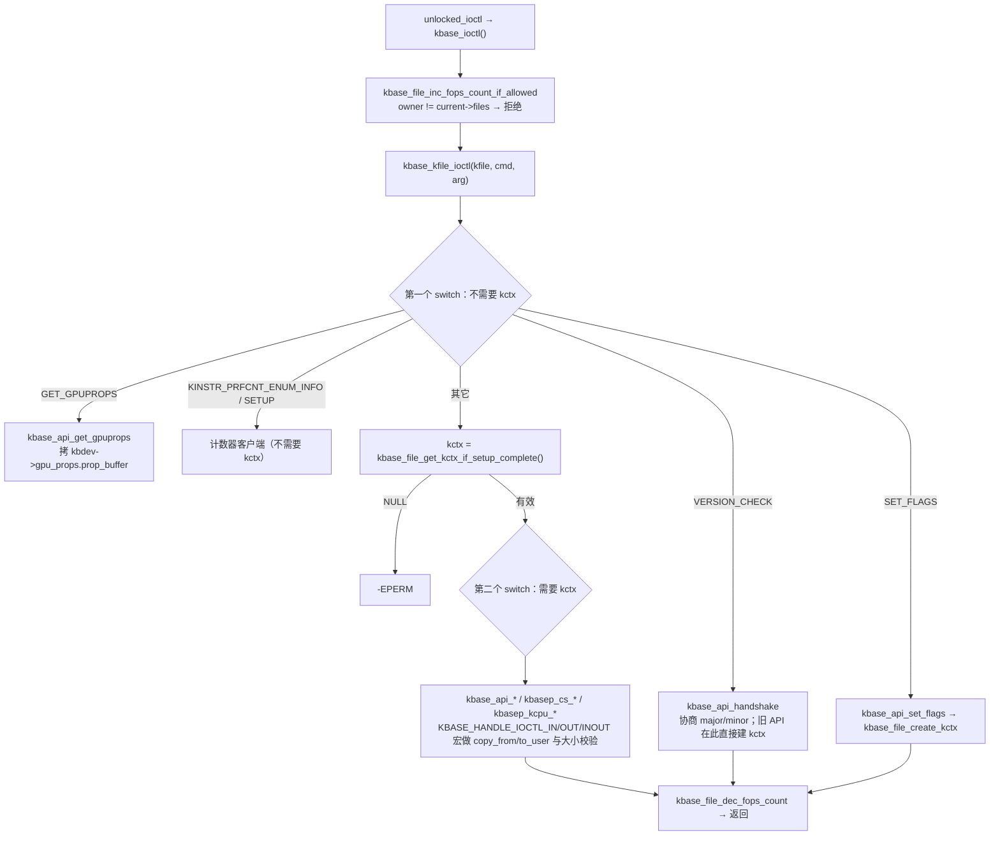

`KBASE_HANDLE_IOCTL{,_IN,_OUT,_INOUT}` 宏（`core_linux.c:1779-1836`）在编译期 `BUILD_BUG_ON` 校验 `_IOC_DIR(cmd)` 与 `sizeof(param) == _IOC_SIZE(cmd)`，运行期做 `copy_from_user` → 调 handler → `copy_to_user`，并在 `do{}while(0)` 里直接 `return ret`。未匹配的 cmd 落到 `dev_warn("Unknown ioctl")` + `-ENOIOCTLCMD`（`:2154-2156`）。

### 4.2 命令全表

| 类别 | ioctl | handler | 说明 |
|---|---|---|---|
| **握手 / 查询**（无需 kctx） | `VERSION_CHECK` | `kbase_api_handshake`（`:473`） | `major` 相同则 `minor = min(驱动, 用户)`；否则回写驱动版本。旧 API 在这里 `kbase_file_create_kctx(SYSTEM_MONITOR_SUBMIT_DISABLED)` |
| | `VERSION_CHECK_RESERVED` | `kbase_api_handshake_dummy` | 恒 `-EPERM` |
| | `SET_FLAGS` | `kbase_api_set_flags`（`:862`） | 创建 kctx（见 3.4） |
| | `GET_GPUPROPS` | `kbase_api_get_gpuprops`（`:919`） | `size==0` 返回缓冲大小 |
| | `KINSTR_PRFCNT_ENUM_INFO` / `_SETUP` | `kbase_api_kinstr_prfcnt_*` | 计数器 API，返回新 fd |
| **内存**（JM/CSF 共用） | `MEM_ALLOC` / ★`MEM_ALLOC_EX` | `kbase_api_mem_alloc(_ex)` | CSF 的 `MEM_ALLOC` 转 `_ex`；核心 `kbase_mem_alloc()` |
| | `MEM_QUERY` / `MEM_FREE` / `MEM_COMMIT` / `MEM_ALIAS` / `MEM_IMPORT` / `MEM_FLAGS_CHANGE` / `MEM_SYNC` | `kbase_api_mem_*` | 第 6 章 |
| | `MEM_JIT_INIT` / `MEM_EXEC_INIT` | | 从 CUSTOM_VA 里切出 JIT / EXEC zone |
| | `MEM_FIND_CPU_OFFSET` / `MEM_FIND_GPU_START_AND_OFFSET` | | CPU↔GPU 地址换算 |
| | `MEM_PROFILE_ADD` | → `kbasep_mem_profile_debugfs_insert` | 用户态内存 profile 字符串 |
| | `STICKY_RESOURCE_MAP` / `UNMAP` | | 外部资源常驻映射 |
| ☆**JM** | `JOB_SUBMIT` | `kbase_api_job_submit` → `kbase_jd_submit` | 第 9 章 |
| | `POST_TERM` | → `kbase_event_close` | 让 `read()` 返回 `DRV_TERMINATED` |
| | `SOFT_EVENT_UPDATE` | `kbase_api_soft_event_update` | 触发 soft event |
| | `KINSTR_JM_FD` | `kbase_api_kinstr_jm_fd` | atom 状态流 fd |
| ★**CSF** | `CS_QUEUE_REGISTER(_EX)` / `TERMINATE` / `BIND` / `KICK` | `kbasep_cs_queue_*` | 第 10 章 |
| | `CS_QUEUE_GROUP_CREATE(_1_6/_1_18)` / `TERMINATE` | 三个版本都到 `kbase_csf_queue_group_create` | |
| | `KCPU_QUEUE_CREATE` / `DELETE` / `ENQUEUE` | `kbasep_kcpu_queue_*` | CPU 侧命令队列 |
| | `CS_TILER_HEAP_INIT(_1_13)` / `TERM` | | 可增长 tiler 堆 |
| | `CS_EVENT_SIGNAL` | → `kbase_csf_event_signal_notify_gpu` | 唤醒 CPU 等待者并敲 GLB doorbell |
| | `CS_GET_GLB_IFACE` | → `kbase_csf_firmware_get_glb_iface` | 把固件接口能力表交给用户态 |
| | `CS_CPU_QUEUE_DUMP` / `QUEUE_GROUP_CLEAR_FAULTS` / `READ_USER_PAGE`（仅 `LATEST_FLUSH`） | | |
| **同步** | `STREAM_CREATE` | → `kbase_sync_fence_stream_create` | 无 `CONFIG_SYNC_FILE` 时 `-ENOENT` |
| | `FENCE_VALIDATE` | `kbase_api_fence_validate` | |
| **观测** | `TLSTREAM_ACQUIRE` / `FLUSH` / `STATS`（`MALI_UNIT_TEST`） | → `kbase_timeline_io_acquire` | 返回 timeline fd |
| | `GET_CPU_GPU_TIMEINFO` | | CPU/GPU 时间戳对齐 |
| | `HWCNT_SET`（NO_MALI）/ `CINSTR_GWT_START/STOP/DUMP`（`CONFIG_MALI_CINSTR_GWT`） | | |
| **杂项** | `DISJOINT_QUERY` / `GET_DDK_VERSION` / `GET_CONTEXT_ID` / `CONTEXT_PRIORITY_CHECK` / `SET_LIMITED_CORE_COUNT` | | `CONTEXT_PRIORITY_CHECK`：CSF→`kbase_csf_priority_check`，JM→`kbase_js_priority_check` |

`kbase_caps_table`（`core_linux.c:151-169`）记录每个能力（SYSTEM_MONITOR、JIT_PRESSURE_LIMIT、MEM_DONT_NEED、MEM_GROW_ON_GPF、MEM_PROTECTED、MEM_IMPORT_SYNC_ON_MAP_UNMAP、MEM_KERNEL_SYNC）在 JM / CSF 各自从哪个 uapi 版本开始支持——`mali_kbase_supports_cap()` 让驱动能对老用户态保持兼容行为。

### 4.3 完成事件：read / poll

**JM**（`kbase_read`，`core_linux.c:2230-2293`）：阻塞式。循环 `kbase_event_dequeue()`（`mali_kbase_event.c:52-96`）取 `base_jd_event_v2`（`event_code`、`atom_number`、`udata`），没有事件且非 `O_NONBLOCK` 就 `wait_event_interruptible(kfile->event_queue, kbase_event_pending(kctx))`。事件来自 `kbase_event_post()`（atom 完成时按 `BASE_JD_REQ_EVENT_ONLY_ON_FAILURE / EVENT_NEVER / EVENT_COALESCE` 决定是否入队）；`POST_TERM` 后 `event_closed` 置位，队列空时现场生成 `BASE_JD_EVENT_DRV_TERMINATED`。

**CSF**（`:2174-2228`）：**非阻塞**。优先级：`kctx->event_count != 0` → 返回 `BASE_CSF_NOTIFICATION_EVENT`（只表示"有 sync object 变化，自己去查"）；否则 `kbase_csf_event_read_error()`（group fatal / timeout / OOM 等错误）；否则 `kbase_csf_cpu_queue_read_dump_req()`（内核请求用户态 dump CPU queue）。CSF 下用户态大多数时候是**直接轮询 GPU 内存里的 sync object**，`read` 只是错误与通知通道。

`kbase_poll()`（`:2296-2333`）：`poll_wait(kfile->event_queue)`；`kbase_event_pending()` 在 JM = `event_count || event_closed`，CSF = `event_count || csf_event_error_pending || cpu_queue_dump_needed`。唤醒都走 `kbase_event_wakeup()` → `wake_up_interruptible(&kctx->kfile->event_queue)`。

### 4.4 mmap 分发：一个 fd 承载多种映射

`kbase_mmap()` → `kbase_context_mmap()`（`mali_kbase_mem_linux.c:2753-2919`）按 `vma->vm_pgoff` 分类：

| `vm_pgoff` 范围 | 含义 | 处理 |
|---|---|---|
| `PFN_DOWN(BASE_MEM_MAP_TRACKING_HANDLE)` | 追踪页（1 页，无访问权限） | `kbase_tracking_page_setup`：`vm_ops = kbase_vm_special_ops`，`map_count++`；用户态用它的生命周期挂钩 kctx 销毁 |
| `BASE_MEM_MMU_DUMP_HANDLE` | 页表 dump（`CONFIG_MALI_VECTOR_DUMP`） | `kbase_mmu_dump_mmap` |
| ★`BASEP_MEM_CSF_USER_REG_PAGE_HANDLE` | CSF user register 页（`LATEST_FLUSH`） | `kbase_csf_cpu_mmap_user_reg_page` |
| ★`BASEP_MEM_CSF_USER_IO_PAGES_HANDLE .. BASE_MEM_COOKIE_BASE-1` | 某个 queue 的 input/output 两页 | `kbase_csf_cpu_mmap_user_io_pages`（`csf.lock` 下） |
| `BASE_MEM_COOKIE_BASE .. BASE_MEM_FIRST_FREE_ADDRESS-1` | **SAME_VA 分配的 cookie** | `kbasep_reg_mmap`（`:2680-2751`）：取 `pending_regions[cookie]`，`kbase_gpu_mmap` 到 `vma->vm_start`（GPU VA == CPU VA），归还 cookie |
| 其它（`default`） | 已存在 region 的 GPU VA | `kbase_region_tracker_find_region_enclosing_address` → 权限/大小检查 → dma-buf 走 `dma_buf_mmap`，alias 校验 stride，最后 `kbase_cpu_mmap` |

`kbase_get_unmapped_area()` → `kbase_context_get_unmapped_area()`（`thirdparty/mali_kbase_mmap.c`）保证 SAME_VA 分配拿到的 CPU 地址满足 GPU 侧的对齐要求（2MB 大页、4GB 边界等）。

### 4.5 sysfs / debugfs / PM 回调

sysfs（`kbase_sysfs_init`，`core_linux.c:5914-5943`）三组属性：默认组 `debug_command`、`js_softstop_always`（JM debug）、`js_timeouts`、`soft_job_timeout`、`gpuinfo`、`dvfs_period`、`pm_poweroff`、`reset_timeout`、☆`js_scheduling_period` / ★`csg_scheduling_period`、★`add/remove_prioritized_process`、★`fw_timeout`、★`idle_hysteresis_time(_ns)`、★`mcu_shader_pwroff_timeout(_ns)`、`power_policy`、`core_mask`、`mem_pool_size` / `mem_pool_max_size` / `lp_mem_pool_size` / `lp_mem_pool_max_size`、☆`js_ctx_scheduling_mode`；`scheduling/serialize_jobs`（JM）；`mempool/{max_size,lp_max_size,ctx_default_max_size}`。

debugfs 根 `/sys/kernel/debug/<devname>/`（`init_debugfs`，`:5075-5190`）：`ctx/`（每个 kctx 一个 `<tgid>_<id>/`，含 `infinite_cache`、`force_same_va`、mem_profile、mem_view、jit、CSF 的 kcpu_queues / groups 等）、`instrumentation/`、`regs_history`、☆`job_fault` / ★`csf_fault`、`gpu_memory`、`as_fault`、`pbha`、`quirks_{sc,tiler,mmu,gpu}`、`ctx/defaults/`、`protected_debug_mode`、`reset`（写入触发复位）、`mali_trace`（ktrace）、`ipa/`、`dvfs_utilization` 等。完整表见第 12 章。

`dev_pm_ops kbase_pm_ops`（`:6236-6244`）：`suspend=kbase_device_suspend`（`kbase_pm_suspend` 失败返 `-EBUSY`；停 metrics；devfreq suspend）、`resume=kbase_device_resume`、`runtime_suspend`（CSF 先 `kbase_pm_handle_runtime_suspend`，再平台 `callback_power_runtime_off`）、`runtime_resume`、`runtime_idle`。这是第 8 章电源管理与 Linux PM 框架的接缝。

---

## 5. 核心数据结构总览

前面几章零散地提到过各种结构，这里把"谁指向谁"集中画一遍，后面讲流程时可以随时回来对照。

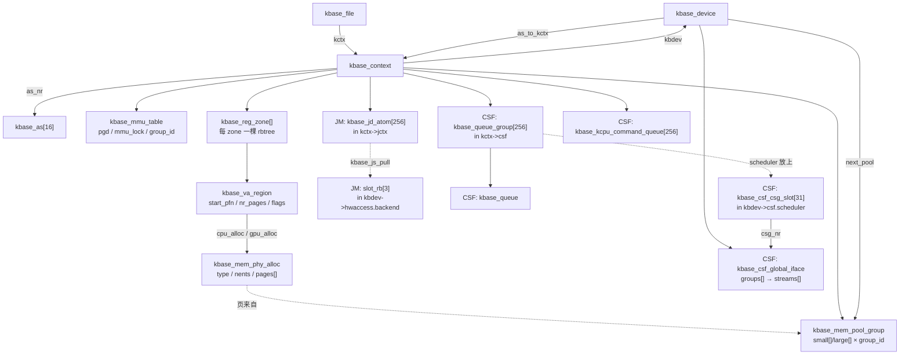

| 结构 | 定义 | 一句话 |
|---|---|---|
| `kbase_device` | `mali_kbase_defs.h:1071` | 一块 GPU 的一切；生命周期 = 模块 probe 到 remove |
| `kbase_file` | `mali_kbase_defs.h:1453` | 一次 `open()`；负责 setup 状态机、跨进程保护、事件等待队列 |
| `kbase_context` | `mali_kbase_defs.h:1913` | 一个进程的 GPU 世界：页表、VA、页池、JIT、作业对象 |
| `kbase_as` | `jm/mali_kbase_jm_defs.h:852` / `csf/mali_kbase_csf_defs.h:1768` | 一个硬件地址空间的 fault 工作项与当前 setup |
| `kbase_mmu_table` | `mali_kbase_defs.h:312-342` | 一棵页表：`pgd` 根、`mmu_lock`、`group_id`、teardown 暂存区；kctx 有一棵，CSF 的 MCU 也有一棵（`kbdev->csf.mcu_mmu`） |
| `kbase_reg_zone` | `mali_kbase_reg_track.h:172-178` | 一个 GPU VA 区间 + 它的 rbtree + region 的 kmem_cache |
| `kbase_va_region` | `mali_kbase_mem.h:649-695` | 一段 GPU VA：`start_pfn`、`nr_pages`、`flags`(`KBASE_REG_*`)、`cpu_alloc`/`gpu_alloc`、JIT 字段、`va_refcnt`、`no_user_free_count` |
| `kbase_mem_phy_alloc` | `mali_kbase_mem.h:348-395` | 一组物理页：`type`（NATIVE / IMPORTED_UMM / IMPORTED_USER_BUF / ALIAS / RAW）、`nents`、`pages[]`（`tagged_addr`）、`imported` 联合体、`evict_node`、`kref` |
| `kbase_mem_pool` | `mali_kbase_defs.h:533-548` | 一个页池：`order`（0=4K，9=2MB）、`cur_size/max_size`、`next_pool`（溢出目标）、shrinker |
| `kbase_jd_atom` | `jm/mali_kbase_jm_defs.h` | JM 一个作业：`status`、`core_req`、`dep[2]`、`gpu_rb_state`、`sched_priority`、`slot_nr`… |
| `kbase_queue` / `kbase_queue_group` | `csf/mali_kbase_csf_defs.h:412-450 / 600-663` | CSF 一条命令流 / 一个组（含 `bound_queues[32]`、`run_state`、suspend buffer） |
| `kbase_csf_global_iface` | `csf/mali_kbase_csf_firmware.h:266-276` | 固件共享接口：`groups[]`（每个含 `streams[]`）、`input/output` 页指针 |

---

## 6. 内存管理

内存子系统要回答的问题是：**用户态说"给我 N 页 GPU 内存、要能被 CPU 访问、要 cache 一致"，驱动怎么在 GPU VA、CPU VA、物理页三者之间建立映射，并且在压力下能回收。** 涉及文件：`mali_kbase_mem.c`（region / 物理页 / JIT）、`mali_kbase_mem_linux.c`（ioctl 入口 / mmap / import / evict）、`mali_kbase_reg_track.c`（zone / rbtree）、`mali_kbase_mem_pool*.c`（页池）、`mali_kbase_mem_migrate.c`（页迁移）、`mmu/`（页表，见第 7 章）。

### 6.1 三个地址空间与三类对象

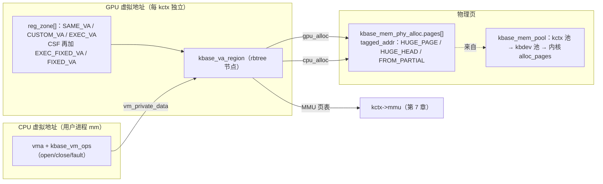

- **GPU VA zone**（`enum kbase_memory_zone`，`mali_kbase_reg_track.h:141-156`）：`SAME_VA_ZONE`、`CUSTOM_VA_ZONE`、`EXEC_VA_ZONE`；CSF 另有 `EXEC_FIXED_VA_ZONE`、`FIXED_VA_ZONE`（用户指定固定地址）和设备级 `MCU_SHARED_ZONE`。每个 zone 是一个 `kbase_reg_zone`：`base_pfn`、`va_size_pages`、独立 `reg_rbtree`。
- **`kbase_region_tracker_init`**（`mali_kbase_reg_track.c:961`，由 `zones_init[]` 表 `:945-958` 驱动）在 SET_FLAGS 时划 zone：
  - `SAME_VA`：`base_pfn=1`，大小 `(1<<same_va_bits)/PAGE_SIZE - 1`（`:759-787`）；64 位进程默认 `KCTX_FORCE_SAME_VA`，即 GPU VA 与 CPU mmap 地址相同。
  - `CUSTOM_VA`：仅 32 位（compat）进程，从 4GB 起（`KBASE_REG_ZONE_CUSTOM_VA_BASE`），大小 CSF `(1<<43)-4GB` / JM `(1<<44)-4GB`（`:796-831`）。
  - `EXEC_VA`：JM 下初始为空（`base=U64_MAX`），由 `MEM_EXEC_INIT` → `kbase_region_tracker_init_exec`（`:1218`）按需切出；CSF 下固定在 `1<<47`（64 位）/ `1<<43`（32 位）处，4GB（`:840-871`）。
  - `EXEC_FIXED_VA` / `FIXED_VA`（CSF）：紧接 EXEC_VA 之后各 4GB / 至 `1<<48`（`:887-926`）。
  - JIT 区：`MEM_JIT_INIT` → `kbase_region_tracker_init_jit`（`:1155-1216`）在 64 位进程下从 SAME_VA **尾部**切出（`init_jit_64`），32 位下复用 CUSTOM_VA。
- **选 zone**（`kbase_mem_alloc`，`mali_kbase_mem_linux.c:365-382`）：`BASE_MEM_SAME_VA` → SAME_VA；CSF 且 `FIXED|FIXABLE` → 有 `PROT_GPU_EX` 则 EXEC_FIXED_VA 否则 FIXED_VA；`PROT_GPU_EX` 且已有 exec zone → EXEC_VA；否则 CUSTOM_VA。
- **region API**：`kbase_alloc_free_region(zone, start_pfn, nr_pages)`（`:1347-1386`，从 `zone->cache` 分配，初始 `flags = zone_bits | KBASE_REG_FREE | KBASE_REG_GROWABLE`）；`kbase_add_va_region`（`:551-598`）→ `kbase_add_va_region_rbtree`（指定地址则找到 enclosing free region 拆分插入，否则走 free 链表找地址；CUSTOM_VA 内存不足时先 `kbase_jit_evict` 再重试）；`kbase_remove_va_region`（`:345`）；`kbase_region_tracker_find_region_enclosing_address / base_address`（`:216-269`，`gpu_addr>>PAGE_SHIFT` 定位 zone 后二分）。
- **`KBASE_REG_*` flags**（`mali_kbase_mem.h:71-261`）：`FREE`、`CPU_WR/RD`、`GPU_WR/RD/NX`、`CPU_CACHED/GPU_CACHED`、`GROWABLE`、`PF_GROW`（缺页可增长）、`GPU_VA_SAME_4GB_PAGE`、`SHARE_IN/SHARE_BOTH`（一致性域）、`MEMATTR_MASK`（3 位 memattr 索引）、`PROTECTED`、`DONT_NEED`（在 evict 链表上）、`IMPORT_PAD`、`CSF_EVENT`、`TILER_ALIGN_TOP`（JM）、`PERMANENT_KERNEL_MAPPING`、`VA_FREED`、`HEAP_INFO_IS_SIZE`、`ACTIVE_JIT_ALLOC`、`FIXED_ADDRESS`（CSF）。bit11-13 编码 zone。

### 6.2 页池：三级 fallback

`kbase_mem_pool_group`（`mali_kbase_defs.h:564-567`）= `small[MEMORY_GROUP_MANAGER_NR_GROUPS]` + `large[...]`，按 memory group id 索引；kctx 一组、kbdev 一组，kctx 池的 `next_pool` 指向 kbdev 池（`mali_kbase_mem_pool_group.c:42-81`）。上限 `KBASE_MEM_POOL_MAX_SIZE_KCTX/KBDEV = 64MB`（`mali_kbase_mem.h:966,971`）。

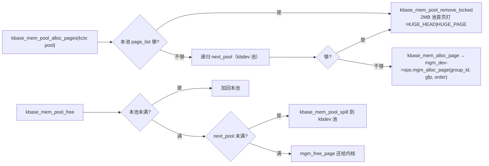

`kbase_alloc_phy_pages_helper`（`mali_kbase_mem.c:1124-1319`）的 2MB 策略：`nr_left >= 512` 且大页开启 → 先从 `large` 池整 2MB 拿；余量先扫 `kctx->mem_partials`（已拆开的 2MB 页，`mem_partials_lock`）用 `kbase_sub_alloc` 补（打 `FROM_PARTIAL`）；不足且无 partial 时再向 large 池要一个 2MB 拆开；最后不足 512 的尾巴从 `small` 池拿。失败回滚已成功部分。这样做的收益是 MMU 用 L2 大页项（第 7 章）减少 TLB miss。

物理页的实际分配/释放通过 **memory group manager**（`kbdev->mgm_dev->ops`：`mgm_alloc_page / mgm_free_page / mgm_vmf_insert_pfn_prot / mgm_update_gpu_pte`）；无平台 MGM 时用 `mali_kbase_native_mgm.c` 的默认实现（`:155-159`，`alloc_pages` 包装）。平台 MGM 可以把不同 `group_id` 映射到不同物理池（如 protected、特定 DDR 通道）并改写 PTE 高位（PBHA，见 6.7）。

页池有 shrinker（`kbase_mem_pool_init`，`mali_kbase_mem_pool.c:529-555`）：内存紧张时 `kbase_mem_pool_reclaim_scan_objects` 把空闲页还给内核。

### 6.3 `MEM_ALLOC` 完整流程

`kbase_api_mem_alloc_ex`（CSF；`core_linux.c:951-1041`）/ `kbase_api_mem_alloc`（JM，转调 `_ex`）先处理 FIXED/FIXABLE 互斥计数、64 位非 compat 强制 `SAME_VA`、CSF event 内存强制 `SAME_VA|CACHED_CPU|COHERENT_SYSTEM`，然后进入 `kbase_mem_alloc()`（`mali_kbase_mem_linux.c:297-500`）：

```mermaid
flowchart TD
  A["kbase_check_alloc_flags + 协调 COHERENT + kbase_check_alloc_sizes"] --> B["选 zone（6.1）"]
  B --> C["kbase_ctx_alloc_free_region：拿一个 region 结构（此时未入树）"]
  C --> D["kbase_update_region_flags：BASE_MEM_* → KBASE_REG_*、memattr、cache 属性"]
  D --> E["kbase_reg_prepare_native：建 cpu_alloc/gpu_alloc（NATIVE）"]
  E --> F["设 threshold_pages（GROW_ON_GPF）/ extension"]
  F --> G["kbase_alloc_phy_pages(reg, va_pages, commit_pages)<br/>= 6.2 的 helper；initial_commit = commit_pages"]
  G --> H["kbase_gpu_vm_lock_with_pmode_sync"]
  H --> I{"BASE_MEM_SAME_VA?"}
  I -->|是| J["从 kctx->cookies 位图取一位<br/>pending_regions[cookie] = reg<br/>返回 gpu_va = (cookie + PFN_DOWN(BASE_MEM_COOKIE_BASE)) << PAGE_SHIFT<br/>此时 GPU 页表未写"]
  I -->|否| K["计算对齐（大页 / 4GB 边界）<br/>kbase_gpu_mmap(kctx, reg, gpu_va, va_pages, align)<br/>= 写 PTE + kbase_add_va_region 入树，返回真实 GPU VA"]
  J -.->|用户随后 mmap(cookie)| L["kbase_context_mmap → kbasep_reg_mmap<br/>取 pending_regions[cookie]<br/>kbase_gpu_mmap 到 vma->vm_start（GPU VA == CPU VA）<br/>归还 cookie；kbase_cpu_mmap 建 CPU 侧"]
```

为什么 SAME_VA 要"先 cookie 后 mmap"：GPU VA 要等于 CPU VA，而 CPU VA 只有在 `mmap()` 时由内核 `get_unmapped_area` 决定（`kbase_context_get_unmapped_area`，`thirdparty/mali_kbase_mmap.c:407`，会按 2MB / GPU PC 位数 / 4GB 边界对齐），所以 ioctl 阶段只能先把 region 挂起来。

`kbase_gpu_mmap`（`mali_kbase_mem.c:315`）：ALIAS 类型走 `kbase_mmu_insert_aliased_pages`，否则 `kbase_mmu_insert_pages(_skip_status_update)`，然后 `kbase_add_va_region` 入 rbtree。

### 6.4 CPU 侧映射与惰性缺页

`kbase_cpu_mmap`（`mali_kbase_mem_linux.c:2499`）只建 vma、挂 `kbase_vm_ops`（`:2495-2497`：`open=kbase_cpu_vm_open`、`close=kbase_cpu_vm_close`、`fault=kbase_cpu_vm_fault`），**不预先填 CPU 页表**；CPU 首次访问触发 `kbase_cpu_vm_fault` → `mgm_dev->ops.mgm_vmf_insert_pfn_prot`（`:2478`）按需插 PFN。内核态需要读写 GPU 内存时用 `kbase_vmap / kbase_vmap_prot / kbase_vunmap`（`:3158-3265`）。

`kbase_cpu_vm_close`（`:2349`）→ `kbase_va_region_alloc_put`（`:2376`）递减 `va_refcnt`，归零才真正释放 region 与物理页。**这就是 SAME_VA 内存不能用 `MEM_FREE` 释放的原因**：`kbase_mem_free`（`mali_kbase_mem.c:934-995`）对 `SAME_VA_ZONE` 直接 `-EINVAL`（`:982-988`），必须 `munmap()`；对 cookie 区间的地址（还没 mmap 过的）则直接从 `pending_regions[]` 摘除归还 cookie。非 SAME_VA 走 `kbase_mem_free_region`（`:864-919`）：`no_user_free` 检查 → `DONT_NEED` 的先 `kbase_mem_evictable_unmake` → `kbase_gpu_munmap`（拆 PTE + 出树）→ CSF FIXED 计数递减 → `kbase_free_alloced_region`。

### 6.5 其它内存 ioctl

| ioctl | 函数 | 要点 |
|---|---|---|
| `MEM_COMMIT` | `kbase_mem_commit`（`mem_linux.c:2141`） | 对 GROWABLE native region 改变已提交页数：增 → `kbase_alloc_phy_pages_helper` + `kbase_mem_grow_gpu_mapping`（`:2094`）；减 → `kbase_mem_shrink`（`:2285`）拆 GPU/CPU 映射并还页 |
| `MEM_IMPORT` | `kbase_mem_import`（`:1956`） | `UMM`（dma-buf）→ `kbase_mem_from_umm`（`:1456`）：`dma_buf_get/attach`，`CONFIG_MALI_DMA_BUF_MAP_ON_DEMAND` 时延迟到 GPU 真正用时才 `kbase_mem_umm_map`（`:1323`）；`USER_BUFFER` → `kbase_mem_from_user_buffer`（`:1601`）：pin 用户页 + dma_map（状态机 `EMPTY→PINNED→DMA_MAPPED→GPU_MAPPED`，`mali_kbase_mem.h:303-309`）；导入内存强制 `SAME_VA`（64 位）、USER_BUFFER 必须 `CACHED_CPU` |
| `MEM_ALIAS` | `kbase_mem_alias`（`:1735`） | 把多个已存在 region 的片段按 stride 拼成一个新 GPU VA（ALIAS 类型），映射走 `kbase_mmu_insert_aliased_pages` |
| `MEM_FLAGS_CHANGE` | `kbase_mem_flags_change`（`:1069`） | 主要用于 `BASE_MEM_DONT_NEED` 开关 → `kbase_mem_evictable_make/unmake`（6.6）；UMM 的 coherency 变更走 `kbase_mem_flags_change_imported_umm` |
| `MEM_SYNC` | `kbase_sync_now` → `kbase_mem_do_sync_imported`（`:1147`） | 对导入内存做 `dma_sync_sg_for_device/cpu`；native cached 内存的 cache 维护 |
| `MEM_QUERY` | `kbase_api_mem_query` | 查 region 的 commit size / va size / flags |

### 6.6 内存压力：evictable 与 JIT

**Evictable**（`BASE_MEM_DONT_NEED`）：用户态告诉驱动"这块暂时不用，紧张时可以回收，但我可能还会用"。`kbase_mem_evictable_make`（`mem_linux.c:854-884`）：先 `kbase_mem_shrink_cpu_mapping` 拆 CPU 映射 → `gpu_alloc` 挂到 `kctx->evict_list`（`jit_evict_lock`）→ 页迁移下标 `NOT_MOVABLE` → `reg->flags |= KBASE_REG_DONT_NEED`。此时 GPU 映射还在，只是"允许被 shrinker 拿走"。`kbase_mem_evictable_init`（`:788-807`）注册的 shrinker `kbase_mem_evictable_reclaim_scan_objects`（`:727-786`）遍历 `evict_list`：`kbase_mem_shrink_gpu_mapping` 拆 GPU 映射 → `kbase_free_phy_pages_helper` 还页 → 标 `evicted` → `kbase_jit_backing_lost` 通知 JIT。用户再 `unmake`（`:886-945`）时若 `evicted` 则重新分配物理页 + `kbase_mem_grow_gpu_mapping`；否则只是把它摘下链表。

**JIT**（Just-In-Time 分配，给驱动内部的"临时 tiler/scratch 内存"）：`kbase_jit_init`（`mali_kbase_mem.c:2500`）建三条链表 `jit_active_head / jit_pool_head / jit_destroy_head`。

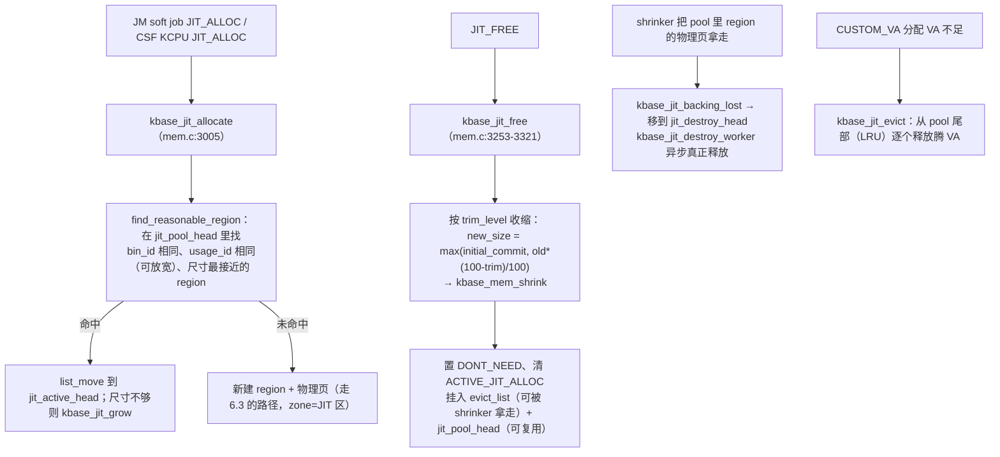

JIT 压力限制（`MALI_JIT_PRESSURE_LIMIT_BASE`）：`kbase_jit_trim_necessary_pages`（`:2874-2910`）按 `jit_phys_pages_limit` 计算需 trim 的页数并 `kbase_mem_jit_trim_pages`；`KCTX_JPL_ENABLED` 表示物理限制小于 VA 限制。JIT 相关 debugfs：`mem_jit_count / mem_jit_vm / mem_jit_phys / mem_jit_used / mem_jit_trim`（`:2411-2457`）。

### 6.7 页迁移、PBHA、GWT、cache 策略

- **页迁移**（`CONFIG_PAGE_MIGRATION_SUPPORT`，`mali_kbase_mem_migrate.c`）：让内核 compaction 能移动 GPU 正在用的页。每页有 `kbase_page_metadata`（`mali_kbase_mem.h:463-497`：`dma_addr`、`migrate_lock`、`status`、`vmap_count`、`group_id`），状态 `enum kbase_page_status`（`:428-438`）：`MEM_POOL / ALLOCATE_IN_PROGRESS / SPILL_IN_PROGRESS / NOT_MOVABLE / ALLOCATED_MAPPED / PT_MAPPED / FREE_IN_PROGRESS / FREE_ISOLATED_IN_PROGRESS / FREE_PT_ISOLATED_IN_PROGRESS`。`kbase_page_isolate / migrate / putback`（`:341,445,553`）通过 `movable_operations`（≥6.0）注册；`ALLOCATED_MAPPED` 页迁移时要改 GPU PTE（`kbase_mmu_migrate_page`），`PT_MAPPED` 页（页表本身）也可迁移。`kbase_mem_migrate_init`（`:662`）用 static key 开关。
- **PBHA**（Page-Based Hardware Attributes，`mali_kbase_pbha.c`）：从 DT 读 `kbase_pbha_read_dtb`（`:315`），`kbase_pbha_write_settings`（`:214`）把各功能块（`SYSC_ALLOC_ID_R_TILER_VERT / _MMU / _IC / _LSC` 等，`:35-50`）的 L2 分配策略（`SYSC_ALLOC_L2_ALLOC / NEVER_ALLOC / ALWAYS_ALLOC / PTL_ALLOC / L2_PTL_ALLOC`）写进 GPU 寄存器；PTE 中的 PBHA 位由 MGM 的 `mgm_update_gpu_pte` 填。L2 上电时重写（第 8 章 L2 状态机 `OFF→PEND_ON` 处调用）。
- **GWT**（GPU Write Tracking，`mali_kbase_gwt.c`，`CONFIG_MALI_CINSTR_GWT`）：`kbase_gpu_gwt_start`（`:63-95`）把 SAME_VA/CUSTOM_VA 里所有可写 region 通过 `kbase_mmu_update_pages` 改成只读，之后 GPU 写会触发 permission fault，fault handler 记录地址到 `gwt_current_list` 并恢复写权限；`CINSTR_GWT_DUMP` 读出。用于增量快照/调试。
- **cache 策略**（`mali_kbase_cache_policy.c:38-51`）：`kbase_cache_enabled(flags)`：无 `BASE_MEM_UNCACHED_GPU` → `KBASE_REG_GPU_CACHED`；`BASE_MEM_CACHED_CPU` → `KBASE_REG_CPU_CACHED`。一致性由 `SHARE_IN/SHARE_BOTH` + memattr 索引控制，与设备 `system_coherency`（ACE / ACE-Lite / NONE，第 7.5 节）配合。

### 6.8 锁

- `kctx->reg_lock`（mutex，`mali_kbase_defs.h:1938`）：`kbase_gpu_vm_lock/unlock`（`mali_kbase_mem.h:1409-1424`）保护 zone rbtree、region、`pending_regions`、cookies；CSF 下 `kbase_gpu_vm_lock_with_pmode_sync` 还持 `pmode_sync_sem` 读锁。注释（`:1367-1408`）特别警告：在非系统调用上下文（kworker）持此锁做大分配可能与 `kbase_cpu_vm_close`（也拿此锁）在 OOM killer 下死锁，要用 `__GFP_NORETRY`。
- `pool->pool_lock`（spinlock）：`cur_size` / `page_list`。
- `kctx->jit_evict_lock`（mutex）：`evict_list` 与三条 JIT 链表。
- `kctx->mem_partials_lock`（spinlock）：拆开的 2MB 页链表。
- JIT 分配路径在 JM 下要求持 `kctx->jctx.lock`，CSF 下 `csf.kcpu_queues.jit_lock`（`mali_kbase_mem.c:3258-3260` 的 lockdep 断言）。
- 与 MMU 的关系：`reg_lock` 在外，`mmut->mmu_lock` 在内（`kbase_gpu_mmap` 持 `reg_lock` 调 `kbase_mmu_insert_pages`，后者取 `mmu_lock`）。

---

## 7. MMU 与地址空间

MMU 子系统负责：**把 kctx 的页表写成 GPU 能走的格式、在正确时机让硬件 AS 指向它、并把 GPU 侧的缺页/总线错误变成"补页"或"杀作业"。** 文件：`mmu/mali_kbase_mmu.c`（页表操作、fault worker）、`mali_kbase_mmu_hw_direct.c`（AS 寄存器命令）、`mali_kbase_mmu_mode_aarch64.c`（PTE 编码）、`backend/mali_kbase_mmu_{jm,csf}.c`（中断入口与 kill 策略差异）。

### 7.1 页表格式

Midgard/AArch64 模式：**4 级**（`MIDGARD_MMU_LEVEL(0..3)`，`mali_kbase_defs.h:98-102`），每级 512 项（`KBASE_MMU_PAGE_ENTRIES`，`mmu/mali_kbase_mmu.h:28`），每项 8 字节，一页正好一级。`kbase_mmu_table`（`mali_kbase_defs.h:312-342`）：`pgd`（L0 物理地址）、`mmu_lock`（mutex）、`kctx`（MCU 页表为 NULL）、`group_id`、`scratch_mem`（teardown 逐级备份 + 待释放 PGD 列表）。

PTE 编码由 `struct kbase_mmu_mode` 的函数指针抽象（`mali_kbase_defs.h:634-647`：`update / get_as_setup / disable_as / pte_to_phy_addr / ate_is_valid / pte_is_valid / entry_set_ate / entry_set_pte / entries_invalidate / get_num_valid_entries / set_num_valid_entries`），AArch64 实现 `aarch64_mode`（`mmu_mode_aarch64.c:193-204`）：

| 位 | 含义（`mmu_mode_aarch64.c:28-41`） |
|---|---|
| bit1:0 | `ENTRY_IS_ATE_L3=3`（L3 有效叶子 4K）、`ENTRY_IS_ATE_L02=1`（L0–L2 有效叶子 = **大页**，L2 即 2MB）、`ENTRY_IS_PTE=3`（指向下一级）、`ENTRY_IS_INVAL=0` |
| bit4:2 | memattr 索引（`KBASE_REG_MEMATTR_VALUE(flags)<<2`），对应 `AS_MEMATTR` 里 8 个属性槽 |
| bit7:6 | `ENTRY_ACCESS_RW=1<<6` / `ENTRY_ACCESS_RO=3<<6`（AArch64 stage1 不支持只写） |
| bit9:8 | `SHARE_INNER_BITS` / `SHARE_BOTH_BITS`（`KBASE_REG_SHARE_IN/BOTH`） |
| bit10 | `ENTRY_ACCESS_BIT` |
| bit54 | `ENTRY_NX_BIT`（`KBASE_REG_GPU_NX`） |
| bit58:55 | 非叶子页表页里 `pgd[0..2]` 借这几位存"本页有效项数"（`get/set_num_valid_entries`，`:150-178`），用于快速判断能否释放该级页表 |

AS 寄存器 setup（`kbase_mmu_get_as_setup`，JM `mmu_jm.c:33-49` / CSF `mmu_csf.c:33-49`）：`transtab = pgd & AS_TRANSTAB_BASE_MASK`；`transcfg = AS_TRANSCFG_MODE_AARCH64_4K`；`memattr` 按索引拼 `IMPL_DEF_CACHE_POLICY / FORCE_TO_CACHE_ALL / WRITE_ALLOC / OUTER_IMPL_DEF / OUTER_WA / NON_CACHEABLE`（CSF 多一个 `SHARED`）。禁用 AS 时 `transtab=0`、`transcfg=UNMAPPED`（`:71-81`）。

### 7.2 插入、拆除、刷新

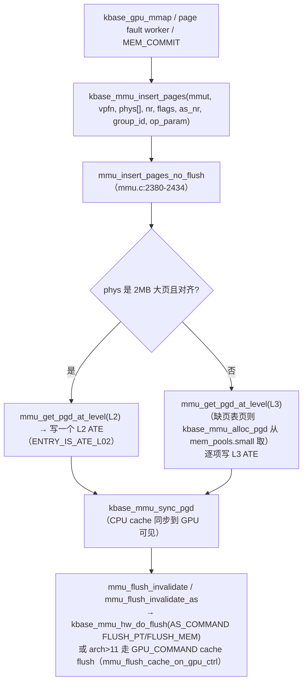

- `kbase_mmu_alloc_pgd`（`mmu.c:1447-1494`）：从 `kbdev->mem_pools.small[group_id]` 取一页、`entries_invalidate` 清空、计入 `kctx->used_pages`。
- `kbase_mmu_teardown_pages`（`:3094` → `mmu_teardown_pages :3011` → `kbase_mmu_teardown_pgd_pages :2839`）：清 ATE，若整级空了则回收页表页到 `free_pgds` 列表，最后 `kbase_mmu_free_pgd`（`:398-413`）还池。
- `kbase_mmu_update_pages`：只改 flags（GWT 改只读、`MEM_FLAGS_CHANGE`）。
- 刷新族（`:88-238`）：`mmu_flush_invalidate_as` 走 AS 命令；`mmu_flush_cache_on_gpu_ctrl` 在 `arch_major > 11` 时改用 `GPU_COMMAND_CACHE_CLN_INV_L2(_LSC)`；`kbase_mmu_flush_pa_range`（`:3802`，CSF）按物理范围刷。
- `kbase_mmu_update`（`:2606-2614`，需 `hwaccess_lock` + `mmu_hw_mutex`）→ `mmu_mode->update` → `kbase_mmu_hw_configure` 把 setup 写进 `AS_TRANSTAB/MEMATTR/TRANSCFG` 并 `AS_COMMAND_UPDATE`。`kbase_mmu_disable`（`:2626`）：CSF 下先 `kbase_mmu_hw_do_lock` 锁全区，若 L2 ON 则 `GPU_COMMAND_CACHE_CLN_INV_L2_LSC` 刷缓存，再禁 AS——保证被驱逐 kctx 的脏数据落地。
- **MCU 页表**：`kbdev->csf.mcu_mmu`，`as_nr = MCU_AS_NR = 0`（`csf/mali_kbase_csf_firmware.h:54`），固件镜像段与共享接口页都插在这棵表里（`mmu.c:1783`：`as_nr = mmut->kctx ? kctx->as_nr : MCU_AS_NR`）。**用户 kctx 因此只能用 AS 1..15**。

HW 命令层（`mmu_hw_direct.c`）：`kbase_mmu_hw_do_lock/unlock/flush`（`:431-565`）写 `AS_COMMAND_LOCK / UNLOCK / FLUSH_PT / FLUSH_MEM`；`lock_region()`（`:88-155`）把 `(vpfn, nr)` 编码成"最小自然对齐区间"写 `AS_LOCKADDR`；每条命令后 `wait_ready()`（`:167-190`）轮询 `AS_STATUS.ACTIVE`，超时（`MMU_AS_INACTIVE_WAIT_TIMEOUT`）则置 `mmu_unresponsive` 并触发 GPU 复位。CSF 命中 `BASE_HW_ISSUE_GPU2019_3901` 时 flush 前后要做 workaround（`:277-317`）。

### 7.3 Fault 处理

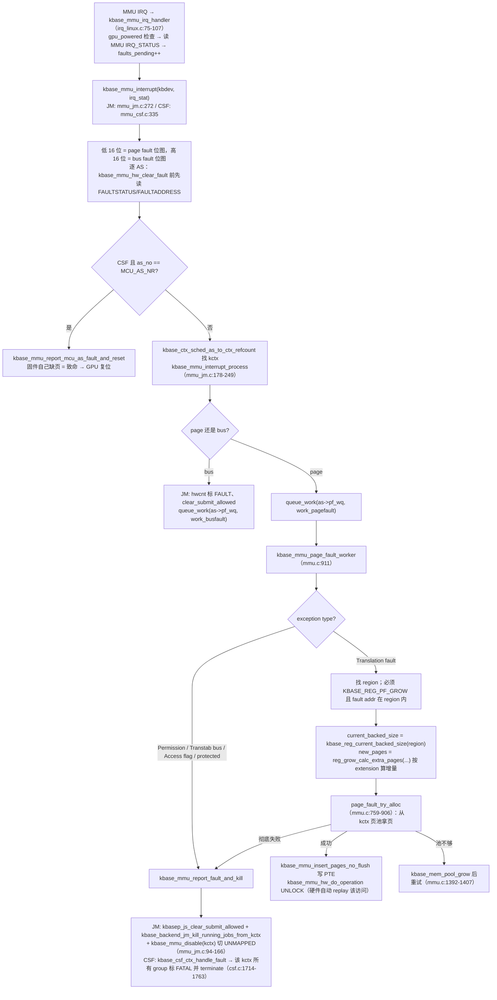

要点：

- 每个 AS 一个 `pf_wq`（`kbase_as.pf_wq`），page fault 与 bus fault 各一个 `work_struct`；`kbase_fault pf_data/bf_data` 记录 `addr / status / protected_mode`。fault 处理都在**进程上下文的 workqueue** 里做，因为要分配内存、拿 mutex。
- 只有 `KBASE_REG_PF_GROW` 的 region 才补页——这就是 growable tmem / JIT / CSF tiler heap 之外的"按需增长"基础。补页时用 `_no_flush` 版本插页表，因为 `UNLOCK` 命令会让 MMU 重放触发 fault 的访问，不需要额外 flush。
- Kill 策略后端不同：JM 只杀"正在跑的这个 kctx 的 job"并禁 AS，kctx 本身还能继续提交；CSF 则把该 kctx 的所有 queue group 标为 fatal error 并 terminate，用户态收到 `BASE_GPU_QUEUE_GROUP_ERROR_FATAL` 后自行重建。
- `KCTX_PAGE_FAULT_REPORT_SKIP` 用于进程退出期间抑制误报；`KCTX_AS_DISABLED_ON_FAULT` 让 ctx_sched 在 refcount 归零时彻底解绑 AS。

### 7.4 锁

`mmut->mmu_lock`（mutex，页表结构）> `kbdev->mmu_hw_mutex`（mutex，AS 寄存器序列）> `kbdev->hwaccess_lock`（spinlock，中断态可持）。`kbase_mmu_update` 要同时持后两把；`kbase_mmu_report_fault_and_kill`（JM）先 `mmu_hw_mutex` 再在内部拿 `hwaccess_lock`（`mmu_jm.c:150-159`）。上层 `kctx->reg_lock` 在 `mmu_lock` 之外。

### 7.5 L2/MMU 配置与一致性

- `kbase_set_mmu_quirks`（`backend/gpu/mali_kbase_l2_mmu_config.c:78-115`）：按 `product_model` 查 `limits[]` 表（tBEx / tTRx / tNAx / tGOx / tNOx 等）设置 `L2_MMU_CONFIG` 里 MMU 读写最大 outstanding 数；ACE 一致性时置 `ALLOW_SNOOP_DISPARITY`。写回在 `kbase_pm_hw_issues_apply`（第 8 章）。
- `kbase_cache_set_coherency_mode`（`backend/gpu/mali_kbase_cache_policy_backend.c:25-44`）：CSF 且 arch ≥ 12.0.1 写 `AMBA_ENABLE.COHERENCY_PROTOCOL`，否则写 `COHERENCY_ENABLE`；`kbase_amba_set_shareable_cache_support`（`:46-64`）。设备的 `system_coherency`（ACE / ACE_LITE / NONE）在 `kbase_device_coherency_init` 从 DT 读；它决定 `SHARE_BOTH` 内存是否真的能被 CPU/GPU 双方硬件一致地访问，以及 JM 下 `kbase_pm_cache_snoop_enable/disable`（通过 SMC 开关 CCI snoop，`mali_kbase_smc.c` 在本树的唯一调用者，`pm_driver.c:3224,3239`）。

---

## 8. 电源管理与频率

电源子系统分三层：**前端**（`mali_kbase_pm.c`：只维护"有多少人需要 GPU"的计数与 system suspend）→ **策略/后端**（`backend/gpu/mali_kbase_pm_backend.c` + `pm_policy.c` + `pm_ca.c`：决定"想要什么状态"）→ **驱动**（`mali_kbase_pm_driver.c`：三个状态机把"想要"变成寄存器写入）。旁边挂着频率（devfreq + metrics + IPA）、时钟跟踪、runtime PM 与平台回调。

### 8.1 从 active_count 到寄存器

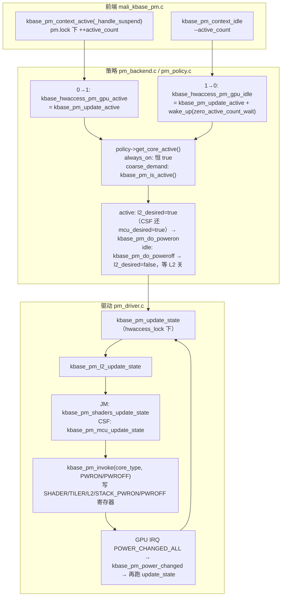

- `kbase_pm_context_active_handle_suspend()`（`mali_kbase_pm.c:55-107`）：arbiter 模式先问 `kbase_arbiter_pm_ctx_active_handle_suspend()`；若正在 suspend 按 `enum kbase_pm_suspend_handler`（`NOT_POSSIBLE / DONT_INCREASE / DONT_REACTIVATE / VM_GPU_GRANTED`）处理；`++active_count == 1` 时依次 `kbase_hwaccess_pm_gpu_active` → arbiter `REF_EVENT` → `kbase_clk_rate_trace_manager_gpu_active`。`kbase_pm_context_idle()`（`:111-138`）对称，归零时 `wake_up(zero_active_count_wait)`——`kbase_pm_driver_suspend` 就等这个。
- 谁在调 `context_active`：JM 是 `kbase_js_sched` 拉到有活的 kctx 时（`mali_kbase_js.c:3543-3565`）；CSF 是 scheduler 的 `scheduler_pm_active`（第 10 章）；还有 firmware 加载、复位、gpuprops 更新等短暂持有。
- 后端 `kbase_pm_do_poweron`（`pm_backend.c:225-251`）：`kbase_pm_clock_on()` → `kbase_pm_update_state()`；`kbase_pm_do_poweroff`（`:644-679`）：置 `mcu_desired/shaders_desired=false`、`l2_desired=false`、`poweroff_wait_in_progress=true`、`invoke_poweroff_wait_wq_when_l2_off=true`，然后只是 `kbase_pm_update_state()`——真正关时钟要等 L2 状态机走到 OFF，由 `gpu_poweroff_wait_wq` worker（`:372-412`）在 `pm.lock` 下 `kbase_pm_clock_off()`（若期间又有人 `poweron_required`，则重新拉起）。
- `kbase_pm_clock_on/off`（`pm_driver.c:2797-3000`）是与平台回调的接缝：`callback_power_on/resume` → `gpu_powered=true` → 需要时 `kbase_pm_init_hw` 复位 → 恢复 AS → `kbase_pm_enable_interrupts` → `gpu_ready=true`；关时先关中断、`kbase_synchronize_irqs`、若 `faults_pending` 非零则拒绝掉电（返回 false，让 worker 稍后重试）、`kbase_pm_cache_snoop_disable`、`gpu_ready=gpu_powered=false`、`callback_power_off`。

`kbase_pm_backend_data`（`mali_kbase_pm_defs.h:435-529`）里最值得记住的字段：`gpu_powered`（时钟开着，寄存器可访问）、`gpu_ready`（复位与中断都就绪，可提交）、`l2_state / shaders_state / mcu_state`、`l2_desired / shaders_desired / mcu_desired`、`shaders_avail / shaders_desired_mask`、`poweroff_wait_in_progress / poweron_required`、`hwcnt_desired / hwcnt_disabled`、`in_reset`、`protected_entry_transition_override`（JM）、CSF+RUNTIME 的 `gpu_sleep_supported / gpu_sleep_mode_active / exit_gpu_sleep_mode / gpu_wakeup_override / db_mirror_interrupt_enabled`、以及各 `callback_power_*` 指针。

### 8.2 三个状态机

**L2**（`mali_kbase_pm_l2_states.h:41-50`；实现 `kbase_pm_l2_update_state`，`pm_driver.c:1415-1776`）：

```
OFF → PEND_ON → [RESTORE_CLOCKS] → ON_HWCNT_ENABLE → ON
ON → ON_HWCNT_DISABLE → [SLOW_DOWN_CLOCKS] → POWER_DOWN → PEND_OFF → OFF
（任意态）→ RESET_WAIT
```

- `OFF` 且 `kbase_pm_is_l2_desired()` 且 `can_power_up_l2()`：CSF+RUNTIME 先 `kbase_ipa_control_handle_gpu_sleep_exit`；写 L2 config override、`kbase_pbha_write_settings`；`kbase_pm_invoke(L2, PWRON)` → `PEND_ON`。上电完成 → `kbase_pm_cache_snoop_enable` → `ON_HWCNT_ENABLE`（重新使能计数器）→ `ON`。
- `ON` 且不再需要 L2：JM 要等 shaders 全 OFF，CSF 要等 MCU 到 `OFF/IN_SLEEP` → `ON_HWCNT_DISABLE`（先禁计数器，`kbase_hwcnt_context_disable`）→ `POWER_DOWN`（`kbase_pm_invoke(L2, PWROFF)`；`l2_always_on` 时改为 `kbase_gpu_start_cache_clean_nolock`）→ `PEND_OFF` → `OFF`；OFF 后若 `invoke_poweroff_wait_wq_when_l2_off` 则排 `gpu_poweroff_wait_work`（`:1768-1773`）。
- `RESTORE/SLOW_DOWN_CLOCKS` 只在 `gpu_clock_slow_down_wa`（errata）时出现。

**Shader**（JM 专属，`mali_kbase_pm_shader_states.h:64-79`；`kbase_pm_shaders_update_state`，`:1850-2181`）：

```
OFF_CORESTACK_OFF → OFF_CORESTACK_PEND_ON → PEND_ON_CORESTACK_ON → ON_CORESTACK_ON
ON_CORESTACK_ON → ON_CORESTACK_ON_RECHECK → WAIT_OFF_CORESTACK_ON（起 shader_tick_timer）
  → WAIT_GPU_IDLE → WAIT_FINISHED_CORESTACK_ON → [L2_FLUSHING_CORESTACK_ON]
  → READY_OFF_CORESTACK_ON → PEND_OFF_CORESTACK_ON → OFF_CORESTACK_PEND_OFF → OFF_CORESTACK_OFF_TIMER_PEND_OFF → OFF_CORESTACK_OFF
```

关键机制：`ON_CORESTACK_ON_RECHECK` 发现 `shaders_desired_mask` 变小/为零时不立刻关，而是通知策略 `handle_event(IDLE)`、启动 `shader_tick_timer`（`stt->configured_ticks`，默认 `DEFAULT_PM_POWEROFF_TICK_SHADER=2` × `DEFAULT_PM_GPU_POWEROFF_TICK_NS=400µs`），tick 归零才继续关——这是"shader 掉电迟滞"，避免连续 job 之间反复上下电。命中 `BASE_HW_ISSUE_TTRX_921` 时关 shader 前要先 flush L2（`L2_FLUSHING_CORESTACK_ON`）。`corestack_driver_control`（`MALI_CORESTACK`）时 core stack 也由驱动上下电。

**MCU**（CSF 专属，`mali_kbase_pm_mcu_states.h:77-108`；`kbase_pm_mcu_update_state`，`:883-1267`）：

```
OFF → PEND_ON_RELOAD（kbase_csf_firmware_trigger_reload）→ ON_GLB_REINIT_PEND（kbase_csf_firmware_global_reinit）
  → [HCTL_SHADERS_PEND_ON → HCTL_CORES_NOTIFY_PEND]（host 控 shader 时）→ ON_HWCNT_ENABLE → ON
ON ↔ ON_CORE_ATTR_UPDATE_PEND（核掩码变化通知固件）
ON ↔ HCTL_MCU_ON_RECHECK → HCTL_CORES_DOWN_SCALE_NOTIFY_PEND → HCTL_CORE_INACTIVE_PEND → HCTL_SHADERS_CORE_OFF_PEND
ON → ON_HWCNT_DISABLE → ON_SLEEP_INITIATE → ON_PEND_SLEEP → IN_SLEEP（gpu_sleep_mode_active 时）
ON → ON_HWCNT_DISABLE → ON_HALT → ON_PEND_HALT → [HCTL_SHADERS_READY_OFF → HCTL_SHADERS_PEND_OFF] → POWER_DOWN → PEND_OFF → OFF
IN_SLEEP → ON_HWCNT_ENABLE（被唤醒：wait_mcu_as_inactive、enable_mcu_db_notification、关 DB mirror 中断）
（任意态）→ RESET_WAIT；CONFIG_MALI_CORESIGHT 下另有 ON_PMODE_ENTER/EXIT_CORESIGHT_* 
```

CSF 下 shader 由**固件**上下电（`GLB_REQ_CFG_PWROFF_TIMER` + `mcu_shader_pwroff_timeout`），驱动只在 `firmware_hctl_core_pwr`（host-control）模式下亲自写 `SHADER_PWRON/PWROFF`（`HCTL_*` 分支）。**GPU sleep**：MCU 收到 `GLB_REQ_SLEEP` 后停在 `IN_SLEEP`，L2 可以关，但 CSG 仍驻留 slot；用户敲 doorbell 时 `DOORBELL_MIRROR` GPU 中断唤醒（第 10 章）。

`kbase_pm_update_state()`（`:2250-2300`，`hwaccess_lock` 下）：先 L2 状态机；JM 再 shader（若 shader 刚全 OFF 则再跑一遍 L2）；CSF 再 MCU（若 MCU 刚变 inactive 再跑 L2）；达到期望态则 `wake_up(gpu_in_desired_state_wait)`。`kbase_pm_wait_for_desired_state / wait_for_l2_powered`（`:2486-2575`）都是"锁下再跑一次状态机 + `wait_event_timeout`"，超时 `kbase_pm_timed_out` 打印各状态。

`kbase_pm_init_hw()`（`:3391-3493`）是"复位并重新初始化 GPU"的统一入口（probe 首次上电、GPU reset、退出 protected mode 都走它）：确保时钟开 → 关中断 → `kbase_pm_do_reset`（`GPU_COMMAND_SOFT_RESET`，等 `RESET_COMPLETED` IRQ，超时 → `HARD_RESET`）→ 清 protected_mode → `PM_HW_ISSUES_DETECT` 时 `kbase_pm_hw_issues_detect`（读 DT quirks 或按 GPU 算 `hw_quirks_sc/tiler/mmu/gpu`）→ `kbase_pm_hw_issues_apply`（写 `SHADER_CONFIG / TILER_CONFIG / L2_MMU_CONFIG / JM_CONFIG 或 CSF_CONFIG`）→ 恢复 coherency 模式 → `PM_ENABLE_IRQS` 时开中断。

### 8.3 策略、核可用性、system suspend

- **策略**（`struct kbase_pm_policy`，`mali_kbase_pm_defs.h:608-678`：`init/term/shaders_needed/get_core_active/handle_event/id/pm_sched_flags`）只有两个：`always_on`（两函数恒 true；CSF 下 `pm_sched_flags = CORE_KEEP_ON | SCHED_IGNORE_IDLE | SCHED_NO_SUSPEND`，即 scheduler 不因 idle 而 suspend）与 `coarse_demand`（默认；`kbase_pm_is_active()`）。`kbase_pm_set_policy()`（`pm_policy.c:288-440`）切换：CSF 若新旧任一带 `CORE_KEEP_ON` 需先 `kbase_csf_scheduler_pm_suspend_no_lock` 挂起调度器并等 L2 OFF；然后假装 `context_active` → `pm.lock` 下 term 旧 init 新 → `kbase_pm_update_active` + `update_cores_state` → `context_idle` → CSF 恢复调度器。sysfs `power_policy` 写入即调它。
- **Core availability**（`mali_kbase_pm_ca.c`）：`kbase_pm_ca_get_core_mask()`（`:122-142`）= `shader_present & ca_cores_enabled & debug_core_mask`；`ca_cores_enabled` 由 devfreq 的 OPP `opp-core-mask` 通过 `kbase_devfreq_set_core_mask()`（`:52-109`）设置，CSF 下缩核还要 `kbase_pm_wait_for_cores_down_scale`；`debug_core_mask` 来自 sysfs `core_mask`。
- **System suspend**（`kbase_pm_driver_suspend`，`mali_kbase_pm.c:178-305`）：`kbase_kinstr_prfcnt_suspend` + `kbase_hwcnt_context_disable` → `pm.suspending=true` → JM `kbasep_js_suspend` / CSF `kbase_csf_scheduler_pm_suspend`（把 on-slot 组 suspend 到 suspend buffer）→ `wait_event(zero_active_count_wait, active_count==0)` → CSF `kbase_csf_kcpu_queue_halt_timers` → `kbase_hwaccess_pm_suspend`（走 poweroff）→ arbiter `vm_stopped`。resume 反向（`:307-341`）。**always_on 也会被 system suspend 关掉**。runtime PM（CSF）：`kbase_pm_handle_runtime_suspend()`（`pm_backend.c:1145-1263`）在 `scheduler.lock + pm.lock` 下确认无 active、无 poweroff 进行中、MCU 已 inactive（`IN_SLEEP` 则先 `pm_handle_mcu_sleep_on_runtime_suspend` 让 scheduler 处理），再 `kbase_pm_clock_off`。

### 8.4 频率：metrics → devfreq → OPP，IPA 给热

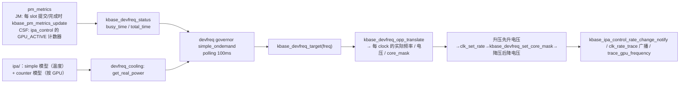

- **metrics**（`mali_kbase_pm_metrics.c`）：JM 在 `kbase_job_hw_submit` / `kbase_gpu_complete_hw` 时 `kbase_pm_metrics_update`（`:475-496`）按 slot 上 `SUBMITTED` 的 atom 分 GL/CL 累计忙时；CSF 通过 `kbase_ipa_control_register` 注册 `GPU_ACTIVE` 计数器会话（`:102-157`），`kbase_pm_get_dvfs_utilisation_calc`（`:184-286`）用 `kbase_ipa_control_query` 拿 active 周期与 protected 时间。`MALI_MIDGARD_DVFS` 时还有 hrtimer 周期调平台 `kbase_platform_dvfs_event`（devicetree 平台里是空壳恒返 1）。
- **devfreq**（`mali_kbase_devfreq.c`）：`kbase_devfreq_init`（`:608-733`）：`polling_ms=100`、governor `"simple_ondemand"`、`kbase_devfreq_init_core_mask_table` 解析 DT `operating-points-v2-mali` 的 `opp-hz / opp-hz-real / opp-microvolt / opp-core-mask`、`CONFIG_DEVFREQ_THERMAL` 下 `kbase_ipa_init` + `of_devfreq_cooling_register_power(&kbase_ipa_power_model_ops)`。`kbase_devfreq_target`（`:110-227`）见图。suspend/resume 通过 `devfreq_queue.workq` 异步。
- **IPA**（`ipa/`）：`kbase_ipa_init`（`mali_kbase_ipa.c:264-326`）先装 fallback `simple` 模型，再按 DT `ipa-model` 或 GPU ID 装 counter 模型。`kbase_get_real_power_locked`（`:604-676`）= 动态（`get_dynamic_coeff` × 频率/电压 × 忙比）+ 静态（温度缩放）。simple 模型（`ipa_simple.c`）后台线程每 200ms 读 thermal zone 温度。counter 模型：JM 有 `mali-g71/g72/g76/g52_r1/g51/g77/tbex/tbax-power-model`（`ipa_counter_jm.c:450-477`），CSF 有 `todx/tgrx/tvax/ttux/ttix/tkrx`（`ipa_counter_csf.c:236-242`）；JM 模型通过 hwcnt virtualizer 客户端取计数器，CSF 通过 `csf/ipa_control`（固件 IPA_CONTROL 寄存器，最多 `KBASE_IPA_CONTROL_MAX_SESSIONS` 个会话，掉电前手动 sample，复位视为一次掉电/上电）。
- **clk_rate_trace_mgr**（`backend/gpu/mali_kbase_clk_rate_trace_mgr.c`）：注册 clock notifier，频率变化或 GPU active/idle 时 `kbase_clk_rate_trace_manager_notify_all`（`:286-319`）→ 标准 ftrace `trace_gpu_frequency` + 遍历 listener（ipa_control、timeline）。arbiter 模式下换成 `arb_clk_rate_trace_ops`。
- **gpu_metrics**（`mali_kbase_gpu_metrics.c`，`CONFIG_MALI_TRACE_POWER_GPU_WORK_PERIOD`）：按 kctx（Android app uid）统计 GPU 活跃区间，每 `gpu_metrics_tp_emit_interval_ns`（默认 500ms）发 `trace_gpu_work_period` tracepoint，供 Android 电量归因。

---

## 9. JM 路径（Job Manager）

JM 的核心抽象是 **atom**：用户态把一个 job chain 的 GPU 地址（`jc`）、需求位（`core_req`）、最多两个依赖（`pre_dep[2]`）打包成 `base_jd_atom`，内核把它变成 `kbase_jd_atom` 放进 kctx 的 `jctx.atoms[]`（`BASE_JD_ATOM_COUNT` 个槽位，用户按 `atom_number` 索引），然后：**Job Dispatcher（jd）解依赖 → Job Scheduler（js）挑 kctx 与 atom → jm 踢到后端 ringbuffer → jm_hw 写 JS 寄存器 → JOB IRQ 回来沿原路完成**。

### 9.1 数据结构

- `kbase_jd_atom`（`jm/mali_kbase_jm_defs.h:508-616`）：`status`（`KBASE_JD_ATOM_STATE_UNUSED → QUEUED → IN_JS → HW_COMPLETED → COMPLETED`）、`core_req`（`BASE_JD_REQ_FS/CS/T/V`、`ONLY_COMPUTE`、`SOFT_JOB`、`DEP`（纯依赖）、`EXTERNAL_RESOURCES`、`EVENT_ONLY_ON_FAILURE/NEVER/COALESCE`、`START/END_RENDERPASS`…）、`dep[2]`（`kbase_jd_atom_dependency{atom, dep_type}`，`dep_type` 只允许 `BASE_JD_DEP_TYPE_ORDER` / `DATA`）、`dep_head[2]` / `dep_item[2]`（反向链表：谁依赖我）、`gpu_rb_state`、`atom_flags`（`KBASE_KATOM_FLAG_BEEN_SOFT_STOPPED / BEEN_HARD_STOPPED / X_DEP_BLOCKED / FAIL_BLOCKER / JSCTX_IN_TREE / PROTECTED / HOLDING_L2_REF_PROT …`，`:74-97`）、`sched_priority`（`KBASE_JS_ATOM_SCHED_PRIO_REALTIME=0 / HIGH / MED / LOW`，`jm/mali_kbase_js_defs.h:172-186`；与用户 `BASE_JD_PRIO_*` 的映射表 `mali_kbase_js.c:61-73`）、`slot_nr`、`x_pre_dep / x_post_dep`（跨槽依赖）、`renderpass_id`（增量渲染）、`protected_state`、`event_code`、`softjob_data`、`fence`。
- `kbase_jd_context`（`:802-822`）：`lock`（**jctx.lock**）、`atoms[BASE_JD_ATOM_COUNT]`、`renderpasses[]`、`job_done_wq`、`zero_jobs_wait`、`job_nr`、`jit_atoms_head / jit_pending_alloc`、`max_priority`。
- `kbasep_js_device_data`（`jm/mali_kbase_js_defs.h:295-365`，`kbdev->js_data`）：`runpool_irq`（`submit_allowed` 位图、`ctx_attr_ref_count[]`、`slot_affinities[]`；`hwaccess_lock` 保护）、`schedule_sem`、`ctx_list_pullable[3][prio] / ctx_list_unpullable[3][prio]`、`nr_user/all_contexts_running`、`js_reqs[3]`、`scheduling_period_ns`（默认 100ms）、`soft_stop_ticks(_cl)`（1）、`hard_stop_ticks_ss/cl/dumping`（50/50/15000）、`gpu_reset_ticks_ss/cl/dumping`（55/55/15020）、`queue_mutex`、`runpool_mutex`。
- `kbasep_js_kctx_info`（`:394-404`，`kctx->jctx.sched_info`）：`jsctx_mutex`、`nr_jobs`、`ctx_attr_ref_count[]`、`is_scheduled_wait`、`ctx_list_entry[3]`。
- `jsctx_queue`（`kctx->jsctx_queue[prio][slot]`）：`runnable_tree`（rbtree，按 age 排）+ `x_dep_head`。
- `slot_rb`（`backend/gpu/mali_kbase_defs.h:71-80`）：`entries[SLOT_RB_SIZE=2]`、`read_idx/write_idx`、`last_kctx_tagged`（判断是否需要 flush L1）、`job_chain_flag`——**每个 job slot 最多 2 个 atom 在硬件侧排队**（`JS_HEAD` 当前 + `JS_HEAD_NEXT` 下一个），这就是 GPU 能"背靠背"跑 job 的机制。

### 9.2 提交：`JOB_SUBMIT` → 上槽

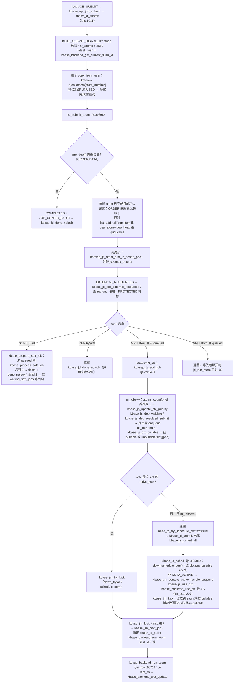

`kbase_js_pull()`（`js.c:2655-2735`，`hwaccess_lock` 下）挑 atom 的规则：`submit_allowed` 位图允许该 kctx；`jsctx_rb_peek` 取该 slot 该 prio 的 `runnable_tree` 队首；`kbase_jsctx_slot_prio_is_blocked`（更高优先级 atom 被 soft-stop 时低优先级不许拉）；`atomic_read(&katom->blocked)`；`kbase_js_atom_blocked_on_x_dep`（跨槽依赖未解则不拉，增量渲染 `END_RENDERPASS` 有例外）；成功后置 `KCTX_PULLED` / `KCTX_PULLED_SINCE_ACTIVE_JSn`。

`kbase_js_sched` 决定"哪个 kctx 上哪个 AS"时用的是 `ctx_list_pullable[slot][prio]` 的 FIFO 顺序 + `js_ctx_scheduling_mode`（`KBASE_JS_SYSTEM_PRIORITY_MODE`：跨进程按 atom 优先级抢占；`PROCESS_LOCAL_PRIORITY_MODE`：只在同进程内按优先级），AS 不够时 `kbase_backend_find_and_release_free_address_space`（`jm_as.c:121-205`）去抢一个 refcount==1 的非特权 kctx 的 AS。

### 9.3 后端 ringbuffer 状态机与硬件提交

`kbase_backend_slot_update()`（`jm_rb.c:861-1069`）对每个 slot 的两个 entry 按 `gpu_rb_state` 推进（`jm/mali_kbase_jm_defs.h:284-293`）：

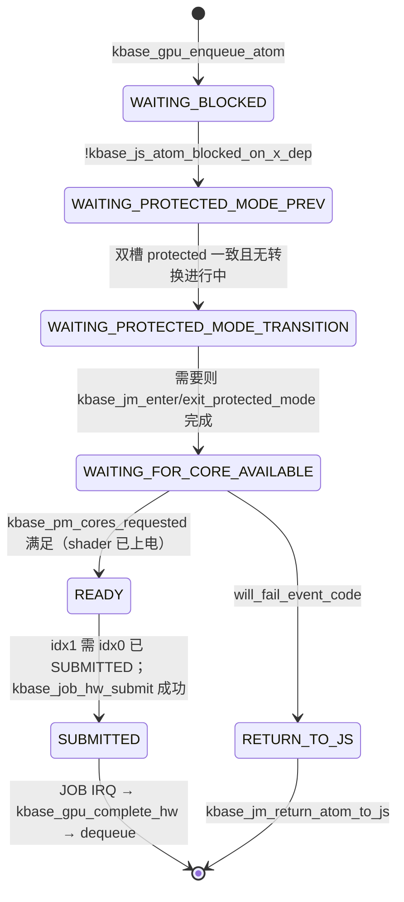

`kbase_job_hw_submit()`（`jm_hw.c:195-315`）：写 `JS_HEAD_NEXT`（jc）→ `JS_AFFINITY_NEXT`（`kbase_job_write_affinity`，按 core_req / `limited_core_mask` / ctx attr）→ 拼 `JS_CONFIG_NEXT`：`ENABLE_FLUSH_REDUCTION`（HW 支持时）、start flush 策略（同 kctx 连续提交且 `SKIP_CACHE_START` → `START_FLUSH_NO_ACTION`；换 kctx → `START_FLUSH_INV_SHADER_OTHER` / `CLEAN_INVALIDATE`）、end flush（`SKIP_CACHE_END` → `NO_ACTION`，否则 `CLEAN` / `CLEAN_INVALIDATE`）、`THREAD_PRI(8)`、protected 或 `END_RENDERPASS` 时 `DISABLE_DESCRIPTOR_WR_BK`、`job_chain_flag` 每次翻转 → 写 `JS_FLUSH_ID_NEXT`（`latest_flush`）→ **`JS_COMMAND_NEXT = JS_COMMAND_START`**。同时 `kbase_pm_metrics_update` 记忙、打 timeline `TL_ATTRIB_ATOM_CONFIG`。

### 9.4 完成、软停、硬停、抢占

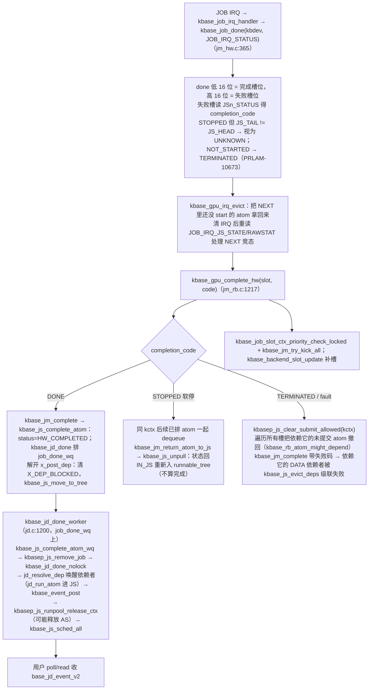

**超时与停止**（`js_backend.c:74-246` 的 `timer_callback`，周期 `scheduling_period_ns`=100ms，仅有可运行 kctx 时运行）：对每个 slot 的队头 atom 计 `ticks`：达到 `soft_stop_ticks`（1 tick）→ `kbase_job_slot_softstop_swflags`（写 `JS_COMMAND_SOFT_STOP_0/1`，硬件在下一个安全点停下，atom 以 `STOPPED` 回来重排——**这就是时间片**）；达到 `hard_stop_ticks`（5s；dumping 时 1500s）→ `kbase_job_slot_hardstop`（`JS_COMMAND_HARD_STOP_0/1`，atom 以 `TERMINATED` 失败）；达到 `gpu_reset_ticks`（5.5s）→ `kbase_prepare_to_reset_gpu_locked + kbase_reset_gpu_locked`。`_0/_1` 后缀由 `job_chain_flag` 决定，保证只停目标 atom 不误伤 NEXT。sysfs `js_timeouts` 可改这些 tick 数。

**优先级抢占**：`kbase_job_slot_ctx_priority_check_locked()`（`jm_hw.c:713-741`）在新高优先级 atom 到来时对槽上低优先级在跑 atom 发 soft-stop；`kbase_jsctx_slot_prio_is_blocked` 保证被停的低优先级不会马上又被拉上去。

**Protected mode**（`kbase_jm_enter_protected_mode`，`jm_rb.c:596-758`）：`CHECK`（无并发转换、GPU 上无其它 atom）→ `HWCNT`（原子式禁计数器）→ `IDLE_L2`（ACE 平台等 L2 空闲）→ `SET_COHERENCY`（`kbase_gpu_disable_coherent`）→ `FINISHED`（`protected_ops->protected_mode_enable` 写 `GPU_COMMAND_SET_PROTECTED_MODE`）。退出（`:760-844`）：`CHECK → IDLE_L2 → RESET → RESET_WAIT`——**退出 protected mode 靠 GPU 复位**。protected atom 不允许被 soft-stop（`jm_hw.c:587-597`）。

**GPU 复位后**（`kbase_backend_reset`，`jm_rb.c:1399`）：`gpu_rb_state < SUBMITTED` 且 kctx 未 dying 的 atom 留在 rb 稍后重提；已 SUBMITTED 的以 `JOB_CANCELLED` 完成。复位流程本身见第 11 章。

### 9.5 Soft job、fence、事件

Soft job 是"由 CPU 在 atom 依赖图里执行的节点"（`mali_kbase_softjobs.c`）。类型（`kbase_process_soft_job` 的 switch，`:1470-1523`）：`DUMP_CPU_GPU_TIME`、`FENCE_TRIGGER`（signal 一个 sync_file）、`FENCE_WAIT`（等 dma_fence）、`EVENT_WAIT / SET / RESET`（用户内存里的软事件字节）、`DEBUG_COPY`、`JIT_ALLOC / JIT_FREE`、`EXT_RES_MAP / UNMAP`。三阶段：`kbase_prepare_soft_job`（提交时：建 sync_file fd、取 fence 引用、JIT prepare）→ `kbase_process_soft_job`（依赖满足时执行；返回 1 表示仍阻塞：`FENCE_WAIT` 已 `dma_fence_add_callback`，`EVENT_WAIT` 挂 `waiting_soft_jobs`）→ `kbase_finish_soft_job`（完成时清理）。

- **fence**（`mali_kbase_fence.c` / `sync_file.c`）：`kbase_sync_fence_out_create` = `kbase_fence_out_new`（`dma_fence_init(kbase_fence_ops, katom->dma_fence.context, seqno)`）+ `sync_file_create` + `fd_install`；`kbase_sync_fence_in_wait`（`sync_file.c:176-228`）`dma_fence_add_callback(kbase_fence_wait_callback)`，fence 已 signal 则立即返回 0；回调里为避免死锁把完成工作投到 `job_done_wq`（`kbase_sync_fence_wait_worker`）。`STREAM_CREATE` ioctl 只是 `anon_inode_getfd` 一个 timeline 占位 fd。
- **soft job 超时**：`kctx->soft_job_timeout` 定时器 → `kbasep_soft_job_timeout_worker`（`:371-412`）：`EVENT_WAIT` 超时直接 `JOB_CANCELLED`；`FENCE_WAIT` 在 `CONFIG_MALI_FENCE_DEBUG` 下打印诊断（`DEFAULT_JS_SOFT_JOB_TIMEOUT` 3s，sysfs `soft_job_timeout`）。`SOFT_EVENT_UPDATE` ioctl → `kbase_soft_event_update` 让用户态 signal 一个软事件。
- **事件**（`mali_kbase_event.c`）：`kbase_event_post`（`:162-212`）按 `EVENT_ONLY_ON_FAILURE / EVENT_NEVER / EVENT_COALESCE` 过滤合并后入 `event_list` + `kbase_event_wakeup`；`kbase_event_dequeue` 取出后 `kbase_event_process` 把 atom 置回 `UNUSED`（用户此后才能复用该 `atom_number`）；`kbase_event_close`（`POST_TERM`）后合成 `DRV_TERMINATED`。
- **kinstr_jm**（`mali_kbase_kinstr_jm.c`）：`KINSTR_JM_FD` 给用户态一个 fd，atom 的 `queue → start → stop → complete` 状态变化流式推送（Perfetto/Streamline 用）。
- **dummy_job_wa**（`mali_kbase_dummy_job_wa.c`）：`BASE_HW_ISSUE_TTRX_3485` 勘误——shader 上电后必须先跑一个哑 job（固件 `valhall-1691526.wa`），`kbase_pm_invoke(SHADER, PWRON)` 时由 `kbase_dummy_job_wa_execute`（`:114-195`）在屏蔽 IRQ 下直接写 `JS_HEAD_NEXT/CONFIG_NEXT` 并轮询 `JOB_IRQ_RAWSTAT`。
- **disjoint**（`mali_kbase_disjoint_events.c`）：GPU 复位 / protected 转换期间 `kbase_disjoint_state_up/down`，期间提交/完成的 atom 计入 `disjoint_event.count`，用户 `DISJOINT_QUERY` 读出，用于判断性能计数是否可信。
- **debug_job_fault**（`mali_kbase_debug_job_fault.c`）：`job_fault` debugfs 打开时，失败 atom 完成前先抓寄存器快照 `kbase_job_fault_get_reg_snapshot` 并阻塞该 kctx 直到用户态读完 dump。

### 9.6 上下文销毁与 zap

`kbase_jd_zap_context`（`jd.c:1512-1546`）：`kbase_js_zap_context`（标 `KCTX_DYING`；未调度的 kctx 直接从 `ctx_list_entry` 摘下并对每个 atom `kbase_jd_cancel`；已调度的禁提交、等它自然退出 runpool，在跑的 atom 由 `kbase_job_slot_hardstop` 打掉）→ 取消 `waiting_soft_jobs` → `kbase_jm_wait_for_zero_jobs`（`ZAP_TIMEOUT` 1000ms 等 `job_nr==0`，再等 `is_scheduled_wait`）。这是第 3.5 节 close 流程里 `kbase_context_flush_jobs` 做的事。

---

## 10. CSF 路径（Command Stream Frontend）

CSF 把"CPU 每次塞一个 atom"改成"**用户态往 GPU 可见的 ring buffer 写命令并敲门铃，GPU 内的 MCU 固件自己拉流执行**"。内核不再看见单个命令，它管的是：

1. **固件**：把 `mali_csffw.bin` 装进 MCU 地址空间、启动 MCU、通过共享内存页与固件对话（`csf/mali_kbase_csf_firmware.c`）；
2. **对象**：`kbase_queue`（一条命令流）绑到 `kbase_queue_group`（CSG，一组最多 32 条流 + 资源需求 + 优先级）（`csf/mali_kbase_csf.c`）；
3. **调度**：把最多 256 个 group/kctx 轮流放到 ≤31 个硬件 CSG slot 上，处理 idle / sync wait / protected mode / 睡眠（`csf/mali_kbase_csf_scheduler.c`，1.2 万行）；
4. **CPU 侧同步**：KCPU queue 执行 fence / CQS / JIT / import 命令，把 CPU 世界接进 GPU 同步图（`csf/mali_kbase_csf_kcpu.c`）；
5. **兜底**：tiler heap OOM 补 chunk、fault/fatal 上报、复位、trace/log/core dump。

### 10.1 固件与共享接口

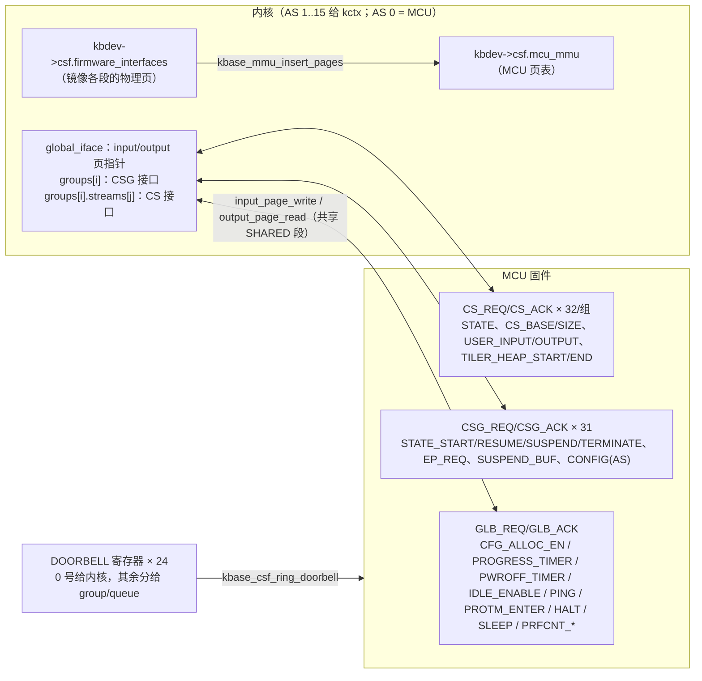

- **加载**（`kbase_csf_firmware_load_init`，`firmware.c:2291-2412`，第一次 `open()` 时由 `kbase_device_firmware_init_once` 触发）：申请 MCU AS（`MCU_AS_NR=0`）→ `kbase_mmu_init(mcu_mmu)` → `request_firmware("mali_csffw.bin")`（模块参数 `fw_name`，DT 可用 `firmware-name` 覆盖）→ 校验 magic `0xC3F13A6E` 与版本 → 逐条 `load_firmware_entry`：`INTERFACE`（内存段：`parse_memory_setup_entry` 按 flags RD/WR/EX/CACHE/SHARED/ZERO/PROTECTED 分配页——`PROTECTED` 走 `kbase_csf_protected_memory_alloc`——拷入数据并插入 `mcu_mmu`）、`CONFIGURATION`（可调参数 → sysfs `firmware_config/`）、`TRACE_BUFFER`、`TIMELINE_METADATA`、`BUILD_INFO_METADATA`、`FUNC_CALL_LIST`、`CORE_DUMP` → `setup_shared_iface_static_region` → trace buffers init → 等 L2 上电 → `load_mmu_tables` → **`boot_csf_firmware`**（写 `MCU_CONTROL=AUTO`，等 `event_wait` 上 `interrupt_received`，超时 `CSF_FIRMWARE_BOOT_TIMEOUT`）→ `parse_capabilities`（读 GLB/CSG/CS 的 features、`group_num`、`stream_num`、`suspend_size`、`prfcnt_size`）→ doorbell 映射 → `kbase_csf_scheduler_init`（**建调度器内核线程**）→ dummy user reg 页 → timeout → **`global_init_on_boot`** → fw log / cfg / core dump。
- **`global_init()`**（`:1744-1783`）：`enable_endpoints_global`（shader 核掩码）→ `set_shader_poweroff_timer` → `set_timeout_global`（progress timeout）→ `enable_gpu_idle_timer` → 写 `GLB_ACK_IRQ_MASK` → 敲内核 doorbell。此后 GLB 层的每次请求都是"翻 `GLB_REQ` 里对应位 → 敲 doorbell → 等 `GLB_ACK` 同位翻转"（`wait_for_global_request`，超时 `kbdev->csf.fw_timeout_ms`）。
- **MCU 控制**：`kbase_csf_firmware_trigger_mcu_halt`（`GLB_REQ_HALT`，须无 on-slot CSG）、`disable_mcu`（`MCU_CONTROL=DISABLE`）、`enable_mcu`（`AUTO`，方便退出 protected mode 时自动重启）、`trigger_mcu_sleep / is_mcu_in_sleep`（`GLB_REQ_SLEEP`）、`ping_wait`（`GLB_REQ_PING`）、`kbase_csf_enter_protected_mode`（`GLB_REQ_PROTM_ENTER`）+ `wait_protected_mode_enter`（等 ACK 后再轮询 `GPU_STATUS.PROTECTED_MODE_ACTIVE`，失败则复位）。这些都由第 8 章 MCU 状态机和第 10.4 节调度器调用。
- **doorbell**：`CSF_NUM_DOORBELL=24`，0 号 `CSF_KERNEL_DOORBELL_NR` 给内核；`kbase_csf_ring_csg_doorbell / ring_cs_kernel_doorbell` 先翻 `CSG_DB_REQ` / `CS_DB_REQ` 位再敲；用户态敲的是 mmap 出去的 doorbell 页（`kbase_csf_ring_cs_user_doorbell` 用 `queue->doorbell_nr`）。
- **no_mali**（`firmware_no_mali.c`）：8 CSG × 8 CSI 的内存内假固件，同名函数替身，让无 GPU 环境也能跑上层逻辑。

### 10.2 用户态视角：建组、建队列、绑定、kick

```mermaid
sequenceDiagram
  participant U as 用户态
  participant K as csf.c
  participant S as scheduler（mali-gpuq-kthread）
  participant FW as MCU 固件
  U->>K: CS_QUEUE_GROUP_CREATE(cs_min, priority, masks…)
  K->>K: kbase_csf_queue_group_create（csf.c:1288）<br/>校验 → create_queue_group：分配 handle、优先级映射、<br/>normal/protected suspend buffer、csg_reg 绑定
  U->>K: MEM_ALLOC ring buffer + mmap
  U->>K: CS_QUEUE_REGISTER(buffer_gpu_addr, size, priority)
  K->>K: csf_queue_register_internal（csf.c:428）<br/>region 必须 NATIVE、size 在 region 内 → kzalloc kbase_queue，reg->user_data=queue
  U->>K: CS_QUEUE_BIND(group_handle, csi_index)
  K->>K: kbase_csf_queue_bind（csf.c:687）<br/>bound_queues[csi]=queue；bind_state=BIND_IN_PROGRESS<br/>返回 mmap_handle（cookie + BASEP_MEM_CSF_USER_IO_PAGES_HANDLE）
  U->>K: mmap(mmap_handle) → kbase_csf_cpu_mmap_user_io_pages
  K->>K: kbase_csf_alloc_command_stream_user_pages（csf.c:277）<br/>2 页 input/output（KBASEP_NUM_CS_USER_IO_PAGES）+ doorbell 页；bind_state=BOUND
  U->>U: 往 ring buffer 写命令，写 input 页 insert 指针
  U->>K: CS_QUEUE_KICK(buffer_gpu_addr)
  K->>K: kbase_csf_queue_kick（csf.c:889）：找 queue；pending_kick++；<br/>挂 kbdev->csf.pending_gpuq_kick_queues[group_priority]；<br/>complete(scheduler.kthread_signal)
  Note over K: ioctl 返回，很短
  S->>S: handle_pending_queue_kicks → kbase_csf_process_queue_kick<br/>→ kbase_csf_scheduler_queue_start（10.4）
  S->>FW: 组已在 slot：program_cs + 敲 CS doorbell<br/>组不在 slot：insert_group_to_runnable，触发 tock/tick 抢 slot
  U->>FW: 之后直接敲用户 doorbell 即可，不必再 ioctl
  FW-->>K: CS/CSG 事件（IRQ）：idle、sync update、fault、tiler OOM…
```

要点：

- **kick 不是提交命令，是"这条 queue 有活了"**。真正让 MCU 开始消费的是 `CS_REQ_STATE_START` + doorbell；此后用户态只要更新 input 页并敲 doorbell，内核完全不参与。
- 本树的 kick 走 **`pending_gpuq_kick_queues[prio]` 链表 + 调度器内核线程 `mali-gpuq-kthread`**（`scheduler.c:6786`），不是老版本的 `pending_submission_worker`。`kbase_csf_process_queue_kick`（`csf.c`）在 `kbase_reset_gpu_prevent_and_wait` + `kctx->csf.lock` 下调 `kbase_csf_scheduler_queue_start`，`-EBUSY` 时把 queue 放回链表尾再唤醒 kthread 重试。
- 每个 kctx 最多 `MAX_QUEUE_GROUP_NUM=256` 个 group、每组 `MAX_SUPPORTED_STREAMS_PER_GROUP=32` 条 queue（实际由固件 `stream_num` 决定）、`KBASEP_MAX_KCPU_QUEUES=256` 个 KCPU queue。
- group 的 `run_state`（`csf_defs.h:175-183`）：`INACTIVE`（刚建）→ `RUNNABLE`（在 kctx 的 `runnable_groups[prio]` 上）↔ `IDLE`（on-slot 但固件报 idle）/ `SUSPENDED`（被换下 slot，状态在 suspend buffer）/ `SUSPENDED_ON_IDLE` / `SUSPENDED_ON_WAIT_SYNC`（等 sync object，在 `idle_wait_groups`）→ `FAULT_EVICTED` / `TERMINATED`。
- `CS_QUEUE_GROUP_TERMINATE` → `term_queue_group`（`csf.c:1424`）：`kbase_csf_scheduler_group_deschedule`（on-slot 则同步 terminate slot）→ `kbase_csf_term_descheduled_queue_group`（解绑 queues、释放 suspend buffer、`TERMINATED`）。`CS_QUEUE_TERMINATE` → `kbase_csf_queue_terminate`（`:630-668`）：解绑并 `kbase_csf_scheduler_queue_stop`，`wait_pending_queue_kick` 等在途 kick，`release_queue`。

### 10.3 user I/O 页与 user register 页

每条 bound queue 有 **2 页 user I/O**（input：用户写 insert 指针等；output：固件写 extract 指针、状态），由内核从 `mem_pools.small` 分配，`kernel_map_user_io_pages` 后 CPU 映射给用户，GPU 侧通过 **MCU 共享区**（`mali_kbase_csf_mcu_shared_reg.c`，`kbdev->csf.scheduler.mcu_regs_data`）映射进 MCU VA——组上 slot 时 `kbase_csf_mcu_shared_group_bind_csg_reg` 把该组的 suspend buffer 与各 queue 的 I/O 页绑到预分配的 `csg_reg` 区间（`nr_csg_regs = MCU_SHARED_REGS_PREALLOCATE_SCALE × group_num`），下 slot 时解绑换回 dummy 页。所以 **user I/O 页只有组在 slot 上时固件才真的能访问**。

**user register 页**（`BASEP_MEM_CSF_USER_REG_PAGE_HANDLE`）：把 GPU 的 `LATEST_FLUSH` 寄存器页 mmap 给用户，用户态每次提交前读它来决定 cache flush 策略；GPU 掉电时内核换成 dummy 页（`kbase_csf_setup_dummy_user_reg_page`，`csf.c:3214`，写入 `POWER_DOWN_LATEST_FLUSH_VALUE`），避免用户态访问已掉电的寄存器。

### 10.4 调度器：一个内核线程、tick/tock、slot 状态

**线程模型**（本树的关键设计）：`kbase_csf_scheduler_kthread`（`scheduler.c:6722-6764`，`kthread_run` 命名 `"mali-gpuq-kthread"`）等 `kthread_signal` completion，醒来后按固定顺序处理：

```
handle_pending_sync_update_works   ← CQS/sync 值变化，重新评估 SUSPENDED_ON_WAIT_SYNC 的组
handle_pending_protm_requests      ← CS 报 PROTM_PEND，评估进 protected mode
handle_pending_kcpuq_commands      ← 优先级进程的 KCPU 命令
handle_pending_queue_kicks         ← 10.2 的 kick（按 prio 0..3 取，高优先级组 kick 后若有 pending tock 顺手做 tock）
if pending_tick_work: schedule_on_tick   （tick 覆盖 tock）
elif pending_tock_work: schedule_on_tock
while pending_gpu_idle_work: gpu_idle_worker
wake_up_all(csf.event_wait)
```

`kbase_csf_scheduler_invoke_tick / invoke_tock`（`scheduler.h:545,565`）只是 `atomic_cmpxchg(pending_*_work, false, true)` + `complete(kthread_signal)`。**tick** 来自 hrtimer `tick_timer`（`tick_timer_callback`，周期 `csg_scheduling_period_ms = CSF_SCHEDULER_TIME_TICK_MS = 100ms`，sysfs `csg_scheduling_period` 可改），代表"时间片到了，全面重排"；**tock** 是事件驱动的"局部重排"（新 group 变 runnable、slot 变 idle、高优先级 kick 等）。

**`schedule_actions(kbdev, is_tick)`**（`:5393-5527`）：

```mermaid
flowchart TD
  A["kbase_csf_scheduler_wait_mcu_active"] --> B{"protected mode 使用中?"}
  B -->|是| B1["跳过 idle slot 更新；若 kbdev->protected_mode 异常态则整体跳过"]
  B -->|否| C["scheduler_handle_idle_slots：读 CSG_STATUS 更新每个 on-slot 组 IDLE/RUNNABLE，填 csg_slots_idle_mask<br/>keep_lru_on_slots 为真则直接返回（无变化不动 slot）"]
  C --> D{"is_tick?"}
  D -->|是| E["scheduler_rotate：top_grp 移到其 kctx 该 prio 链表尾；top_kctx 移到 runnable_kctxs 尾<br/>（时间片轮转的实现）"]
  D -->|否| F
  E --> F["scheduler_prepare（:5157）：清 groups_to_schedule；<br/>按 prio REALTIME→LOW、先 prioritized kctx 后普通 kctx 遍历 runnable_kctxs<br/>scheduler_ctx_scan_groups 收集 privileged/active/idle 三类<br/>scheduler_scan_group_list 依次并入，赋 prepared_seq_num；首个为 top_kctx/top_grp<br/>set_max_csg_slots"]
  F --> G{"ngrp_to_schedule == 0 但仍有 runnable?"}
  G -->|是| H["enqueue_gpu_idle_work → 可能 suspend/sleep"]
  G -->|否| I{"top_grp == active_protm_grp?"}
  I -->|是| J["继续跑 protected 组；scheduler_check_pmode_progress 看有没有超时"]
  I -->|否| K["scheduler_apply：对 groups_to_schedule 前 N 个<br/>已驻留 → update_csg_slot_priority（改 CSG_EP_REQ.priority，翻 EP_CFG）<br/>未驻留 → 找空 slot 或 suspend_queue_group 一个更低优先级驻留组（CSG_REQ_STATE_SUSPEND，wait_csg_slots_suspend）<br/>→ program_csg_slot"]
  K --> L["若之前有 protm 组 → scheduler_force_protm_exit<br/>wait_csg_slots_start；wait_csg_slots_finish_prio_update"]
  L --> M{"top_grp 有 PROTM_PEND?"}
  M -->|是| N["scheduler_group_check_protm_enter（10.6）"]
  M -->|否，且仍有 non_idle_offslot_grps| O["prepare_fast_local_tock：有新空 slot 则回到 prepare 再来一轮（只一次）"]
  N --> P["evict_lru_or_blocked_csg"]
  O --> P
```

**`program_csg_slot`**（`:2898-3070`）是"把一个组放上硬件"的全部动作：`kbase_csf_mcu_shared_group_bind_csg_reg`（10.3）→ `kbase_ctx_sched_retain_ctx`（**这里拿 AS**）→ `interrupt_lock` 下 `csg_inuse_bitmap` 置位、`csg_slots[slot].resident_group=group`、`group->csg_nr=slot` → `assign_user_doorbell_to_group` → 对每条 bound queue `program_cs`（写 `CS_BASE/SIZE/USER_INPUT/USER_OUTPUT/CONFIG(doorbell,prio)/ACK_IRQ_MASK`，`CS_REQ_STATE_START` + 内核 doorbell）→ 写 `CSG_ALLOW_COMPUTE/FRAGMENT/OTHER`、`CSG_EP_REQ`（endpoint 数 + priority）、`CSG_CONFIG`（**AS 号**）、`CSG_SUSPEND_BUF`、`CSG_PROTM_SUSPEND_BUF`、`CSG_DVS_BUF`、`CSG_ACK_IRQ_MASK` → `CSG_REQ_STATE_RESUME`（曾 suspend）或 `START` + CSG doorbell → slot 状态 `READY2RUN` → `kbase_csf_tiler_heap_reclaim_sched_notify_grp_active`（10.7）→ `kbase_csf_mcu_shared_set_group_csg_reg_active`。

slot 状态（`csf_defs.h:207-215`）：`READY → READY2RUN（已发 START/RESUME）→ RUNNING（固件 ACK）→ DOWN2STOP（已发 SUSPEND/TERMINATE）→ STOPPED`，超时分别 `READY2RUN_TIMEDOUT / DOWN2STOP_TIMEDOUT`。`halt_csg_slot(group, suspend)`（`:2060-2103`）发 `CSG_REQ_STATE_SUSPEND` 或 `TERMINATE`；suspend 时固件把组的全部上下文写进 `normal_suspend_buf`（大小 `groups[0].suspend_size`），下次 `RESUME` 恢复——**这就是 CSF 的上下文切换**，比 JM 的"等 atom 跑完"细得多。

**调度器状态**（`SCHED_BUSY`：正在 tick，slot 不可动；`SCHED_INACTIVE`：空闲允许 in-cycle 调整；`SCHED_SUSPENDED`：不持 PM 引用；`SCHED_SLEEPING`：GPU sleep，组仍驻留）。`kbase_csf_scheduler_queue_start`（`:1884-1959`）：`SCHED_BUSY` 时 `-EBUSY`；`FAULT_EVICTED` 组 `-EIO`；否则 `scheduler_group_schedule`（`:3244-3312`）按 `run_state` 把组插回 runnable、`non_idle_offslot_grps++`、`scheduler_wakeup`；若组已在 slot 且 queue 已 enabled 只敲用户 doorbell，否则 `onslot_csg_add_new_queue` → `program_cs`。最后启动 `ping_work`（`firmware_aliveness_monitor`：只有 1 个活跃 CSG 时定期 `kbase_csf_firmware_ping_wait`，失败复位）。

### 10.5 idle、sync wait、睡眠

- **CSG idle**：固件在组无事可做时翻 `CSG_ACK.IDLE`；`process_csg_interrupts`（`csf.c:2634-2731`）置 `csg_slots_idle_mask`，若有非 idle 的 off-slot 组则 `invoke_tock`（让等待者上来）。
- **sync wait**：queue 因 `CS_STATUS_WAIT`（等某个 GPU 内存里的 sync object 达到某值）阻塞时，`save_slot_cs`（`:2245`）在 suspend 时记下 `sync_ptr / sync_value / status_wait`；组进入 `SUSPENDED_ON_WAIT_SYNC` 挂 `idle_wait_groups`；用户 `CS_EVENT_SIGNAL` 或 KCPU `CQS_SET` 触发 `kbase_csf_event_signal` → `check_group_sync_update_cb`（`scheduler.c:6537` 注册）→ `handle_pending_sync_update_works` → `evaluate_sync_update`（`:2404`，按 GT/GE/LE 读内存比较）满足则移回 runnable。
- **GPU idle 事件**：固件 `GLB_ACK.IDLE_EVENT` → `kbase_csf_scheduler_process_gpu_idle_event`（`:797-848`）→ `enqueue_gpu_idle_work` → `gpu_idle_worker`（`:5002-5052`）：`scheduler_idle_suspendable` 判定（所有 on-slot 组 idle、无 non-idle off-slot 组、策略允许、`gpu_no_longer_idle` 未置）→ 支持 sleep 且有活跃 CSG → `scheduler_sleep_on_idle`（`SCHED_SLEEPING`，`scheduler_pm_idle_before_sleep` 放 PM 引用，MCU 走 `IN_SLEEP`），否则 `scheduler_suspend_on_idle`（`suspend_active_groups_on_powerdown` 把 on-slot 组全 suspend 到 buffer → `SCHED_SUSPENDED`）。`gpu_idle_hysteresis_ns` / sysfs `idle_hysteresis_time` 控制固件多久报 idle。
- **runtime suspend**（`kbase_csf_scheduler_handle_runtime_suspend`，`:7150-7194`）：sleep 态下 Linux runtime PM 真要掉电时，再把组 suspend 到 buffer；若仍有非 idle 组则设 `exit_gpu_sleep_mode` 并 `invoke_tick`，中止本次 suspend。用户 doorbell 在 sleep 中触发 `DOORBELL_MIRROR` GPU 中断 → `kbase_pm_disable_db_mirror_interrupt + invoke_tick` 唤醒。
- **`kbase_csf_scheduler_pm_active/idle`**（`:7075-7099`）：`pm_active_count` 0↔1 时才真正 `kbase_pm_context_active/idle`——调度器对 PM 前端只算一个用户。

### 10.6 Protected mode

CS 命令要进 protected 执行时翻 `CS_ACK.PROTM_PEND`（`process_cs_interrupts`，`csf.c:2507-2607`）→ 记 `protm_pending_bitmap`、`tick_protm_pending_seq` → `kbase_csf_scheduler_enqueue_protm_event_work` → `handle_pending_protm_requests` → `kbase_csf_scheduler_group_protm_enter`（`:6231`）→ `scheduler_group_check_protm_enter`（`:4132-4229`）：仅当该组是 `top_grp`、on-slot `RUNNING`、`scheduler_slot_protm_ack` 成功清掉 CSI 的 PROTM_PEND ack 时，`active_protm_grp=group` → `kbase_csf_enter_protected_mode`（GLB_REQ_PROTM_ENTER）→ `wait_protected_mode_enter`。protected 期间只跑这一个组，`schedule_actions` 看到 `top_grp == active_protm_grp` 就不动 slot；更高优先级组到来 → `scheduler_force_protm_exit`（ping + 等 `PROTM_EXIT`，超时复位）。`GPU_PROTECTED_FAULT` GPU 中断 → 组 fatal + 复位（`device_hw_csf.c:87-125`）。`CSF_SCHED_PROTM_PROGRESS_TIMEOUT` 限制 protected 驻留时长。

### 10.7 KCPU queue

KCPU queue 是"跑在 CPU 上的命令流"，与 GPU queue 用同一套 sync 原语（CQS = GPU 内存里的 64 位值）互相等待，替代 JM 的 soft job。

- 结构 `kbase_kcpu_command_queue`（`kcpu.h:297-322`）：`commands[KBASEP_KCPU_QUEUE_SIZE=256]` 环、`start_offset / num_pending_cmds`、`work`（普通 kctx 用 `kcpu_wq`）/ `high_prio_work`（prioritized 进程由 scheduler kthread 处理）、`cqs_wait_count`、`fence_context / fence_seqno`、`jit_blocked`、`has_error`、`fence_timeout`（debug）、`fence_signal_timeout`。
- 命令类型：`FENCE_WAIT / FENCE_SIGNAL / CQS_WAIT / CQS_SET / CQS_WAIT_OPERATION / CQS_SET_OPERATION / ERROR_BARRIER / MAP_IMPORT / UNMAP_IMPORT / UNMAP_IMPORT_FORCE / JIT_ALLOC / JIT_FREE / GROUP_SUSPEND`（`kcpu.c:2094-2294`）。
- `KCPU_QUEUE_ENQUEUE`（`kbase_csf_kcpu_queue_enqueue`，`:2475-2645`）：一次只收 1 条（`nr_commands==1`）；先 `kcpu_queues.lock` 找 queue 再 `queue->lock`（防与 delete 竞争的 UAF）；空间不够 `-EBUSY` + `enqueue_failed=true`；按类型 `*_prepare`（如 `kbase_kcpu_fence_wait_prepare` 取 fence 引用、`cqs_wait_prepare` 首次注册 `kbase_csf_event_wait_add(event_cqs_callback)`、`jit_allocate_prepare`）；然后**立即** `kbase_csf_kcpu_queue_process(queue, false)` 同步处理。
- `kbase_csf_kcpu_queue_process`（`:2081-2333`）按序处理，遇阻塞停下：`FENCE_WAIT` → `dma_fence_add_callback(kbase_csf_fence_wait_callback)`，回调 `enqueue_kcpuq_work` 重新触发；`CQS_WAIT` 不满足 → 等 `kbase_csf_event_signal` 的回调；`JIT_ALLOC` `-EAGAIN` → 挂 `jit_blocked`，`JIT_FREE` 后 `kbase_kcpu_jit_retry_pending_allocs`；`CQS_SET` 写 `evt[VAL]++`、`evt[ERR]=has_error` 后 `kbase_csf_event_signal_notify_gpu`（敲 GLB doorbell 让固件重评估 CS wait）；`ERROR_BARRIER` 清 `has_error`；`MAP/UNMAP_IMPORT` → `kbase_sticky_resource_acquire/release`；`GROUP_SUSPEND` → 把组 suspend buffer 拷给用户。`FENCE_SIGNAL` 有超时监控（`KCPU_FENCE_SIGNAL_TIMEOUT`，debugfs `fence_signal_timeout_ms`），`FENCE_WAIT` 在 `CONFIG_MALI_FENCE_DEBUG` 下 3s 打印诊断。

### 10.8 Tiler heap 与 OOM

CSF 下 tiling 用的堆由内核按需扩：

- `CS_TILER_HEAP_INIT` → `kbase_csf_tiler_heap_init`（`tiler_heap.c:663-828`）：从 `kbase_csf_heap_context_allocator`（`heap_context_alloc.c`：一次 `kbase_mem_alloc` 一块 `MAX_TILER_HEAPS × 32B` 的固件 heap context 区，`sub_alloc` 位图分配）拿 `heap->gpu_va` → `create_initial_chunks`（每个 chunk 一个 region，chunk 头 64 字节里写"下一个 chunk 地址|大小"，`link_chunk` 串成固件可遍历的链）。
- **OOM**：固件在 tiler 内存不够时翻 `CS_ACK.TILER_OOM` → `process_cs_interrupts` 排 `queue->oom_event_work` → `oom_event_worker` → `kbase_queue_oom_event`（`csf.c:2004-2065`）→ `handle_oom_event`：从 CS output 页读 `CS_HEAP_ADDRESS`、`VT_START/VT_END/FRAG_END` 算 in-flight 渲染数 → `kbase_csf_tiler_heap_alloc_new_chunk`（`tiler_heap.c:925`，三段式：锁下校验 `nr_in_flight ≤ target_in_flight && chunk_count < max_chunks` → 放锁分配 → 重锁复核后 `init_chunk` 链入）→ 写 `CS_TILER_HEAP_START/END` 为新 chunk 地址、翻 `CS_REQ.TILER_OOM` 确认 + doorbell。失败但组允许增量渲染（`BASE_CSF_TILER_OOM_EXCEPTION_FLAG` 且 `pending_frag_count==0`）→ 回 0 让固件走 incremental rendering；`-EBUSY` 也回 0 等现有渲染完成；其它错误 → `term_queue_group` + `report_tiler_oom_error`。
- **回收**（`tiler_heap_reclaim.c`）：shrinker 挂在 `scheduler.reclaim_mgr`；组上 slot 时 `notify_grp_active` 把 kctx 移出候选，全部 off-slot 时 `notify_grp_suspend` 加入；`scan` 时先 `kbase_gpu_start_cache_clean` 保证 chunk 头落盘，再沿 heap context 的 free list 释放未用 chunk 的物理页（保留 `HEAP_SHRINK_STOP_LIMIT` 个）。

### 10.9 中断、事件、错误、复位

**JOB IRQ**（`kbase_csf_interrupt`，`csf.c:3002-3106`，`hwaccess_lock` 下）：`JOB_IRQ_STATUS` 的低位每一位对应一个 CSG slot，`JOB_IRQ_GLOBAL_IF` 位对应 GLB。

```
逐 CSG 位 → process_csg_interrupts（scheduler interrupt_lock 下）
   CSG_ACK vs CSG_REQ 差异：SYNC_UPDATE（kbase_csf_handle_csg_sync_update：gpu_no_longer_idle）
                          IDLE（csg_slots_idle_mask；有 off-slot 非 idle 组则 invoke_tock）
                          PROGRESS_TIMER_EVENT（handle_progress_timer_event：组超时 → fatal）
   → process_cs_interrupts：逐 CS 位
        CS_ACK FATAL → handle_fatal_event；FAULT → handle_fault_event（cs_error_work 上报）
        （组正在 suspend 则忽略以下，恢复时固件会重报）
        CS_REQ TILER_OOM → queue->oom_event_work；PROTM_PEND → protm_pending_bitmap
GLB 位 → interrupt_received=true；固件 reload 中则 kbase_csf_firmware_reload_completed
        否则：check_protm_enter_req_complete；PROTM_EXIT → process_protm_exit；
              IDLE_EVENT → 延后到循环外 kbase_csf_scheduler_process_gpu_idle_event（避免与 CSG IDLE 竞争）；
              FATAL → handle_glb_fatal_event；process_prfcnt_interrupts（hwcnt 采样/阈值/溢出）
        kbase_pm_update_state
最后 wake_up_all(csf.event_wait)
```

**GPU IRQ**（`device_hw_csf.c:78-181`）多出：`GPU_PROTECTED_FAULT`（protm 组 fatal + 复位）、`DOORBELL_MIRROR`（sleep 中被敲门 → 唤醒）、`MCU_STATUS_GPU_IRQ`（MCU 状态变化 → `wake_up_all(event_wait)`，PM 状态机等这个）。

**事件与错误通道**（`mali_kbase_csf_event.c`）：`kbase_csf_event_signal(kctx, notify_gpu)`（`:109-149`）= `event_count=1` + `kbase_event_wakeup`（用户 poll 醒来）+ 可选 `sync_update_notify_gpu`（敲 GLB doorbell）+ 遍历 `callback_list`（KCPU CQS wait、scheduler sync update 都注册在这里）。错误用 `kbase_csf_event_add_error`（`:206-232`）挂 `error_list`，`read()` 时 `kbase_csf_event_read_error` 取出（类型 `BASE_CSF_NOTIFICATION_GPU_QUEUE_GROUP_ERROR`：`FATAL / TIMEOUT / TILER_OOM`…；`CPU_QUEUE_DUMP` 请求）。`kbase_csf_add_group_fatal_error`（`csf.c:1584`）、`kbase_csf_ctx_handle_fault`（`:1714-1763`，MMU/GPU fault → 该 kctx 所有组 terminate + fatal）。`csf_fault` debugfs（`mali_kbase_debug_csf_fault.c`）打开时，fault 路径先 `kbase_debug_csf_fault_notify` 并 `wait_completion` 等用户态 dump 完再继续。

**复位**（`mali_kbase_csf_reset_gpu.c`）见第 11.4 节；这里只记 scheduler 侧：`kbase_csf_scheduler_reset`（`:5876-5926`）先尝试 `suspend_active_queue_groups_on_reset`（把 on-slot 组 suspend 保住状态），失败则遍历 `kctx_list` 对每个 kctx `kbase_csf_active_queue_groups_reset`（组标 terminated），最后 `scheduler_inner_reset`。

### 10.10 观测与调试文件

`fw_traces / fw_trace_enable_mask / fw_trace_mode / fw_trace_poll_period_ms`（固件 log ring buffer，`firmware_log.c`）、`csf_tl_poll_interval_in_ms`（`tl_reader.c`：每 200ms 把固件 timeline buffer 搬进 tlstream 的 `TL_STREAM_TYPE_CSFFW`）、`fw_core_dump`、`groups / active_groups`（`csg.c`：先 `kbase_csf_csg_update_status` 让固件刷新 CSG/CS 状态再打印）、`kcpu_queues`、`csf_sync`（GPU/KCPU 两侧的 sync 等待状态）、`cpu_queue`（请求用户态 dump 其 CPU 侧命令队列，3s 超时）、`tiler_heaps`、`scheduling_timer_enabled / scheduling_timer_kick / scheduler_state`、`fence_signal_timeout_enable / _ms`、`csf_fault`；sysfs `csg_scheduling_period / fw_timeout / progress_timeout / idle_hysteresis_time(_ns) / mcu_shader_pwroff_timeout(_ns) / add|remove_prioritized_process / firmware_config/*`。

---

## 11. 硬件访问、中断与复位

### 11.1 寄存器访问：regmap

所有 MMIO 经 `hw_access/`。`kbase_regmap_init()`（`hw_access/mali_kbase_hw_access.c:94-118`）在 `kbase_device_early_init` 里按 `GPU_ID` 的 arch 版本调用 `kbase_regmap_backend_init()`：JM 是链式 `kbase_regmap_v6_0_init → v6_2 → v7_0 → v7_2 → v9_0 → v9_2`（`regmap/mali_kbase_regmap_jm.c:34-2243`，高版本复用低版本再增删），CSF 是 `v10_8 → v10_10 → v11 → v12`（`regmap_csf.c:34-1146`）。结果是一张 **枚举 → 偏移 + 权限/宽度 flags** 的查找表（`kbdev->regmap.regs[] / flags[]`，`KBASE_REGMAP_PERM_READ/WRITE`、`WIDTH_32/64_BIT`）。调用方用 `kbase_reg_read32/64(kbdev, GPU_CONTROL_ENUM(GPU_ID))` 这样的枚举，`kbase_reg_is_valid`（`:46-49`）让同一份代码在不存在该寄存器的 GPU 上安全跳过。真硬件实现在 `backend/mali_kbase_hw_access_real_hw.c`（`readl/writel`），`MALI_NO_MALI` 时 `backend/mali_kbase_hw_access_model_linux.c:43-131` 把读写转给 `midgard_model_read_reg/write_reg`（`backend/gpu/mali_kbase_model_dummy.c` 软件模拟寄存器与中断，`model_linux.c:74-104` 用 workqueue 注入 IRQ 并复用真实 handler）。`regs_history` debugfs（`MALI_DEBUG`）记录最近 N 次寄存器访问。

### 11.2 三路中断

```mermaid
flowchart TD
  I["硬件 IRQ 线：JOB / MMU / GPU（kbase_get_irqs 从 DT 取，kbase_install_interrupts request_irq）<br/>kbase_handler_table[]（irq_linux.c:177-181）"] --> J{"哪一路?"}
  J -->|JOB| J1["kbase_job_irq_handler（:40-73）<br/>!gpu_powered → IRQ_NONE<br/>读 JOB_IRQ_STATUS"]
  J1 -->|JM| J2["kbase_job_done（9.4）"]
  J1 -->|CSF| J3["kbase_csf_interrupt（10.9）"]
  J -->|MMU| M1["kbase_mmu_irq_handler（:75-107）<br/>faults_pending++；读 MMU IRQ_STATUS"]
  M1 --> M2["kbase_mmu_interrupt（7.3）"]
  J -->|GPU| G1["kbase_gpu_irq_handler（:110-151）<br/>读 GPU_IRQ_STATUS"]
  G1 --> G2["kbase_gpu_interrupt<br/>JM: device_hw_jm.c:53-104 / CSF: device_hw_csf.c:78-181"]
  G2 --> G3["GPU_FAULT → kbase_report_gpu_fault<br/>RESET_COMPLETED → kbase_pm_reset_done<br/>PRFCNT_SAMPLE_COMPLETED → kbase_instr_hwcnt_sample_done（JM）<br/>CLEAN_CACHES_COMPLETED → kbase_clean_caches_done<br/>POWER_CHANGED_ALL（CSF 还含 MCU_STATUS_GPU_IRQ）→ kbase_pm_power_changed → 状态机<br/>CSF: GPU_PROTECTED_FAULT → 复位；DOORBELL_MIRROR → 唤醒；MCU_STATUS_GPU_IRQ → wake_up(event_wait)"]
```

单中断线平台用 `kbase_combined_irq_handler`（`:163-175`）依次调三个。`kbase_synchronize_irqs`（`:486-495`）在掉电/复位前保证 handler 跑完；`kbase_set_custom_irq_handler`（`MALI_DEBUG`，`:195-229`）给 KUTF irq 测试替换 handler；`kbase_validate_interrupts`（`:413`）在 debug 构建的 `backend_late_init` 里自测三条线是否接对。所有 handler 第一件事是查 `pm.backend.gpu_powered`——GPU 没电时寄存器不可读，直接 `IRQ_NONE`。

### 11.3 时间与超时

`backend/gpu/mali_kbase_time.c`：`kbase_backend_get_gpu_time`（JM 先 `kbase_pm_request_gpu_cycle_counter` 再读 `CYCLE_COUNT` + `TIMESTAMP`）；`kbase_backend_time_init` 建立 CPU↔GPU 时间戳偏移。**超时统一按频率缩放**：`kbase_timeout_scaling_init`（`:225-259`）把 `mali_kbase_config_defaults.h` 里以 100MHz 为基准的 `*_CYCLES` 常量按 `lowest_gpu_freq_khz` 换算成毫秒填 `device_scaled_timeouts[]`，`kbase_get_timeout_ms(selector)`（`:261-269`）查表。selector（CSF `csf_defs.h:289-309` / JM `jm_defs.h:143-152`）：`CSF_FIRMWARE_TIMEOUT`（7.5G cycles ≈ 75s@100MHz）、`CSF_PM_TIMEOUT`（≈2.5s）、`CSF_GPU_RESET_TIMEOUT`（≈62s）、`CSF_CSG_SUSPEND_TIMEOUT`（≈31s）、`CSF_CSG_TERM_TIMEOUT`（≈1s）、`CSF_FIRMWARE_BOOT_TIMEOUT`（≈0.25s）、`CSF_FIRMWARE_PING_TIMEOUT`（≈6s）、`CSF_SCHED_PROTM_PROGRESS_TIMEOUT`、`MMU_AS_INACTIVE_WAIT_TIMEOUT`、`KCPU_FENCE_SIGNAL_TIMEOUT`（≈10s）、`KBASE_PRFCNT_ACTIVE_TIMEOUT`、`KBASE_CLEAN_CACHE_TIMEOUT`、`KBASE_AS_INACTIVE_TIMEOUT`、`IPA_INACTIVE_TIMEOUT`、`CSF_FIRMWARE_STOP_TIMEOUT`（≈120s）；JM 的 `JM_DEFAULT_JS_FREE_TIMEOUT`。JM 复位超时是毫秒常量 `JM_DEFAULT_RESET_TIMEOUT_MS=3000`（sysfs `reset_timeout`）。

### 11.4 GPU 复位：JM 与 CSF 两套框架

触发源：JS 超时（`gpu_reset_ticks`）、MMU `wait_ready` 超时（`mmu_unresponsive`）、MCU AS fault、固件 ping 失败、protected mode 进入/退出失败、`GPU_PROTECTED_FAULT`、hwcnt 不可恢复错误、debugfs `reset`。统一入口 `kbase_prepare_to_reset_gpu(_locked)(flags)` + `kbase_reset_gpu(_locked)()`；静默版本 `kbase_reset_gpu_silent()`。

| | JM（`backend/gpu/mali_kbase_jm_hw.c`） | CSF（`csf/mali_kbase_csf_reset_gpu.c`） |
|---|---|---|
| 状态 | 宏 `KBASE_RESET_GPU_NOT_PENDING / PREPARED / COMMITTED / HAPPENING / SILENT`（`backend/gpu/mali_kbase_defs.h:112-126`） | `enum kbase_csf_reset_gpu_state`：`NOT_PENDING / PREPARED / COMMITTED / HAPPENING / COMMITTED_SILENT / FAILED` |
| prepare | `cmpxchg(NOT_PENDING→PREPARED)`；`kbase_disjoint_state_up`；对每个 slot `kbase_job_slot_softstop`（`:1264-1292`） | `cmpxchg(NOT_PENDING→PREPARED)`；`HWC_UNRECOVERABLE_ERROR` 时先通知 hwcnt；唤醒 PM 等待者 |
| commit | `PREPARED→COMMITTED`；起 `reset_timer`（`reset_timeout_ms`）等 softstop 生效；`kbasep_try_reset_gpu_early` 若 GPU 已空闲提前做 | 直接 `queue_work(reset.workq, reset.work)` |
| 互斥 | 无"prevent"机制（`kbase_reset_gpu_prevent_and_wait` 等在 JM 是 `WARN` 桩，`:947-977`）；靠 `hwaccess_lock` + 状态检查 | **`reset.sem` 读写信号量**：复位线程 `down_write`；任何要碰 GPU 的路径先 `kbase_reset_gpu_prevent_and_wait()`（`down_read`，`:96-112`）/ `try_prevent`，完事 `kbase_reset_gpu_allow()`（`up_read`）。lockdep 可查死锁 |
| worker | `kbasep_reset_timeout_worker`（`:1015-1188`）：`kbase_hwcnt_context_disable` → 取消 timer → `context_active` → `kbase_pm_reset_start_locked` + 关中断 → `kbase_synchronize_irqs` + `kbase_flush_mmu_wqs` → dump 寄存器 → **`kbase_backend_reset`**（9.4：处理 rb 中 atom）→ `kbase_instr_hwcnt_on_before_reset` → **`kbase_pm_init_hw`** → **`kbase_ctx_sched_restore_all_as`** → 开中断 → `kbase_pm_reset_complete` + `update_cores_state` + `wait_for_desired_state` → `NOT_PENDING`、`wake_up(reset_wait)` → `kbase_js_sched_all` + `kbase_backend_slot_update` → `context_idle` → `hwcnt_context_enable` | `kbase_csf_reset_gpu_worker`（`:446-528`）→ `kbase_csf_reset_gpu_now`（`:380-444`）：`down_write(sem)`、状态 `HAPPENING` → sleep 中先 `kbase_pm_force_mcu_wakeup_after_sleep` → **`kbase_csf_scheduler_reset`**（10.9）→ `cancel_work_sync(firmware_reload_work)` → `hwcnt_context_disable` → `kbase_csf_reset_gpu_once`：`pm_reset_start_locked` → 关中断 → `synchronize_irqs` + `flush_mmu_wqs` → 非 silent 时 `kbase_csf_debug_dump_registers` + `kbase_csf_firmware_log_dump_buffer` → `ipa_control_handle_gpu_reset_pre` → `hwcnt_backend_csf_on_before_reset` → **`kbase_pm_init_hw`** → **`kbase_ctx_sched_restore_all_as`**（含 MCU AS）→ `ipa_control_handle_gpu_reset_post` → 开中断 → `kbase_pm_reset_complete` → **`kbase_pm_wait_for_desired_state`**（MCU 走 `PEND_ON_RELOAD → GLB_REINIT → ON`，固件重载）→ 若 `MCU_REINIT_FAILED` 则 `firmware_full_reload_needed=true` 再来一次 → `hwcnt_context_enable` → `NOT_PENDING/FAILED`、`up_write`、`wake_up`、`enable_tick_timer` |
| 等待 | `kbase_reset_gpu_wait`：`wait_event` 无超时（`:1385-1391`） | `wait_event_timeout(CSF_GPU_RESET_TIMEOUT)`，`FAILED` 返回 `-ENOMEM`（`:586-621`） |
| 作业善后 | rb 中未 SUBMITTED 的重提，已 SUBMITTED 的 `JOB_CANCELLED`；`kbase_js_sched_all` 重新调度 | scheduler reset：能 suspend 的组保状态、否则 terminate；`kbase_ctx_sched_restore_all_as` 后由 tick 重新上 slot |

两者共同的骨架是：**停提交 → 静默中断/工作队列 → 记录现场 → 让作业子系统自处理 → `kbase_pm_init_hw` 真复位 → 恢复所有 AS 的页表 → 恢复电源状态 → 重新调度**。

### 11.5 GPU fault

`GPU_FAULT` 位 → `kbase_report_gpu_fault`（读 `GPU_FAULTSTATUS / GPU_FAULTADDRESS`，`kbase_gpu_exception_name` 翻译，`gpu/backend/mali_kbase_gpu_fault_{jm,csf}.c:26`；`kbase_gpu_access_type_name`，`gpu/mali_kbase_gpu.c:26-40`）。CSF 版本 `kbase_as` 多一个 `work_gpufault` 让 GPU fault 也进 AS 的 workqueue 处理并终止相关组。

---

## 12. 可观测性与调试

### 12.1 硬件性能计数器（hwcnt）

设计目标：**多个消费者（用户 kinstr_prfcnt、IPA 功耗模型）共享同一套只能被一个人配置的硬件计数器**，并且在 GPU 掉电/复位时不丢样本。

```mermaid
flowchart TB
  subgraph BE["backend（二选一）"]
    JMB["hwcnt_backend_jm.c → instr_backend.c<br/>PRFCNT_BASE/CONFIG/JM_EN/SHADER_EN/TILER_EN/MMU_L2_EN<br/>GPU_COMMAND_PRFCNT_SAMPLE → PRFCNT_SAMPLE_COMPLETED IRQ<br/>+ jm_watchdog（1s/18s 防 32 位溢出）"]
    CSFB["hwcnt_backend_csf.c + csf_if_fw.c<br/>与固件共享 ring buffer；GLB_PRFCNT_* 配置<br/>PRFCNT_SAMPLE/THRESHOLD/OVERFLOW GLB 中断"]
  end
  CTX["kbase_hwcnt_context（hwcnt.c）<br/>disable/enable 计数：PM 掉电前 disable（先 dump 一次）"]
  ACC["kbase_hwcnt_accumulator<br/>唯一 acquire 者；set_counters 原子切 enable_map；累加到 accum_buf"]
  VIRT["kbase_hwcnt_virtualizer<br/>多 client；enable_map 取 OR 下发；<br/>dump 间隔 < 200µs 直接返回累加值"]
  C1["kinstr_prfcnt client（用户 fd）"]
  C2["IPA counter model（JM）"]
  BE --> CTX --> ACC --> VIRT --> C1
  VIRT --> C2
```

- 后端接口 `kbase_hwcnt_backend_interface`（`hwcnt/backend/mali_kbase_hwcnt_backend.h:220-233`）：`metadata / init / term / timestamp_ns / dump_enable(_nolock) / dump_disable / dump_clear / dump_request / dump_wait / dump_get`。
- JM：`kbase_instr_hwcnt_enable_internal`（`instr_backend.c:47`）配置寄存器，状态 `KBASE_INSTR_STATE_DISABLED / IDLE / DUMPING / FAULT / UNRECOVERABLE_ERROR`（`instr_defs.h:34-46`）。
- CSF：状态 `KBASE_HWCNT_BACKEND_CSF_DISABLED / TRANSITIONING_TO_ENABLED / ENABLED / TRANSITIONING_TO_DISABLED / DISABLED_WAIT_FOR_WORKER / UNRECOVERABLE_ERROR(_WAIT_FOR_WORKER)`（`hwcnt_backend_csf.c:138-146`）；`csf_if_fw.c:557-583` 写 `GLB_PRFCNT_CONFIG_SIZE/SET_SELECT`、`JASID`、`BASE`、`EXTRACT`、`CSF_EN/SHADER_EN/MMU_L2_EN/TILER_EN/FW_EN/CSG_EN`、`CSG_SELECT`、`CONFIG`。计数块类型 `FE / TILER / MEMSYS / SC / FW / CSG`（`hwcnt_gpu.h:84-105`），计数集 `PRIMARY / SECONDARY / TERTIARY`（编译期 `MALI_PRFCNT_SET_*`）。
- Virtualizer 阈值 `KBASE_HWCNT_GPU_VIRTUALIZER_DUMP_THRESHOLD_NS = 200µs`（`mali_kbase_defs.h:127`）。
- **kinstr_prfcnt**（`mali_kbase_kinstr_prfcnt.c`，本树已无 vinstr）：`KINSTR_PRFCNT_ENUM_INFO` 枚举可用计数器；`KINSTR_PRFCNT_SETUP` 建 client（内部是一个 virtualizer client）返回匿名 fd（fops `:1132-1139`：`poll / ioctl / mmap / release`）；fd 上 `PRFCNT_CONTROL_CMD_START / STOP / SAMPLE_SYNC / DISCARD`；样本通过 mmap 的 `sample_arr` 环交给用户；周期采样用 hrtimer `dump_timer` + `dump_worker`。`mali_kbase_ccswe.c`（cycle count software estimator）在没有稳定周期计数器时按频率变化历史估算周期数。

### 12.2 Timeline（tlstream）

给 Streamline / Perfetto 用的二进制事件流：`kbase_timeline_acquire`（`tl/mali_kbase_timeline.c:172`，`TLSTREAM_ACQUIRE` ioctl）：同一时刻只允许一个 reader（`atomic_cmpxchg`）；`kbase_create_timeline_objects`（`tl/backend/mali_kbase_timeline_{jm,csf}.c:28`）先把现有 kctx / AS / LPU（job slot）/ GPU 对象的"摘要"发出（`TL_STREAM_TYPE_OBJ_SUMMARY`），CSF 还启动 `kbase_csf_tl_reader_start` 搬固件 timeline；然后返回匿名 fd（`anon_inode_getfd("[mali_tlstream]")`，fops `read / poll / fsync / release`，`timeline_io.c:364-419`）。四条流 `OBJ_SUMMARY / OBJ / AUX / CSFFW`（`tlstream.h:92-100`）；`kbase_tlstream_msgbuf_acquire/release` 写包，`AUTOFLUSH_INTERVAL=1000ms` 定时 flush。tracepoint 宏（`tl/mali_kbase_tracepoints.h`）：`TL_NEW_CTX / NEW_GPU / NEW_LPU / NEW_ATOM / NEW_AS`、`TL_RET/NRET_*`（引用关系）、`TL_ATTRIB_ATOM_CONFIG / JIT*`、`TL_EVENT_LPU_SOFTSTOP / ATOM_SOFTJOB_START/END`、`AUX_PM_STATE / PAGEFAULT / PAGESALLOC / DEVFREQ_TARGET / PROTECTED_ENTER/LEAVE / JIT_STATS / TILER_HEAP_STATS / MMU_COMMAND`。**这也是 `GRAPH_REPORT.md` 里 `mali_kbase_tracepoints.c` 成为最大枢纽的原因。**

### 12.3 ktrace 与 CoreSight

`KBASE_KTRACE_ADD(kbdev, code, kctx, info_val)`（`debug/mali_kbase_debug_ktrace.h:205`）：`CONFIG_MALI_MIDGARD_ENABLE_TRACE` 时写 512 项环形缓冲（`KBASE_KTRACE_SIZE`，`ktrace_defs.h:115-116`，spinlock 保护），debugfs `mali_trace`（`ktrace.c:344`）读；`CONFIG_MALI_SYSTEM_TRACE` 时同时发 ftrace 事件（`debug/backend/mali_kbase_debug_linux_ktrace_{jm,csf}.h` 的 `TRACE_EVENT`）。事件码在 `ktrace_codes.h` + `backend/ktrace_codes_{jm,csf}.h`。sysfs `debug_command` 写 `dumptrace` 可 dump。CoreSight（`debug/backend/mali_kbase_debug_coresight_csf.c`，`CONFIG_MALI_CORESIGHT`）通过固件 `GLB_REQ_DEBUG_CSF_REQ` 配置片上调试总线，MCU 状态机有专门的 `ON_PMODE_ENTER/EXIT_CORESIGHT_*` 态处理 protected mode 切换时的 disable/enable。

### 12.4 debugfs / sysfs 总表

debugfs 根 `/sys/kernel/debug/mali0/`（`init_debugfs`，`core_linux.c:5075-5190`）：

| 路径 | 后端 | 用途（实现文件） |
|---|---|---|
| `ctx/<tgid>_<id>/{infinite_cache, force_same_va, mem_profile, mem_view, mem_zones, mem_pool_size, mem_pool_max_size, lp_mem_pool_*, mem_jit_*}` | 通用 | 每 kctx（`core_linux.c:760`；`mali_kbase_debug_mem_*.c`、`mem_profile_debugfs.c`、`mem_pool_debugfs.c`、`mem.c`） |
| `ctx/<…>/atoms`、`job_fault` | JM | atom 列表（`jd_debugfs.c`）；失败 atom 寄存器 dump（`debug_job_fault.c`） |
| `ctx/<…>/{kcpu_queues, groups, tiler_heaps, cpu_queue, csf_sync}` | CSF | KCPU / CSG / tiler heap / CPU 队列 dump / sync 状态 |
| `ctx/defaults/{infinite_cache, mem_pool_max_size, lp_mem_pool_max_size}` | 通用 | 新 kctx 默认值 |
| `gpu_memory` | 通用 | 全局 GPU 内存统计（`gpu_memory_debugfs.c`） |
| `address_spaces/asN` | 通用 | AS fault 信息（`as_fault_debugfs.c`） |
| `regs_history_enabled / regs_history_size / regs_history` | 通用（MALI_DEBUG） | 寄存器访问历史 |
| `quirks_sc / quirks_tiler / quirks_mmu / quirks_gpu` | 通用 | HW quirk 寄存器覆盖 |
| `protected_debug_mode`、`reset`、`serialize_jobs`（JM） | 通用 | 写 `reset` 触发复位 |
| `mali_trace` | 通用 | ktrace |
| `tlstream` | 通用 | timeline（等价 ioctl） |
| `dvfs_utilization` | 通用 | 忙闲统计（`dvfs_debugfs.c`） |
| `ipa/…` | 通用（DEVFREQ_THERMAL） | 功耗模型参数与当前功耗 |
| `pbha/{int_id_overrides, propagate_bits}` | 通用 | PBHA 配置 |
| `instrumentation/` | 通用 | 计数器集选择（`MALI_PRFCNT_SET_SELECT_VIA_DEBUG_FS`） |
| `csf_fault`、`fw_traces / fw_trace_enable_mask / fw_trace_mode / fw_trace_poll_period_ms`、`fw_core_dump`、`csf_tl_poll_interval_in_ms`、`active_groups`、`scheduling_timer_enabled / scheduling_timer_kick / scheduler_state`、`fence_signal_timeout_enable / _ms` | CSF | 见 10.10 |
| `kutf_tests/<app>/<suite>/<test>/{type, run, filters}` | 测试 | KUTF |

sysfs 见 4.5 节表。

---

## 13. 平台适配、虚拟化与测试

### 13.1 platform/

`platform/$(MALI_PLATFORM_NAME)/`（默认 `devicetree`）提供三样东西（`mali_kbase_config_platform.h`）：`POWER_MANAGEMENT_CALLBACKS`（`struct kbase_pm_callback_conf pm_callbacks`，`mali_kbase_runtime_pm.c:271-295`：`power_on / power_off / power_suspend / power_resume / power_runtime_init / term / on / off / idle / runtime_gpu_active / idle`）、`PLATFORM_FUNCS`（`kbasep_platform_device_init/term/late_init`、`context_init/term`）、`CLK_RATE_TRACE_OPS`（`enumerate_gpu_clk / get_gpu_clk_rate / gpu_clk_notifier_register`）。devicetree 平台的 `pm_callback_power_on`（`:77-116`）：CSF 直接 `enable_gpu_power_control`（regulator + clk），JM 走 `pm_runtime_get_sync`；`kbase_device_runtime_init` 设 `AUTO_SUSPEND_DELAY=100ms`。core_linux 的 `power_control_init`（`:4712`）从 DT 取 regulator / clock / `dev_pm_opp_of_add_table`。`meson` 平台多一个 `pm_callback_soft_reset`（用 `reset_control` 复位并写 `PWR_KEY / PWR_OVERRIDE1`），`vexpress*` 是 FPGA 参考。**kbase 主体假定：`callback_power_on` 返回后寄存器可访问、时钟已稳；此层之下的电源域切换全部在平台回调里。**

### 13.2 Arbiter（虚拟化）

`CONFIG_MALI_ARBITER_SUPPORT` 让多个 VM 的 kbase 分时使用同一块 GPU：`arbiter/mali_kbase_arbif.c` 通过 DT `arbiter-if` phandle 找到 arbiter-if 设备并注册回调（`on_gpu_granted / on_gpu_stop / on_gpu_lost / on_max_config / on_update_freq`），kbase 主动调用 `kbase_arbif_gpu_request / gpu_active / gpu_idle / gpu_stopped`。状态机 `enum kbase_vm_state`（`mali_kbase_arbiter_pm.h:57-69`）：

```mermaid
stateDiagram-v2
  [*] --> INITIALIZING
  INITIALIZING --> INITIALIZING_WITH_GPU: probe 时已 granted
  INITIALIZING --> STOPPED: 无 GPU
  INITIALIZING_WITH_GPU --> ACTIVE: GPU_INITIALIZED_EVT 且 active_count>0
  INITIALIZING_WITH_GPU --> IDLE: GPU_INITIALIZED_EVT 且空闲
  STOPPED --> STOPPED_GPU_REQUESTED: 有工作 → kbase_arbif_gpu_request
  STOPPED_GPU_REQUESTED --> STARTING: GPU_GRANTED_EVT
  STARTING --> ACTIVE: REF_EVENT（context_active）
  STARTING --> IDLE: 初始化完成且空闲
  IDLE --> ACTIVE: REF_EVENT
  ACTIVE --> IDLE: GPU_IDLE_EVENT（clock_off 时）
  ACTIVE --> STOPPING_ACTIVE: GPU_STOP_EVT
  IDLE --> STOPPING_IDLE: GPU_STOP_EVT
  STOPPING_IDLE --> STOPPING_ACTIVE: REF_EVENT
  STOPPING_ACTIVE --> STOPPED: 已让出（gpu_stopped）
  STOPPING_IDLE --> STOPPED: 已让出
  ACTIVE --> SUSPEND_PENDING: OS_SUSPEND_EVENT
  SUSPEND_PENDING --> SUSPENDED
  STOPPED --> SUSPEND_WAIT_FOR_GRANT: OS_SUSPEND 时无 GPU
  SUSPENDED --> STOPPED: OS_RESUME_EVENT 后重新申请
```

`kbase_arbiter_pm_vm_event()`（`mali_kbase_arbiter_pm.c:783-860`）是分发器；`GPU_LOST_EVT`（`kbase_gpu_lost`，`:610-656`）在任何持有 GPU 的态都要走 `kbase_pm_handle_gpu_lost`（JM 打掉在跑 job、CSF 复位调度器）。`kbase_pm_context_active_handle_suspend` 第一步就问 `kbase_arbiter_pm_ctx_active_handle_suspend()`——没有 grant 时调用方拿不到 GPU，必须处理"先请求再重试"。`kbase_pm_clock_off` 时发 `GPU_IDLE_EVENT`，`kbase_pm_driver_suspend` 末尾 `kbase_arbiter_pm_vm_stopped`。频率跟踪换成 `arb_clk_rate_trace_ops`。仓库另有 `CONFIG_MALI_ARBITRATION` 指向树外 `../arbitration/` 参考实现。

### 13.3 tests/：KUTF

`tests/kutf/`（`CONFIG_MALI_KUTF`）是内核态单元测试框架：`kutf_create_application → kutf_create_suite(_with_filters) → kutf_add_test(_with_filters(_and_data))`（`kutf_suite.c:838/804/707`），在 debugfs `kutf_tests/<app>/<suite>/<test>/` 下建 `type`（只读）与 `run`（写触发、读结果），结果级别 `enum kutf_result_status`（`BENCHMARK / SKIP / UNKNOWN / PASS / DEBUG / INFO / WARN / FAIL / FATAL / ABORT / USERDATA / USERDATA_WAIT / TEST_FINISHED`）；`kutf_helpers_user.h` 提供内核↔用户态"命名键值"协议（`send_named_u64/str`、`receive_named_val`）。三个测试：`mali_kutf_irq_test`（`kbase_set_custom_irq_handler` 挂 GPU IRQ 测中断延迟）、`mali_kutf_clk_rate_trace`（"portal" 服务器验证 clk_rate_trace_mgr）、`mali_kutf_mgm_integration_test`（memory group manager，16 组）。`Kbuild:95-99`：开 KUTF 时 `MALI_KERNEL_TEST_API=1` 导出内部符号。

---

## 14. 锁与并发模型

kbase 的并发模型可以概括为"**一把大自旋锁保护硬件状态 + 一组子系统 mutex + 大量 workqueue**"。

### 14.1 主要锁（由外到内）

| 锁 | 类型 | 保护 | 典型持有者 |
|---|---|---|---|
| `kctx->csf.lock`（CSF） | mutex | kctx 的 queue/group 表、bind 状态 | ioctl `CS_QUEUE_*`、`kbase_csf_process_queue_kick`、`kbase_csf_ctx_term` |
| `kbdev->csf.scheduler.lock`（CSF） | mutex | 调度器全部软状态、`groups_to_schedule`、slot 分配 | scheduler kthread、`queue_start/stop`、`group_deschedule`、PM suspend/resume；**必须在 `kctx->csf.lock` 之内**（`kbase_csf_scheduler_reset` 的注释即因此遍历 kctx_list） |
| `js_devdata->queue_mutex` / `runpool_mutex` / `kctx->jctx.sched_info.ctx.jsctx_mutex`（JM） | mutex | pullable 队列 / runpool 成员 / 单 kctx JS 状态 | `kbase_js_sched`、`kbasep_js_add_job`、`release_ctx` |
| `kctx->jctx.lock`（JM） | mutex | atom 数组与依赖链 | `kbase_jd_submit`、`kbase_jd_done_worker`、soft job |
| `kbdev->pm.lock` | mutex | `active_count`、`suspending`、策略切换 | `kbase_pm_context_active/idle`、`kbase_pm_set_policy`（JM 下 `kbase_pm_lock` 还带 `runpool_mutex`） |
| `kctx->reg_lock`（`kbase_gpu_vm_lock`） | mutex | VA zone / region / cookies | 全部 mem ioctl、mmap、fault worker、JIT |
| `mmut->mmu_lock` | mutex | 一棵页表 | `kbase_mmu_insert/teardown/update_pages` |
| `kbdev->mmu_hw_mutex` | mutex | AS 寄存器命令序列 | `kbase_mmu_update`、`ctx_sched_retain/remove/restore` |
| `kbdev->csf.reset.sem`（CSF） | rw_semaphore | "复位 vs 用 GPU"互斥 | 写：复位 worker；读：几乎所有要碰硬件的路径 `kbase_reset_gpu_prevent_and_wait` |
| `kbdev->csf.scheduler.interrupt_lock`（CSF） | spinlock | slot 的中断态状态（`csg_slots[]`、idle mask、protm pending） | `kbase_csf_interrupt`、`program_csg_slot`、`scheduler_prepare` |
| **`kbdev->hwaccess_lock`** | **spinlock（irqsave）** | 硬件正在做什么：PM 三状态机、`as_to_kctx`、JM slot_rb、`submit_allowed`、CSF slot 绑定 | IRQ handler、`kbase_pm_update_state`、`kbase_js_pull`、`kbase_backend_slot_update`、`ctx_sched_*`；**最内层，可在中断上下文持** |
| `kbdev->hwcnt.lock`、`pool->pool_lock`、`mem_partials_lock`、`kctx_list_lock`、`pending_gpuq_kick_queues_lock` 等 | spinlock | 各自小对象 | |

顺序原则：mutex 类"上层对象 → 下层对象"（kctx 级 → 设备级），最后才是 `hwaccess_lock`；已持 `hwaccess_lock` 时不能睡眠、不能取任何 mutex。`kbase_gpu_vm_lock` 与 `mmu_lock` 是外→内；`reg_lock` 的注释（`mali_kbase_mem.h:1367-1408`）提醒 kworker 中持锁分配要 `__GFP_NORETRY` 防 OOM 死锁。

### 14.2 工作队列与线程

| 队列/线程 | 谁排 | 干什么 |
|---|---|---|
| `kctx->jctx.job_done_wq`（JM） | `kbase_jd_done`、fence 回调 | atom 完成后的依赖解析、事件投递 |
| JM `reset_workq` / CSF `csf.reset.workq` | prepare/reset | GPU 复位全过程 |
| `kbdev->as[i].pf_wq` | MMU IRQ | page fault 补页 / bus fault kill / CSF gpu fault |
| `pm.backend.gpu_poweroff_wait_wq` | L2 OFF | 真正关时钟 |
| `kbdev->csf.scheduler.gpuq_kthread`（"mali-gpuq-kthread"） | kick / IRQ / timer / event | CSF 调度全部：sync update、protm、KCPU（prioritized）、kick、tick/tock、idle |
| `kctx->csf.wq`、`kcpu_queues.kcpu_wq` | CS 中断、KCPU enqueue | oom_event_work、cs_error_work；普通 KCPU 队列处理 |
| `system_wq` / `system_long_wq` | | `destroy_kctx_work`（kfile）、`ping_work`、`firmware_reload_work`、`fw_error_work` |
| hrtimer | | JS `scheduling_timer`（JM 100ms）、CSF `tick_timer`（100ms）、shader `shader_tick_timer`、metrics、kinstr `dump_timer`、timeline autoflush |

设计上的共同点：**中断里只记状态、清中断、排 work；一切要拿 mutex、分配内存、等待的事都在 work / kthread 里做**。CSF 更进一步把所有调度决策收进一个 kthread，靠"顺序处理"避免锁竞争。

---

## 15. 关键路径串讲

前面按子系统切开，这里把三条最常见的真实路径钉回一次完整调用。对照 `ioctl-call-hierarchy.html` 与 `sample-call-hierarchy-job-submit.html` 阅读。

### 15.1 三条路径共用的骨架

```mermaid
flowchart LR
  A["open /dev/mali0<br/>kbase_open → firmware_init_once（CSF 首次装固件）→ kbase_file_new"] --> B["VERSION_CHECK / GET_GPUPROPS"]
  B --> C["SET_FLAGS → context_init[]：页表、zone、页池、JIT、jctx 或 csf"]
  C --> D["MEM_ALLOC(+mmap) 若干次：拿 GPU VA"]
  D --> E{"后端"}
  E -->|JM| F["JOB_SUBMIT → … → JS 寄存器"]
  E -->|CSF| G["GROUP_CREATE / QUEUE_REGISTER / BIND / mmap I/O 页 / KICK → CSG slot"]
  F --> H["首次有活：kbase_pm_context_active → L2/Shader（JM）或 L2/MCU（CSF）上电"]
  G --> H
```

### 15.2 路径 A — JM `JOB_SUBMIT`

```mermaid
sequenceDiagram
  participant U as App
  participant C as core_linux
  participant JD as jd.c
  participant JS as js.c
  participant JM as jm.c / jm_rb.c
  participant PM as pm
  participant HW as jm_hw.c → GPU
  participant IRQ as JOB IRQ
  U->>C: ioctl JOB_SUBMIT(atoms[], nr, stride)
  C->>JD: kbase_jd_submit → jd_submit_atom（每个 atom）
  JD->>JD: 校验依赖类型；有未完成依赖则挂 dep_head 返回（queued）
  JD->>JS: 无依赖：kbasep_js_add_job → 入 runnable_tree、挂 pullable[slot][prio]
  JS->>JS: kctx 是 active_kctx → kbase_jm_try_kick；否则 need_sched
  JD->>JS: kbase_jd_submit 末尾 kbase_js_sched_all
  JS->>PM: kctx 未 ACTIVE → kbase_pm_context_active_handle_suspend
  PM->>PM: active_count 0→1 → policy → l2_desired → 状态机 L2 ON、Shader ON
  JS->>JS: kbase_js_use_ctx → kbase_backend_use_ctx → ctx_sched_retain_ctx（拿 AS，kbase_mmu_update 写 TRANSTAB）
  JS->>JM: kbase_jm_kick → kbase_js_pull → kbase_backend_run_atom（入 slot_rb）
  JM->>JM: kbase_backend_slot_update：WAITING_BLOCKED→…→READY（等 shader 上电）
  JM->>HW: kbase_job_hw_submit：JS_HEAD_NEXT / AFFINITY_NEXT / CONFIG_NEXT / COMMAND_NEXT=START
  HW-->>IRQ: JOB_IRQ_STATUS 位
  IRQ->>HW: kbase_job_done：读 JS_STATUS
  HW->>JM: kbase_gpu_complete_hw → kbase_jm_complete → kbase_js_complete_atom（HW_COMPLETED）
  JM->>JD: kbase_jd_done → job_done_wq: kbase_jd_done_worker → kbase_jd_done_nolock
  JD->>JD: jd_resolve_dep 唤醒依赖者 → jd_run_atom 再进 JS；kbase_event_post
  JD->>JS: kbasep_js_runpool_release_ctx（refcount 0 可能放 AS）；kbase_js_sched_all
  JD-->>U: poll 唤醒 → read() 得 base_jd_event_v2
```

三个容易误解的点：(1) `kbase_js_sched_all` 与 `kbase_jm_try_kick` 是两条汇合到 `kbase_jm_kick` 的入口，前者要 `down(schedule_sem)` 会重新分配 AS，后者只在 kctx 已是 slot 的 active_kctx 时走快路；(2) soft job 不进 slot，在 `jd_submit_atom` 或依赖解开时由 CPU 执行；(3) 完成路径大部分在 `job_done_wq` 里，IRQ 里只做 `kbase_gpu_complete_hw`。

### 15.3 路径 B — CSF `CS_QUEUE_KICK`

```mermaid
sequenceDiagram
  participant U as App
  participant C as csf.c
  participant K as mali-gpuq-kthread
  participant S as scheduler.c
  participant PM as pm
  participant FW as MCU 固件
  participant IRQ as JOB IRQ
  U->>C: GROUP_CREATE / QUEUE_REGISTER / QUEUE_BIND / mmap(I/O 页)
  U->>U: 写 ring buffer，更新 input 页 insert
  U->>C: ioctl CS_QUEUE_KICK(buffer_gpu_addr)
  C->>C: kbase_csf_queue_kick：pending_kick++，挂 pending_gpuq_kick_queues[prio]，complete(kthread_signal)
  Note over C: ioctl 返回
  K->>C: handle_pending_queue_kicks → kbase_csf_process_queue_kick（reset_prevent + csf.lock）
  C->>S: kbase_csf_scheduler_queue_start（scheduler.lock）
  S->>S: scheduler_group_schedule：组进 runnable_groups[prio]，non_idle_offslot_grps++，scheduler_wakeup
  S->>PM: scheduler_pm_active → kbase_pm_context_active → L2 ON、MCU：OFF→PEND_ON_RELOAD→…→ON
  S->>S: invoke_tock/tick → schedule_actions → scheduler_prepare 选出 top_grp → scheduler_apply
  S->>S: program_csg_slot：ctx_sched_retain_ctx（AS）、mcu_shared bind I/O 页、program_cs 每条 queue
  S->>FW: 写 CSG_EP_REQ / CONFIG(AS) / SUSPEND_BUF、CSG_REQ_STATE_START + CSG doorbell
  FW-->>IRQ: CSG_ACK STATE（slot RUNNING）
  U->>FW: 之后直接写 input 页 + 敲用户 doorbell（不经内核）
  FW->>FW: 执行命令流；空闲时 CSG_ACK.IDLE；等 sync 时 CS_STATUS_WAIT
  FW-->>IRQ: CS/CSG/GLB 事件
  IRQ->>C: kbase_csf_interrupt → process_csg/cs_interrupts → invoke_tock / oom work / sync update
  C-->>U: 需要时 kbase_csf_event_signal → poll 唤醒；错误经 read() 的 base_csf_notification
```

要点：kick 是"声明有活"，不是"提交命令"；组之间靠 100ms tick 轮转 + 事件 tock 抢占；组下 slot 时状态存 suspend buffer；用户敲 doorbell 是 MCU 侧唯一的唤醒边沿，内核在稳态完全不在环上。

### 15.4 路径 C — `MEM_ALLOC` 到 GPU 真正访问

```mermaid
flowchart TD
  M0["ioctl MEM_ALLOC(va_pages, commit_pages, flags)"] --> M1["kbase_mem_alloc：选 zone → alloc region → prepare_native → kbase_alloc_phy_pages（页池三级 fallback）"]
  M1 --> M2{"SAME_VA?"}
  M2 -->|是（64 位默认）| M3["返回 cookie；用户 mmap(cookie)"]
  M3 --> M4["kbase_context_mmap → kbasep_reg_mmap → kbase_gpu_mmap 到 vma->vm_start<br/>→ kbase_mmu_insert_pages（写 L3/L2 PTE，flush）→ kbase_add_va_region"]
  M2 -->|否| M5["ioctl 内 kbase_gpu_mmap，返回真实 GPU VA"]
  M4 --> M6["用户把 GPU VA 写进 atom 的 jc / CS 命令"]
  M5 --> M6
  M6 --> M7["GPU 用 AS.TRANSTAB → L0→L1→L2→L3 走页表；CPU 侧首次访问由 kbase_cpu_vm_fault 惰性填 CPU 页表"]
  M7 --> M8{"访问了未 backing 的页?"}
  M8 -->|PF_GROW region| M9["MMU fault → pf_wq → page_fault_worker 补页 → UNLOCK 重放"]
  M8 -->|其它| M10["report_fault_and_kill：JM 杀该 kctx 在跑 job；CSF terminate 所有组"]
  M8 -->|否| M11["正常"]
```

一个映射错误不会在 ioctl 阶段暴露，而是在 GPU 运行时变成 MMU fault，然后走第 7.3 节。排查"GPU page fault"时，先用 `address_spaces/asN` / `mem_view` / `mem_zones` debugfs 看 fault 地址落在哪个 region、是不是 growable。

### 15.5 阅读源码时的入口清单

| 想看的问题 | 从这里读 |
|---|---|
| 模块如何挂上内核、fd 生命周期 | `mali_kbase_core_linux.c`：`kbase_platform_device_probe`、`kbase_fops`、`kbase_open/flush/release`、`kbase_kfile_ioctl` |
| 设备 / 上下文初始化顺序 | `device/backend/mali_kbase_device_{jm,csf}.c` 的 `dev_init[]`；`context/backend/mali_kbase_context_{jm,csf}.c` 的 `context_init[]` |
| GPU 型号差异 | `mali_kbase_hw.c`（features/issues 表）、`hw_access/regmap/*`、`backend/gpu/mali_kbase_l2_mmu_config.c`、`ipa/backend/*` |
| 内存 | `mali_kbase_mem_linux.c`（ioctl/mmap）→ `mali_kbase_mem.c`（region/页/JIT）→ `mali_kbase_reg_track.c`（zone）→ `mmu/mali_kbase_mmu.c` |
| MMU fault | `mmu/backend/mali_kbase_mmu_{jm,csf}.c` → `mmu/mali_kbase_mmu.c:kbase_mmu_page_fault_worker` |
| 电源 | `mali_kbase_pm.c` → `backend/gpu/mali_kbase_pm_backend.c` → `pm_policy.c` → `pm_driver.c`（三个状态机） |
| 频率/功耗 | `backend/gpu/mali_kbase_devfreq.c`、`pm_metrics.c`、`ipa/mali_kbase_ipa.c`、`csf/ipa_control/` |
| JM 提交与完成 | `mali_kbase_jd.c` → `mali_kbase_js.c` → `mali_kbase_jm.c` → `backend/gpu/mali_kbase_jm_rb.c` → `mali_kbase_jm_hw.c` |
| CSF 固件 | `csf/mali_kbase_csf_firmware.c`（`load_init`、`global_init`、`kbase_csf_firmware_*`） |
| CSF 队列与调度 | `csf/mali_kbase_csf.c`（`queue_kick`、`kbase_csf_interrupt`）→ `csf/mali_kbase_csf_scheduler.c`（`kbase_csf_scheduler_kthread`、`schedule_actions`、`program_csg_slot`） |
| CSF CPU 侧同步 | `csf/mali_kbase_csf_kcpu.c`、`csf/mali_kbase_csf_event.c` |
| 中断 | `backend/gpu/mali_kbase_irq_linux.c`、`device/backend/mali_kbase_device_hw_{jm,csf}.c` |
| 复位 | JM `backend/gpu/mali_kbase_jm_hw.c:kbasep_reset_timeout_worker`；CSF `csf/mali_kbase_csf_reset_gpu.c:kbase_csf_reset_gpu_now` |
| 计数器 / timeline / trace | `hwcnt/`、`mali_kbase_kinstr_prfcnt.c`、`tl/`、`debug/` |
| 平台与虚拟化 | `platform/devicetree/`、`arbiter/` |

---

## 附录 A：构建选项速查

| 选项 | 默认 | 含义 |
|---|---|---|
| `MALI_MIDGARD` | n | 总开关，出 `mali_kbase.ko` |
| `MALI_PLATFORM_NAME` | `"devicetree"` | 选 `platform/<name>/` |
| `MALI_REAL_HW` / `MALI_NO_MALI` | REAL_HW | 真硬件 vs 软件模型（`MALI_NO_MALI_DEFAULT_GPU` 默认 `tMIx`） |
| `MALI_CSF_SUPPORT` | n | CSF 后端（否则 JM）；`Kbuild:86-92` 据此设 `MALI_USE_CSF`、`MALI_JIT_PRESSURE_LIMIT_BASE`（CSF 为 0） |
| `MALI_DEVFREQ` | y | devfreq；`MALI_MIDGARD_DVFS`（n）是遗留回调 |
| `MALI_GATOR_SUPPORT` | y | Streamline 事件（`mali_kbase_gator.h`） |
| `MALI_MIDGARD_ENABLE_TRACE` / `MALI_SYSTEM_TRACE` | debug 时 y | ktrace ring buffer / ftrace |
| `MALI_DEBUG` | n | 调试构建（`MALI_UNIT_TEST=1`、`MALI_CUSTOMER_RELEASE=0`）；`MALI_FENCE_DEBUG` 随之 |
| `MALI_ARBITER_SUPPORT` / `MALI_ARBITRATION` | n | 虚拟化客户端 / 树外参考实现 |
| `MALI_DMA_BUF_MAP_ON_DEMAND` / `MALI_DMA_BUF_LEGACY_COMPAT` | n | dma-buf 延迟映射 / 旧 cache 维护行为 |
| `LARGE_PAGE_SUPPORT` | y | 2MB 页池 |
| `PAGE_MIGRATION_SUPPORT` | y（Android n） | 页迁移 |
| `MALI_CORESTACK` | n | 驱动控制 core stack 电源 |
| `MALI_PRFCNT_SET_PRIMARY/SECONDARY/TERTIARY`、`_SELECT_VIA_DEBUG_FS` | PRIMARY | 计数器集 |
| `MALI_JOB_DUMP`、`MALI_PWRSOFT_765`、`MALI_HW_ERRATA_1485982_*` | n | 作业 dump / 特定内核与勘误变通 |
| `MALI_TRACE_POWER_GPU_WORK_PERIOD` | y | Android GPU 工作周期 tracepoint |
| `MALI_CORESIGHT` | n（需 CSF 且非 NO_MALI） | CoreSight |
| `MALI_KUTF` + `_IRQ_TEST` / `_CLK_RATE_TRACE` / `_MGM_INTEGRATION_TEST` | n | 内核单元测试；开启时 `MALI_KERNEL_TEST_API=1` |
| `Kbuild` 变量 | | `MALI_RELEASE_NAME="r48p0-01eac0"`（`:72`）、`ccflags -DMALI_USE_CSF=…`；`INCLUDE_SUBDIR` 子目录列表（`:215-226`）；CSF 追加 `csf/Kbuild`（`:228`），arbiter 追加 `arbiter/Kbuild`，devfreq+thermal 追加 `ipa/Kbuild`；JM 专属对象在 `:197-212` |

## 附录 B：与本仓库其它产物的关系

| 文件 | 用途 | 怎么配合本文 |
|---|---|---|
| `GPU_DRIVER_ARCHITECTURE.md`（本文） | 分层、对象、流程、锁 | 先读本文建立框架 |
| `ioctl-call-hierarchy.html` | 单条 ioctl 的函数级调用树 | 第 4、9、10 章的每条 ioctl 都能在里面展开到叶子函数 |
| `sample-call-hierarchy-job-submit.html` | `kbase_jd_submit()` 调用样本 | 对照 15.2 |
| `GRAPH_REPORT.md` / `graph.html` / `graph.json` / `GRAPH_TREE.html` | graphify 全库调用图：4196 节点 / 10791 边 / 188 社区 | 枢纽节点（`kbase_device`、`kbase_context`、`mali_kbase_pm_internal.h`、`mali_kbase_csf_scheduler.c`、`mali_kbase_jm_rb.c`、`mali_kbase_mem_pool.c`…）与本文各章一一对应；`mali_kbase_tracepoints.c` 排第一是打点导致的（见 12.2） |
| `gpu-refs_tags_android-13.0.0_r0.127-mali_kbase-callflow.html` | 英文调用流文档 | 与本文互为补充 |

本文不覆盖用户态 DDK（libmali）、shader 编译器、显示合成；它们通过第 4 章的 ioctl 契约与 kbase 交互。
