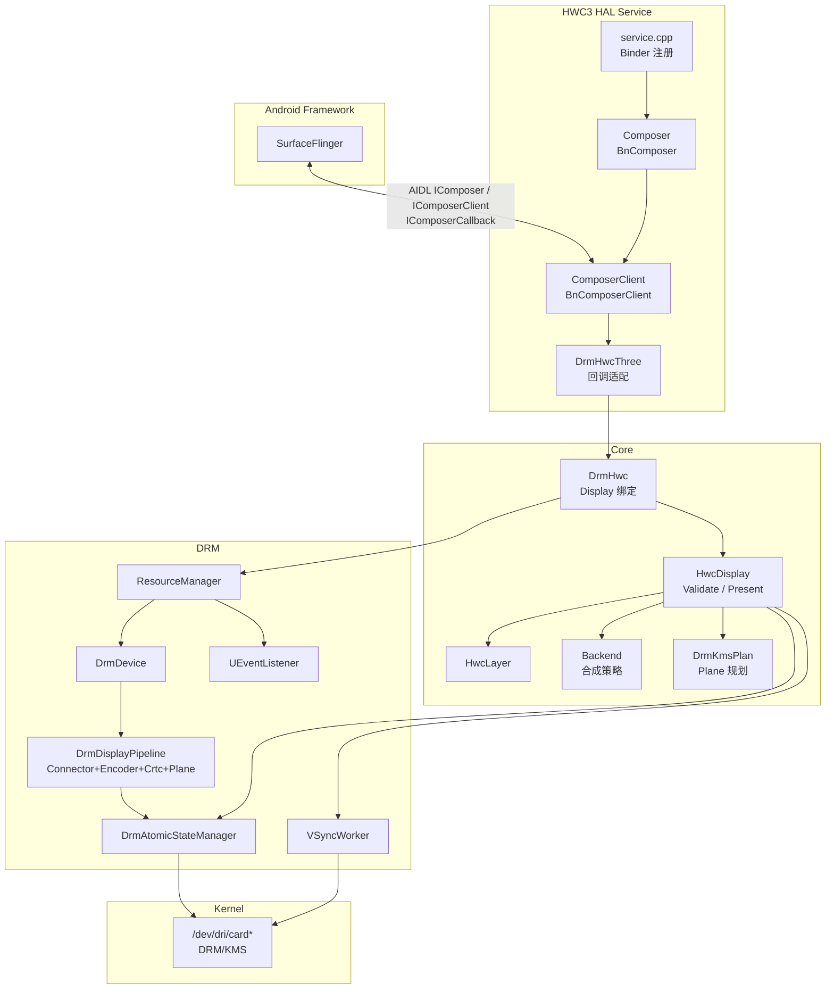
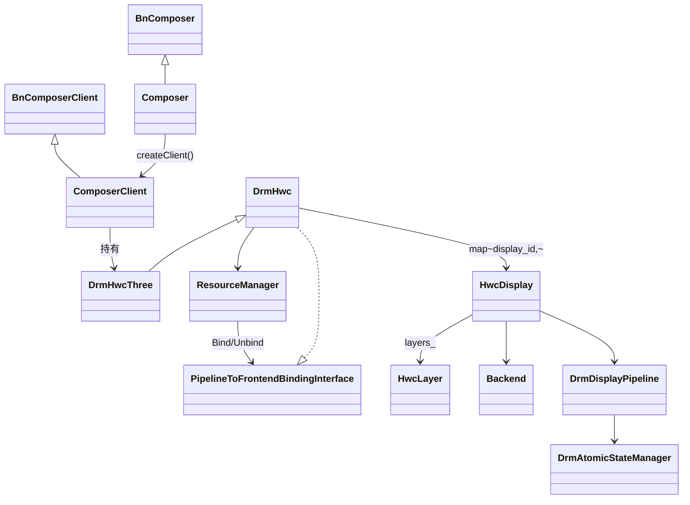
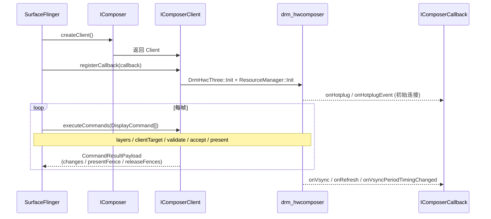
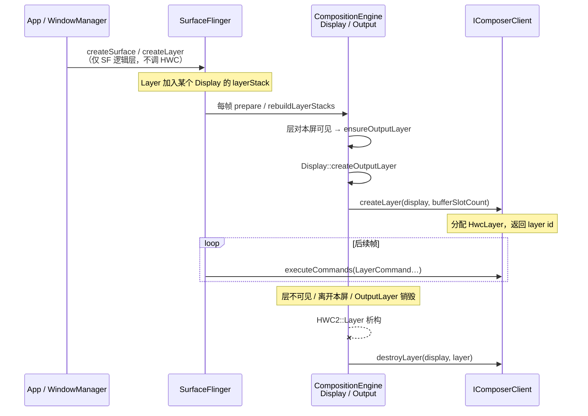
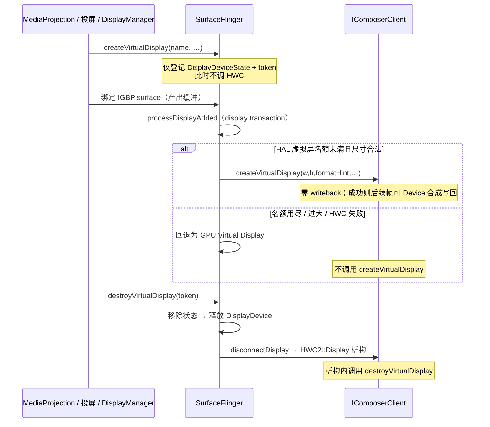
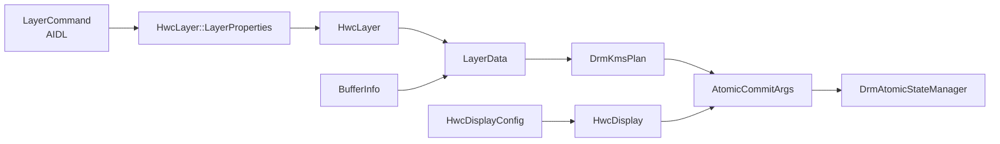
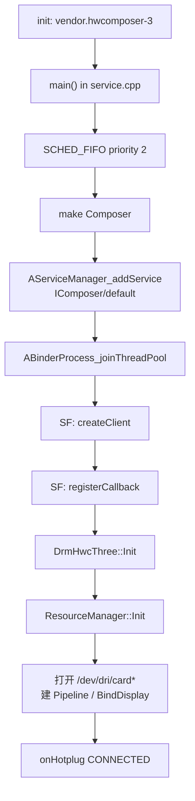
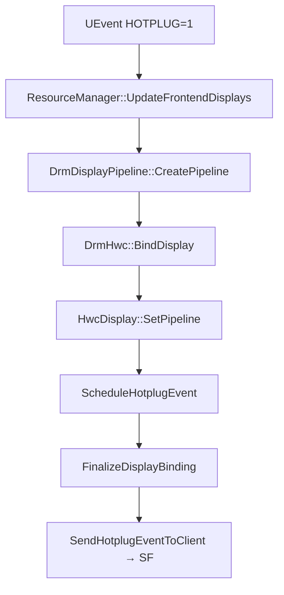
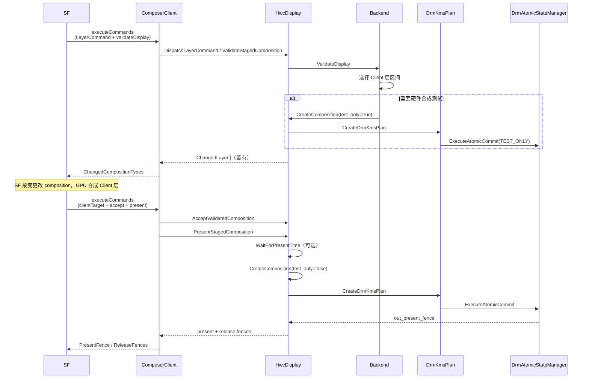

# drm_hwcomposer 技术架构文档

> 适用范围：本仓库 `drm_hwcomposer`（设备侧 AIDL Composer3 / HWC3 实现）  
> 接口版本：`android.hardware.graphics.composer3` **AIDL V4**  
> 服务名：`android.hardware.graphics.composer3.IComposer/default`  
> 二进制：`android.hardware.composer.hwc3-service.drm`

同工作区还有：

| 目录 | 角色 |
|------|------|
| `drm_hwcomposer/` | **真实设备 HWC 实现**（本文重点） |
| `goldfish-opengl/` | 模拟器 / ranchu 独立 HWC3 实现 |
| `hardware_interfaces/` | Composer/Mapper/Allocator 的 AIDL/HIDL **接口定义与 VTS**，非设备驱动实现 |

---

## 1. 总体架构

HWC 位于 Android 图形栈中 **SurfaceFlinger（SF）与 DRM/KMS 内核驱动之间**，负责：

1. 接收 SF 下发的 Layer / Display 状态；
2. 决定每层走 **Device（硬件 Overlay）** 还是 **Client（GPU / GLES 合成）**；
3. 通过 DRM Atomic Commit 将帧送到扫描输出；
4. 通过回调把 **hotplug / vsync / refresh** 事件回传给 SF。

### 1.1 分层总览



### 1.2 软件位置（进程视角）

```
SurfaceFlinger 进程
        │
        │  Binder (AIDL)
        ▼
vendor.hwcomposer-3 进程
  android.hardware.composer.hwc3-service.drm
        │
        │  ioctl (DRM Atomic / ModeSetting)
        ▼
Kernel DRM/KMS  → Display Controller / Panel
```

服务由 `hwc3/hwc3-drm.rc` 拉起，`onrestart restart surfaceflinger`，与 SF 生命周期强绑定。

---

## 2. 目录与模块划分

```
drm_hwcomposer/
├── hwc3/                 # AIDL Composer3 入口层（对 SF）
├── hwc2_device/          # Display/Layer 核心逻辑 + 可选 HWC2 C-API 适配
├── drm/                  # DRM 资源、Pipeline、Atomic、VSync、Hotplug
├── backend/              # 合成策略（Device vs Client）
├── compositor/           # Plane 规划、LayerData、Flattening
├── bufferinfo/           # Gralloc buffer → DRM BO/FB
└── utils/                # 属性、FD、EDID、UEvent 辅助
```

### 2.1 模块职责一览

| 模块 | 关键类 | 职责 |
|------|--------|------|
| **hwc3** | `Composer`, `ComposerClient`, `DrmHwcThree`, `CommandResultWriter` | Binder 服务入口；实现几乎全部 Composer3 API；`executeCommands` 批处理；回调转发给 SF |
| **hwc2_device** | `HwcDisplay`, `HwcLayer`, `HwcDisplayConfigs`, `DrmHwcTwo` | 单屏状态机；Validate/Present；Layer 属性与 Buffer；Configs；HWC2 兼容表 |
| **drm** | `DrmHwc`, `ResourceManager`, `DrmDevice`, `DrmDisplayPipeline`, `DrmAtomicStateManager`, `VSyncWorker`, `UEventListener` | Display 绑定；扫描 DRM 卡；Pipeline 组装；Atomic Commit；VSync；热插拔 |
| **backend** | `Backend`, `BackendClient`, `BackendManager` | 决定哪些层 Client 合成；atomic test-only 验证 |
| **compositor** | `DrmKmsPlan`, `LayerData`, `FlatteningController` | Layer↔Plane 绑定；送入 KMS 的层数据；空闲 flatten 触发 refresh |
| **bufferinfo** | `BufferInfoGetter`, `BufferInfoMapperMetadata`, legacy getters | `buffer_handle_t` → GEM/FB 元数据 |

### 2.2 类继承与持有关系



### 2.3 `DrmHwcThree` 与 `DrmHwc` 的关系

一句话：**`DrmHwc` 是协议无关的「设备前端」核心；`DrmHwcThree` 是挂在其上的 HWC3 / AIDL 回调适配层。**  
二者是 **继承关系**（`DrmHwcThree : public DrmHwc`），不是并列组合。

```text
ComposerClient
    │  unique_ptr<DrmHwcThree> hwc_
    ▼
┌──────────────────────────────────────────────┐
│ DrmHwcThree          （hwc3/）                │
│  · composer_callback_  → SF IComposerCallback │
│  · Init / Send*Event*  （override）           │
│  · GetHwc3Display → Hwc3Display 私有状态      │
├──────────────────────────────────────────────┤
│ DrmHwc               （drm/，基类）            │
│  · ResourceManager（扫描卡、Hotplug、Pipeline）│
│  · displays_ / BindDisplay / UnbindDisplay    │
│  · Create/DestroyVirtualDisplay、Dump         │
│  · 纯虚 Send*Event*（由子类实现）              │
│  · 实现 PipelineToFrontendBindingInterface    │
└──────────────────────────────────────────────┘
          ▲
          │ HwcDisplay::hwc_（DrmHwc*）
          │ VSync / Flatten / Hotplug 回调用基类指针
          │ → 多态落到 DrmHwcThree::Send*
```

#### 职责划分

| | `DrmHwc`（基类） | `DrmHwcThree`（派生） |
|--|------------------|------------------------|
| **所在目录** | `drm/DrmHwc.{h,cpp}` | `hwc3/DrmHwcThree.{h,cpp}` |
| **对谁可见** | `HwcDisplay`、`ResourceManager`、虚拟屏逻辑 | `ComposerClient`、SF 回调路径 |
| **拥有什么** | `ResourceManager`、`displays_` map、deferred hotplug | `IComposerCallback`、`Hwc3Display` 挂载逻辑 |
| **做什么** | Display 绑定/解绑、主屏 headless、虚拟屏、dump | 把内部事件 **翻译成 AIDL** 回 SF；`Init` 注入 callback 并启动 ResMan |
| **不做什么** | 不依赖 AIDL / Composer3 类型 | 不重复实现 BindDisplay / Atomic / Validate |

基类把四类「通知客户端」声明为纯虚函数，由子类填洞：

```text
DrmHwc（纯虚）
  SendVsyncEventToClient
  SendVsyncPeriodTimingChangedEventToClient
  SendRefreshEventToClient
  SendHotplugEventToClient
        │ override
        ▼
DrmHwcThree
  → composer_callback_->onVsync / onVsyncPeriodTimingChanged
  → onRefresh（并置 Hwc3Display::must_validate）
  → onHotplug / onHotplugEvent（API≥35）
```

#### 生命周期与调用链

1. **`ComposerClient::Init`**：`hwc_ = std::make_unique<DrmHwcThree>()`。  
2. **`registerCallback`**：`DrmHwcThree::Init(callback)` → 保存 `composer_callback_`，再 `GetResMan().Init()` 扫 DRM。  
3. **Hotplug / Bind**：`ResourceManager` 经 `PipelineToFrontendBindingInterface` 调到 **基类** `DrmHwc::BindDisplay`，创建/附着 `HwcDisplay`；`FinalizeDisplayBinding` 里调 `SendHotplugEventToClient` → 实际执行的是 **`DrmHwcThree` 的 override**。  
4. **VSync / Flatten**：`HwcDisplay` 持有 `DrmHwc* hwc_`，回调时仍走基类虚函数表，落到 Three。  
5. **销毁**：`~DrmHwcThree` → `GetResMan().DeInit()`；Client 析构里先 `DeinitDisplays()` 再 `reset`。

#### 与 `DrmHwcTwo` 的对称关系

同一基类可挂不同 HAL 前端，共享 Display/DRM 核心：

```text
                 ┌─────────────┐
                 │   DrmHwc    │  公共设备前端
                 └──────┬──────┘
            ┌───────────┴───────────┐
            ▼                       ▼
     DrmHwcThree              DrmHwcTwo
     （AIDL Composer3）       （HWC2 C-API 回调表）
     hwc3/                    hwc2_device/
```

产品主路径是 **Three**；Two 仅作 HWC2 兼容入口，二者 **不会** 在同一进程里各持一套 `ResourceManager` 抢 `card0`。

#### 代码索引

| 主题 | 位置 |
|------|------|
| 基类：Display 绑定、虚拟屏、deferred hotplug | `drm/DrmHwc.{h,cpp}` |
| HWC3 派生：AIDL 回调、`Init`、`Hwc3Display` | `hwc3/DrmHwcThree.{h,cpp}` |
| HWC2 派生（对照） | `hwc2_device/DrmHwcTwo.{h,cpp}` |
| 持有 Three 实例 | `hwc3/ComposerClient`（`hwc_`） |
| 回指基类指针 | `HwcDisplay::hwc_`（`DrmHwc*`） |

---

## 3. 模块间交互关系

### 3.1 自上而下调用

| 调用方 | 被调用方 | 交互内容 |
|--------|----------|----------|
| SF | `Composer` / `ComposerClient` | `createClient`、`registerCallback`、`executeCommands`、查询/设置 Display 属性 |
| `ComposerClient` | `DrmHwcThree` / `HwcDisplay` | 解析 DisplayCommand / LayerCommand，落到 Display/Layer |
| `DrmHwcThree` | `ResourceManager` | `Init()` 扫描 DRM；事件回调经 `IComposerCallback` 回 SF |
| `HwcDisplay` | `Backend` | `ValidateDisplay` 决定合成类型 |
| `HwcDisplay` | `DrmKmsPlan` | 按 validated 结果规划 Plane |
| `HwcDisplay` | `DrmAtomicStateManager` | test-only / 正式 Atomic Commit |
| `HwcLayer` | `BufferInfoGetter` → `DrmFbImporter` | Buffer 导入为 DRM FB |
| `UEventListener` | `ResourceManager` → `DrmHwc` | Hotplug → Bind/Unbind Display |
| `VSyncWorker` | `DrmHwcThree` | VSync 时间戳 → `onVsync` |
| `FlatteningController` | `DrmHwcThree` | 空闲 flatten → `must_validate` + `onRefresh` |

### 3.2 锁与并发

- 多数 ComposerClient API 与 UEvent 回调共用 `ResourceManager::GetMainLock()`（`recursive_mutex`）。
- VSync 回调在独立 worker 线程，经 `SendVsyncEventToClient` 调用 SF 的 oneway 回调。

### 3.3 共享核心：HWC3 与 HWC2

```
                ┌─────────────────┐
   HWC3 AIDL ──►│  HwcDisplay     │◄── HWC2 C-API (hwc2_device.cpp)
                │  HwcLayer       │
                │  Backend/DRM    │
                └─────────────────┘
```

产品主交付是 HWC3 service；`hwc2_device` 中的 `HwcDisplay` / `HwcLayer` 核心仍被 HWC3 复用。

前端适配层对称关系见 **§2.3**：`DrmHwcThree` / `DrmHwcTwo` 均继承 `DrmHwc`，只替换「事件如何回传 SF」的实现。

### 3.4 接口与数据传递：`DrmHwc` / `HwcDisplay` / `drm` / Kernel

分层关系（本仓库视角）：

```text
ComposerClient / SF 回调
        │
   DrmHwcThree（派生）
        │ 继承
   DrmHwc  ◄──── PipelineToFrontendBindingInterface
        │              ▲
        │              │ Bind / Unbind / Finalize / NotifyLink
   ResourceManager ────┘
        │
   DrmDevice / DrmDisplayPipeline / DrmAtomicStateManager / …
        │
   HwcDisplay ──持有──► pipeline_ / atomic_state_manager
        │                ▲
        │                │ AtomicCommitArgs / LayerData / DrmKmsPlan
        └────────────────┘
        │
   libdrm（xf86drm*.h）
        │ ioctl
   Kernel DRM/KMS
```

说明：`DrmHwc` 源码虽在 `drm/` 目录，概念上是 **设备前端**；下文「drm 子系统」指 `ResourceManager`、`DrmDevice`、`DrmDisplayPipeline`、`DrmAtomicStateManager`、`DrmFbImporter`、`VSyncWorker` 等 KMS 封装。更细的 libdrm↔Kernel 对照见 `docs/drm.md`。

---

#### 3.4.1 `DrmHwc` ↔ drm 子系统

**边界接口**：`PipelineToFrontendBindingInterface`（`ResourceManager` → `DrmHwc`）+ `DrmHwc` 对 `ResourceManager` / `HwcDisplay` 的持有与调度。

| 方向 | 接口 / 方法 | 传递数据 | 说明 |
|------|-------------|----------|------|
| ResMan → DrmHwc | `BindDisplay(pipeline)` | `shared_ptr<DrmDisplayPipeline>` | 某 Connector 已组好 Pipeline；DrmHwc 分配 `display_id`，`new HwcDisplay`，`SetPipeline(pipeline)` |
| ResMan → DrmHwc | `UnbindDisplay(pipeline)` | `shared_ptr<DrmDisplayPipeline>` | 解绑；Primary 变 headless（`SetPipeline({})`），次屏进延迟删除列表 |
| ResMan → DrmHwc | `FinalizeDisplayBinding()` | 无额外参数；内部消费 `deferred_hotplug_events_` | 保证 Primary 存在；必要时次屏升主屏；再 `SendHotplugEventToClient` |
| ResMan → DrmHwc | `NotifyDisplayLinkStatus(pipeline)` | `shared_ptr<DrmDisplayPipeline>` | 链路训练失败 → `ScheduleHotplugEvent(..., kLinkTrainingFailed)` |
| DrmHwc → ResMan | 构造 `resource_manager_(this)` | `PipelineToFrontendBindingInterface*`（`this`） | ResMan 回调前端的唯一入口 |
| DrmHwc → ResMan | `GetResMan().Init()` / `DeInit()` | 无 | 扫 `/dev/dri/card*`、挂 UEvent；析构路径停监听 |
| DrmHwc → ResMan | `GetVirtualDisplayPipeline()` | 返回 `shared_ptr<DrmDisplayPipeline>`（writeback） | 虚拟屏创建依赖 |
| DrmHwc → ResMan | `GetWritebackConnectorsCount()` | 返回 `uint32_t` | 决定 `GetMaxVirtualDisplayCount` |
| DrmHwc → ResMan | `GetMainLock()` | `recursive_mutex&` | API / Hotplug 共用锁 |
| DrmHwc 内部 | `displays_` / `display_handles_` | `display_id ↔ HwcDisplay`；`Pipeline ↔ display_id` | 前端 Display 表与 Pipeline 反向索引 |
| DrmHwc → 派生类 | `SendHotplug/Vsync/Refresh…`（纯虚） | `display_id` + 状态/时间戳/period | 由 `DrmHwcThree` 转 AIDL；**不直连 Kernel** |

**数据对象说明**

| 数据 | 谁产生 | 谁消费 | 含义 |
|------|--------|--------|------|
| `DrmDisplayPipeline` | `DrmDevice` / ResMan 组装 | `DrmHwc::BindDisplay` → `HwcDisplay` | 一条完整扫描通路：Connector+Encoder+CRTC+Planes+`atomic_state_manager` |
| `DisplayStatus` | Hotplug / Link 路径 | deferred map → `SendHotplugEventToClient` | `kConnected` / `kDisconnected` / `kLinkTrainingFailed` |
| `hwc2_display_t` | `DrmHwc` 分配（Primary=0） | SF / ComposerClient / HwcDisplay | 逻辑 Display ID |

---

#### 3.4.2 `HwcDisplay` ↔ drm 子系统

**边界**：`HwcDisplay` 持有 `pipeline_`（及经 `GetPipe()` 访问的 `atomic_state_manager`、`connector`、`crtc`…），并通过 `hwc_`（`DrmHwc*`）回指前端。帧路径核心载荷是 **`AtomicCommitArgs` + `LayerData` + `DrmKmsPlan`**。

##### A. 生命周期 / 配置

| 方向 | 接口 / 方法 | 传递数据 | 说明 |
|------|-------------|----------|------|
| DrmHwc → HwcDisplay | `SetPipeline(pipeline)` | `shared_ptr<DrmDisplayPipeline>` 或 `{}` | 附着/摘除 KMS 通路；触发 `Init`/`Deinit` + `ScheduleHotplugEvent` |
| HwcDisplay → drm | `configs_.Update(*connector)` | Connector modes / EDID → `HwcDisplayConfigs` | 从 DRM Connector 拉模式列表 |
| HwcDisplay → drm | `CreateModesetCommit` / `SetConfig` | `DrmMode`、可选 `LayerData` → `AtomicCommitArgs` | 改分辨率/刷新率，走 Atomic modeset |
| HwcDisplay → drm | `Deinit` 时空 plan + `active=false` | 空 `DrmKmsPlan`、`active=false` | 关扫描、释放 plane |
| HwcDisplay → drm | `VSyncWorker::CreateInstance(pipeline_)` | Pipeline（取 CRTC / fd） | 本屏 vsync 线程 |
| HwcDisplay → DrmHwc | `SendRefreshEventToClient`（经 Flatten） | `display_id` | 空闲 flatten 请求 SF 重绘 |
| HwcDisplay → DrmHwc | `GetResMan().GetCtmHandling()` 等 | 策略枚举 | CTM / GPU scale 策略查询 |

##### B. 每帧合成（Validate / Present）

| 方向 | 接口 / 方法 | 传递数据 | 说明 |
|------|-------------|----------|------|
| HwcLayer → drm | `PopulateLayerData` → `DrmFbImporter` | `BufferInfo`（prime_fds/format/modifier…）→ `DrmFbIdHandle`（fb_id） | GraphicBuffer 导入为 DRM FB |
| HwcDisplay → compositor | `DrmKmsPlan::CreateDrmKmsPlan(pipe, layers, cursor)` | 入：`vector<LayerData>` + Pipeline；出：`Layer↔Plane` 绑定 | 按可用 Overlay/Cursor 规划 |
| HwcDisplay → drm | `ExecuteAtomicCommit(a_args)` **TEST_ONLY** | `AtomicCommitArgs{test_only=true, composition, …}` | Validate：内核只 check |
| HwcDisplay → drm | `ExecuteAtomicCommit(a_args)` 正式 | 同上 + `blocking`/`NONBLOCK`；出：`out_fence` | Present：编程硬件 |
| drm → HwcDisplay | `a_args.out_fence` | `SharedFd`（sync_file） | PresentFence → SF |
| HwcDisplay 内部 | release fences | 复用 `out_present_fence` 按层标记 | 旧 buffer 可释放时机 |

##### C. `AtomicCommitArgs` 字段 ↔ drm 行为

| 字段（入/出） | 类型 | drm 侧如何用 |
|---------------|------|----------------|
| `test_only` | `bool` | `DRM_MODE_ATOMIC_TEST_ONLY` |
| `blocking` | `bool` | 无 NONBLOCK；否则 `DRM_MODE_ATOMIC_NONBLOCK` |
| `display_mode` | `optional<DrmMode>` | 建 MODE blob → CRTC `MODE_ID` |
| `active` | `optional<bool>` | CRTC `ACTIVE` |
| `composition` | `shared_ptr<DrmKmsPlan>` | 各 Plane `AtomicSetState` / 未用 Plane disable |
| `color_matrix` | `shared_ptr<drm_color_ctm>` | CTM blob → CRTC |
| `colorspace` / `hdr_metadata` / `min_bpc` / `content_type` | 可选 | Connector 属性 |
| `writeback_fb` / `writeback_release_fence` | FB + fd | 虚拟屏 writeback |
| **`out_fence`（出）** | `SharedFd` | CRTC `OUT_FENCE_PTR` 返回 |

##### D. `LayerData` → Plane 属性（`DrmPlane::AtomicSetState`）

| `LayerData` 字段 | 写入的 DRM Property | 说明 |
|------------------|---------------------|------|
| `fb` → `GetFbId()` | `FB_ID` | 扫描缓冲 |
| `acquire_fence` | `IN_FENCE_FD` | 等 GPU/生产者完成 |
| `pi.display_frame` | `CRTC_X/Y/W/H` | 屏上目标矩形 |
| `pi.source_crop` | `SRC_X/Y/W/H`（16.16） | 源裁剪 |
| `pi.transform` | `rotation` | 旋转/翻转 |
| `pi.alpha` | `alpha` | 不透明度 |
| `bi->blend_mode` | `pixel blend mode` | 混合 |
| `bi->color_space` / `sample_range` | `COLOR_ENCODING` / `COLOR_RANGE` | YUV |
| （joining.`z_pos`） | `zpos` | 叠层顺序 |
| （crtc id） | `CRTC_ID` | 绑定 CRTC |

---

#### 3.4.3 drm 子系统 ↔ Kernel

经 **libdrm** 调 `ioctl(fd, DRM_IOCTL_*, …)`；`fd` 来自 `open("/dev/dri/card*")`（`DrmDevice`）。

##### A. 初始化 / 能力 / Master

| drm 封装 | libdrm / ioctl | 传递数据 | 说明 |
|----------|----------------|----------|------|
| `DrmDevice::Init` | `drmSetClientCap` | UNIVERSAL_PLANES / ATOMIC / WRITEBACK | 打开 Atomic 与全 Plane |
| 同上 | `drmGetCap` | ADDFB2_MODIFIERS、CURSOR_W/H | 能力查询 |
| 同上 | `drmSetMaster` | — | 抢 modeset 控制权 |
| 同上 | `drmModeGetResources` 等 | CRTC/Encoder/Connector/Plane id 列表 | 拓扑枚举 |
| `GetProperty` | `drmModeObjectGetProperties` / `GetProperty` | prop id/value/enum | 对象属性元数据 |
| `GetName` | `drmGetVersion` | 驱动名 | Backend 选择等 |

##### B. Buffer：Prime → FB

| drm 封装 | libdrm / ioctl | 传递数据 | 说明 |
|----------|----------------|----------|------|
| `DrmFbImporter` | `drmPrimeFDToHandle` | dma-buf **fd** → GEM **handle** | 导入 GraphicBuffer |
| 同上 | `drmModeAddFB2` / `AddFB2WithModifiers` | handles、pitch、offset、format、**modifier** → **fb_id** | 注册可扫描 FB |
| `~DrmFbIdHandle` | `drmModeRmFB` + `DRM_IOCTL_GEM_CLOSE` | fb_id / handle | 销毁（不关 dma-buf 本身） |
| Modeset dumb | `CREATE/MAP/DESTROY_DUMB`、`PrimeHandleToFD` | 宽高 bpp → handle/fd | 无层时的 modeset 辅助缓冲 |

##### C. Atomic / Blob / DPMS / VBlank

| drm 封装 | libdrm / ioctl | 传递数据 | 说明 |
|----------|----------------|----------|------|
| `DrmDevice::RegisterUserPropertyBlob` | `CREATE/DESTROYPROPBLOB` | mode / CTM / HDR 字节流 → blob_id | MODE_ID 等 |
| `DrmProperty::AtomicSet` | `drmModeAtomicAddProperty`（用户态组包） | `obj_id + prop_id + value` | 填入 `drmModeAtomicReq` |
| `DrmAtomicStateManager::CommitFrame` | **`drmModeAtomicCommit`** | 整份 req + flags（ALLOW_MODESET / TEST_ONLY / NONBLOCK） | **每帧主路径**；内核 check/commit |
| 同上 | CRTC `OUT_FENCE_PTR` | 返回 sync_file fd | Present fence |
| `ActivateDisplayUsingDPMS` | `drmModeConnectorSetProperty`（DPMS） | ON/OFF | 部分电源路径 |
| `VSyncWorker` | `drmWaitVBlank` | CRTC 管道 + 类型 | 阻塞等到 vblank，回调时间戳 |

##### D. 一帧数据穿过 drm→Kernel（摘要）

```text
LayerData / DrmMode / CTM / …
    → drmModeAtomicReq（一组 obj+prop+value）
    → DRM_IOCTL_MODE_ATOMIC
    → 内核：atomic_check →（非 TEST_ONLY）atomic_commit → DPU 扫描
    → out_fence / vblank
```

| 用户态概念 | 内核侧落点 |
|------------|------------|
| `fb_id` | Plane `FB_ID` → framebuffer 对象 |
| GEM handle | 该进程对 buffer 的引用（Prime 导入） |
| `MODE_ID` blob | CRTC 显示时序 |
| `IN_FENCE_FD` | 等 acquire fence 再扫 |
| `OUT_FENCE_PTR` | 扫描完成信号给 SF |
| `TEST_ONLY` | 只跑 `drm_atomic_check_only`，不换硬件状态 |

---

#### 3.4.4 对照：谁跟谁说话

| 配对 | 主要「语言」 | 不直接做什么 |
|------|--------------|--------------|
| **DrmHwc ↔ drm** | Pipeline 指针、Display 绑定、ResMan 策略/锁、Hotplug 状态 | 不组 Atomic 属性、不 ioctl |
| **HwcDisplay ↔ drm** | `AtomicCommitArgs`、`LayerData`、`DrmKmsPlan`、Configs/Mode、VSyncWorker | 不打开 `/dev/dri`、不实现 BindDisplay |
| **drm ↔ Kernel** | libdrm / `DRM_IOCTL_*`（fd、handle、fb_id、property、atomic req） | 不懂 HWC Layer / Composer Command |

更完整的 ioctl 表与内核处理路径见同目录 **`docs/drm.md`**（§5–§6、§11–§12）。

---

## 4. 与 SurfaceFlinger 的交互接口

### 4.1 接口形态

| 项目 | 内容 |
|------|------|
| HAL | AIDL `android.hardware.graphics.composer3` |
| VINTF | Version **4**（`hwc3/hwc3-drm.xml`） |
| 服务实例 | `IComposer/default` |
| 链接库 | `android.hardware.graphics.composer3-V4-ndk` |

接口定义位于：

`hardware_interfaces/graphics/composer/aidl/android/hardware/graphics/composer3/`

### 4.2 双向通道



### 4.3 SF → HWC（`IComposer` / `IComposerClient`）

#### IComposer（设备级，很少调用）

| API | 实现 | 说明 |
|-----|------|------|
| `createClient()` | `Composer::createClient` | 创建唯一 `ComposerClient` |
| `getCapabilities()` | `Composer::getCapabilities` | 能力列表 |

#### IComposerClient（主接口）

**生命周期 / Display**

| API | 落到 |
|-----|------|
| `registerCallback` | `DrmHwcThree::Init` → 扫描 DRM、开始回调 |
| `createLayer` / `destroyLayer` | `HwcDisplay::CreateLayer` / `DestroyLayer` |
| `createVirtualDisplay` / `destroyVirtualDisplay` | `DrmHwc::CreateVirtualDisplay` 等 |
| **无 `createDisplay`** | 物理屏由 DRM hotplug 创建，SF 经回调获知 |

#### SF 何时调用 `createLayer` / `destroyLayer`

> 易混淆点：Framework 里也有 `SurfaceFlinger::createLayer()`（给 App/WM 建 **SF Layer**），**不等于** 调用 HWC 的 `IComposerClient::createLayer`。  
> HWC 的 layer 是 **某 Display 上参与合成的 Overlay 槽位**，由 CompositionEngine 在需要时再分配。



| 时机 | SF 侧路径（android16） | 是否调用 HWC |
|------|------------------------|--------------|
| App/WM 创建 Surface | `SurfaceFlinger::createLayer` → 建 `Layer` / `LayerFE` | **否** |
| 层首次在本屏可见并进入合成列表 | `Output::rebuildLayerStacks` → `ensureOutputLayerIfVisible` → `Display::createOutputLayer` → `HWComposer::createLayer` → **`IComposerClient::createLayer`** | **是** |
| 条件 | Display 已连上 HWC（`halDisplayId` 存在）且未 `mIsDisconnected`；物理屏与 **HAL 虚拟屏** 都会建；纯 GPU 虚拟屏不建 HWC layer | — |
| 层离开本屏 / 不可见导致 `OutputLayer` 释放 | `shared_ptr<HWC2::Layer>` 引用归零 → `HWC2::Layer::~Layer` → **`destroyLayer`** | **是** |
| Display 断开 / 销毁 | `HWC2::Display` 析构时清理其上所有 Layer，逐个 `destroyLayer` | **是** |

要点：

- **按「屏上可见合成」分配，不是按「Surface 创建」分配**：同一 SF Layer 可在多屏各有一份 HWC layer（mirror / 多显）。
- **Client Target 不是 `createLayer` 出来的**：GPU 合成结果走 `clientTarget`，对应 HWC 内部的 `client_layer_`。
- 较新平台上，部分生命周期也可能打进 `executeCommands` 的 `LayerCommand`（`LayerLifecycleBatchCommandType::CREATE/DESTROY`）；本实现 `ComposerClient::DispatchLayerCommand` 同样处理该路径，语义与独立 RPC 一致。

#### SF 何时调用 `createVirtualDisplay` / `destroyVirtualDisplay`

> 同样易混淆：`ISurfaceComposer::createVirtualDisplay`（Binder 给系统服务）**不会立刻**调 HWC；只有走到 **HAL 虚拟屏** 分配时才会调 `IComposerClient::createVirtualDisplay`。



| 阶段 | SF 行为 | HWC API |
|------|---------|---------|
| ① 请求创建 VD | `SurfaceFlinger::createVirtualDisplay`：发 token、写入 `mCurrentState.displays`，`eDisplayTransactionNeeded` | **不调用** |
| ② 尚无 surface | `processDisplayAdded` 认为是 **dormant**，直接 return | **不调用** |
| ③ 已绑定 surface，处理 display transaction | `processDisplayAdded` → `acquireVirtualDisplay` → `HWComposer::allocateVirtualDisplay` | **`createVirtualDisplay`**（成功才算 HAL VD） |
| ③′ 回退 | `getMaxVirtualDisplayCount` 用尽、分辨率超限、或 HWC 返回失败 → **GPU VD** | **不调用** |
| ④ 销毁请求 | `destroyVirtualDisplay(token)`：从 state 移除，置 transaction | 尚未直接调 HWC |
| ⑤ 真正拆掉 DisplayDevice | `releaseVirtualDisplay` / `disconnectDisplay` → `unique_ptr<HWC2::Display>` 析构 | 析构里对 VIRTUAL 类型调 **`destroyVirtualDisplay`** |

典型上层触发源（经 DisplayManager / MediaProjection 等落到 SF）：

- 屏幕录制、投屏（Miracast / Cast）、`VirtualDisplay` API、部分截屏/同屏方案。

与本仓库实现的对应关系：

- `createVirtualDisplay` → `DrmHwc::CreateVirtualDisplay` → `ResourceManager::GetVirtualDisplayPipeline()`（依赖 DRM **writeback** connector）；没有 writeback 则 HWC 返回失败，SF 走 GPU VD。
- 物理屏 **没有** `createDisplay`：只靠 hotplug 回调；虚拟屏才是 SF **主动** `createVirtualDisplay` 建出来的 HWC display。

**配置 / 能力查询（RPC，非每帧）**

`getDisplayConfigs` / `getDisplayConfigurations` / `getDisplayAttribute` /  
`getActiveConfig` / `setActiveConfig` / `setActiveConfigWithConstraints` /  
`getDisplayVsyncPeriod` / `getHdrCapabilities` / `getColorModes` /  
`getDisplayCapabilities` / `getDisplayIdentificationData` /  
`getDisplayConnectionType` / `getDisplayPhysicalOrientation` / …

**电源与 VSync**

| API | 落到 |
|-----|------|
| `setPowerMode` | `HwcDisplay::SetPowerMode` → DPMS / Atomic |
| `setVsyncEnabled` | `HwcDisplay::SetVsyncEnabled` → `VSyncWorker` |

**每帧路径（核心）：`executeCommands`**

SF 不再逐个调用 `setLayerBuffer` / `validateDisplay`（HIDL 时代风格），而是打包为 `DisplayCommand[]`：

| DisplayCommand 字段 | 含义 | HWC 处理 |
|---------------------|------|----------|
| `layers[]` (`LayerCommand`) | buffer、z、blend、crop、transform、composition type… | `DispatchLayerCommand` → `HwcLayer` |
| `clientTarget` | GPU 合成结果 buffer + acquire fence | `ExecuteSetDisplayClientTarget` → `client_layer_` |
| `virtualDisplayOutputBuffer` | 虚拟屏输出 | `ExecuteSetDisplayOutputBuffer` |
| `colorTransformMatrix` | 颜色矩阵 | `SetColorTransformMatrix` |
| `expectedPresentTime` | 期望上屏时间 | 存入 `Hwc3Display::desired_present_time` |
| `validateDisplay` | 请求校验 | `ValidateStagedComposition` |
| `acceptDisplayChanges` | 接受 HWC 改写的 composition type | `AcceptValidatedComposition` |
| `presentDisplay` | 上屏 | `PresentStagedComposition` |
| `presentOrValidateDisplay` | 可跳过往返的合并路径 | validate 后若无需 Client 更新则直接 present |

**LayerCommand 常见字段**：`buffer`、`damage`、`blendMode`、`composition`、`dataspace`、`displayFrame`、`planeAlpha`、`sidebandStream`、`sourceCrop`、`transform`、`z`、`color`、`brightness` 等。

### 4.4 HWC → SF（`IComposerCallback`）

实现类：`DrmHwcThree`，回调对象在 `registerCallback` 时注入。

| 回调 | 触发源 | 作用 |
|------|--------|------|
| `onHotplug` / `onHotplugEvent`（API≥35） | UEvent hotplug → Bind/Unbind → `FinalizeDisplayBinding` | 通知物理屏插拔；注册后必须至少上报一次 |
| `onVsync` | `VSyncWorker`（需先 `setVsyncEnabled`） | SF 帧调度节拍 |
| `onVsyncPeriodTimingChanged` | Mode 切换完成 | 刷新率切换时间线更新 |
| `onRefresh` | `FlatteningController` 等 | 强制 SF 重新 validate/present（HWC 侧设 `must_validate`） |

**注意**：连接后的 Display 默认 `PowerMode.OFF`；只有 `setVsyncEnabled(true)` 后才会有 `onVsync`。

### 4.5 Fence 语义（与 SF 同步）

| Fence | 方向 | 含义 |
|-------|------|------|
| Layer / ClientTarget **acquire fence** | SF → HWC | 可读 buffer 的时机 |
| **present fence** | HWC → SF | 本帧内容已上屏（或提交完成） |
| Layer **release fence** | HWC → SF | 上一帧 buffer 可被复用/释放（对曾 Device 扫描的层） |

结果通过 `CommandResultPayload`（`PresentFence` / `ReleaseFences` / `ChangedCompositionTypes` 等）返回。

---

## 5. 重要数据结构

本章按模块梳理核心 **类 / 结构体** 及其关键字段。字段以头文件为准；仅列出理解架构与帧路径时真正需要关注的成员。

### 5.0 数据流关系（字段如何串起来）



| 层级 | 类型 | 角色 |
|------|------|------|
| HAL 入参 | `DisplayCommand` / `LayerCommand` | SF 每帧下发 |
| 前端状态 | `Hwc3Display` / `HwcLayer` | HWC 内 Display/Layer 状态 |
| 合成载荷 | `LayerData` / `BufferInfo` | 送入 KMS 前的统一描述 |
| 规划结果 | `DrmKmsPlan` | Layer ↔ Plane 绑定 |
| 提交参数 | `AtomicCommitArgs` | Atomic Commit 入参/出参 |
| 硬件资源 | `DrmDisplayPipeline` 等 | Connector/CRTC/Plane 绑定 |

---

### 5.1 hwc3 模块（HAL 前端）

#### `Hwc3Display` — `hwc3/DrmHwcThree.h`

挂在 `HwcDisplay::frontend_private_data_` 上的 **每屏 HWC3 私有状态**。

| 字段 | 类型 | 说明 |
|------|------|------|
| `must_validate` | `bool` | 为 true 时禁止直接 present（如收到 `onRefresh` 后强制重新 validate） |
| `desired_present_time` | `optional<int64_t>` | `expectedPresentTime` 暂存；present 时再消费 |
| `next_layer_id` | `int64_t` | 本屏分配 layer id 的递增计数（从 1 起） |

#### `DrmHwcThree` — `hwc3/DrmHwcThree.h`

**`DrmHwc` 的 HWC3 派生类**（关系见 §2.3）。在基类 Display/DRM 能力之上，只负责 AIDL 回调适配与每屏 HWC3 私有状态挂载。

| 字段 / 方法 | 类型 | 说明 |
|-------------|------|------|
| `composer_callback_` | `shared_ptr<IComposerCallback>` | SF 注册的回调；hotplug/vsync/refresh 经此回传 |
| `Init(callback)` | — | 保存 callback，再调用 `GetResMan().Init()` |
| `Send*EventToClient` | override | 实现基类纯虚函数 → `onVsync` / `onRefresh` / `onHotplug*` |
| `GetHwc3Display` | static | 从 `HwcDisplay` 取/建 `Hwc3Display` 私有数据 |

#### `Composer` — `hwc3/Composer.h`

| 字段 | 类型 | 说明 |
|------|------|------|
| `client_` | `weak_ptr<IComposerClient>` | 单 Client 弱引用；保证同时最多一个活跃 Client |

#### `ComposerClient` — `hwc3/ComposerClient.h`

| 字段 | 类型 | 说明 |
|------|------|------|
| `hwc_` | `unique_ptr<DrmHwcThree>` | 核心 HWC 实例（含 Display map、ResourceManager） |
| `cmd_result_writer_` | `unique_ptr<CommandResultWriter>` | 将 validate/present 结果写入 `CommandResultPayload[]` |

#### `DisplayChanges` / `CommandResultWriter` — `hwc3/CommandResultWriter.h`

| 类型 / 字段 | 说明 |
|-------------|------|
| `DisplayChanges::composition_changes` | validate 后需 SF 接受的 composition type 变更 |
| `DisplayChanges::display_request_changes` | Display 级 request（较少使用） |
| `CommandResultWriter::results_` | 指向本轮 `executeCommands` 的输出 vector |
| `CommandResultWriter::index_` | 当前命令索引（错误上报用） |

---

### 5.2 hwc2_device 模块（Display / Layer 核心）

#### `HwcDisplay` — `hwc2_device/HwcDisplay.h`

单逻辑显示的状态中心（物理屏 / 虚拟屏 / headless）。

| 字段 | 类型 | 说明 |
|------|------|------|
| `handle_` | `hwc2_display_t` | Display ID；Primary 固定为 `0` |
| `type_` | `HWC2::DisplayType` | Physical / Virtual |
| `hwc_` | `DrmHwc*` | 回指设备前端（回调、ResMan） |
| `pipeline_` | `shared_ptr<DrmDisplayPipeline>` | 空则 **Headless**；非空则绑定 KMS 通路 |
| `layers_` | `map<ILayerId, HwcLayer>` | SF 创建的普通层 |
| `client_layer_` | `HwcLayer` | GPU Client Target（非 `layers_` 成员） |
| `writeback_layer_` | `unique_ptr<HwcLayer>` | 虚拟屏 / writeback 输出层 |
| `configs_` | `HwcDisplayConfigs` | 模式列表与 active/preferred |
| `backend_` | `unique_ptr<Backend>` | 本屏合成策略 |
| `flatcon_` | `shared_ptr<FlatteningController>` | 空闲 flatten |
| `vsync_worker_` | `unique_ptr<VSyncWorker>` | 本屏 vsync 线程 |
| `vsync_event_en_` | `bool` | 是否向 SF 发 onVsync |
| `current_plan_` | `shared_ptr<DrmKmsPlan>` | validate→present 间锁住的 Plane 规划 |
| `color_matrix_` | `shared_ptr<drm_color_ctm>` | 待应用 CTM |
| `staged_mode_config_id_` / `staged_mode_change_time_` | 排队中的模式切换 | 到点后在 CreateComposition 里生效 |
| `virtual_disp_width_` / `height_` | `uint16_t` | 虚拟屏分辨率 |
| `frontend_private_data_` | `shared_ptr<FrontendDisplayBase>` | HWC3 时为 `Hwc3Display` |
| `total_stats_` | `Stats` | 帧数、GPU pixops、KMS 失败计数等 |

**`HwcDisplay::Stats`**

| 字段 | 说明 |
|------|------|
| `total_frames_` | present 尝试次数 |
| `total_pixops_` / `gpu_pixops_` | 总/GPU 像素运算量（统计） |
| `failed_kms_validate_` / `failed_kms_present_` | Atomic 失败计数 |
| `frames_flattened_` | 被 flatten 强制 Client 的帧数 |

#### `HwcDisplayConfig` / `HwcDisplayConfigs` — `hwc2_device/HwcDisplayConfigs.h`

| 结构体 | 字段 | 说明 |
|--------|------|------|
| `HwcDisplayConfig` | `id` | HWC config id（对 SF 暴露） |
| | `group_id` | 无缝切模式分组 |
| | `mode` | 对应 `DrmMode` |
| | `disabled` | 是否对 SF 隐藏 |
| | `output_type` | HDR/SDR 等输出类型 |
| `HwcDisplayConfigs` | `hwc_configs` | `config_id → HwcDisplayConfig` |
| | `active_config_id` | 当前已提交/生效 config |
| | `preferred_config_id` | 首选模式 |
| | `mm_width` / `mm_height` | 物理尺寸（DPI） |

#### `HwcLayer` — `hwc2_device/HwcLayer.h`

| 字段 / 嵌套类型 | 说明 |
|-----------------|------|
| `sf_type_` | SF 请求的 composition（Device/Client/Cursor…） |
| `validated_type_` | Backend validate 后的类型；与 sf 不同则需 SF accept |
| `z_order_` | Z 序 |
| `layer_data_` | 填充后的 `LayerData`（present/test 使用） |
| `slots_` | `slot_id → {BufferInfo, DrmFbIdHandle}`，buffer 缓存槽 |
| `active_slot_id_` | 当前使用的 slot |
| `prior_buffer_scanout_flag_` | 上一帧是否 Device 扫描；用于发 release fence |
| `color_space_` / `sample_range_` / `blend_mode_` | Buffer 色彩/混合元数据 |
| `fb_import_failed_` | FB 导入失败 → 不可作 Device 层 |
| `parent_` | 所属 `HwcDisplay*` |
| `frontend_private_data_` | 可选前端私有数据 |

**`HwcLayer::LayerProperties`**（`SetLayerProperties` 入参，字段均为 `optional`，有值才更新）

| 字段 | 含义 |
|------|------|
| `slot_buffer` | 某 slot 的新 `BufferInfo` |
| `active_slot` | 激活 slot + acquire fence |
| `blend_mode` / `color_space` / `sample_range` | 混合与色彩 |
| `composition_type` | SF 期望合成类型 |
| `display_frame` / `source_crop` | 目的/源矩形 |
| `alpha` / `transform` / `z_order` | 透明度、变换、Z |

---

### 5.3 compositor 模块（合成载荷与规划）

#### `LayerTransform` / `SrcRectInfo` / `DstRectInfo` / `PresentInfo` — `compositor/LayerData.h`

| 类型 | 关键字段 | 说明 |
|------|----------|------|
| `LayerTransform` | `hflip`, `vflip`, `rotate90` | 先 flip 再顺时针旋转 |
| `SrcRectInfo` | `f_rect` | 源裁剪（float）；空=整 buffer |
| `DstRectInfo` | `i_rect` | 目的矩形（int）；空=整屏 |
| `PresentInfo` | `transform`, `alpha`, `source_crop`, `display_frame` | 几何+alpha；`RequireScalingOrPhasing()` 判断是否需缩放/相位 |

#### `LayerData` — 送入 Plane / Atomic 的单层快照

| 字段 | 类型 | 说明 |
|------|------|------|
| `bi` | `optional<BufferInfo>` | Buffer 几何与 format/modifier |
| `fb` | `shared_ptr<DrmFbIdHandle>` | 已导入的 DRM FB |
| `pi` | `PresentInfo` | 变换与矩形 |
| `acquire_fence` | `SharedFd` | 可读 fence |

`ILayerId` = `int64_t`，与 AIDL layer handle 对齐。

#### `DrmKmsPlan` — `compositor/DrmKmsPlan.h`

| 字段 | 说明 |
|------|------|
| `plan` | `vector<LayerToPlaneJoining>`，按合成顺序的绑定列表 |
| `LayerToPlaneJoining::layer` | `LayerData` |
| `LayerToPlaneJoining::plane` | 占用的 `DrmPlane`（`BindingOwner`） |
| `LayerToPlaneJoining::z_pos` | 写入 Plane zpos 的值 |

由 `CreateDrmKmsPlan(pipe, composition_layers, cursor_layer)` 生成。

#### `FlatteningController` — `compositor/FlatteningController.h`

| 字段 | 说明 |
|------|------|
| `flatten_next_frame_` | 下一帧是否强制全 Client |
| `disabled_` | 单层时关闭 flatten |
| `sleep_until_` | 空闲超时时刻（默认 `kTimeout = 1s`） |
| `cbks_.trigger` | 超时回调 → 通常触发 `onRefresh` |

#### `QueuedConfigTiming` — `compositor/DisplayInfo.h`

| 字段 | 说明 |
|------|------|
| `refresh_time_ns` | SF 须在此时间前提交新帧 |
| `new_vsync_time_ns` | 新 vsync period 生效时间 |

另有枚举 `Colorspace`、`PanelOrientation`、`Colormode`，映射 Connector/CRTC 属性。

---

### 5.4 bufferinfo 模块

#### `BufferInfo` — `bufferinfo/BufferInfo.h`

| 字段 | 说明 |
|------|------|
| `width` / `height` | 像素尺寸 |
| `format` | `DRM_FORMAT_*` |
| `pitches[4]` / `offsets[4]` / `sizes[4]` | 多 plane 布局 |
| `prime_fds[4]` | DMA-BUF fd（生命周期由 `fds_shared` 保活） |
| `modifiers[4]` | 格式 modifier |
| `color_space` / `sample_range` / `blend_mode` | 色彩与混合枚举 |
| `fds_shared` | 保证 fd 在 `BufferInfo` 使用期内不关闭 |

相关枚举：`BufferColorSpace`、`BufferSampleRange`、`BufferBlendMode`。

---

### 5.5 drm 模块（设备 / Pipeline / Commit）

#### `DrmHwc` — `drm/DrmHwc.h`

**协议无关的设备前端基类**（与 `DrmHwcThree` 的关系见 §2.3）。实现 `PipelineToFrontendBindingInterface`；事件回传通过纯虚 `Send*EventToClient` 交给派生类。

| 字段 | 说明 |
|------|------|
| `resource_manager_` | DRM 卡、热插拔、Pipeline 附着（构造时 `resource_manager_(this)`） |
| `displays_` | `display_id → unique_ptr<HwcDisplay>` |
| `display_handles_` | `Pipeline → display_id` 反向表 |
| `deferred_hotplug_events_` | 延迟到 `FinalizeDisplayBinding` 再发给 SF（调虚函数 `SendHotplugEventToClient`） |
| `displays_for_removal_list_` | 待延迟销毁的 display |
| `last_display_handle_` | 分配次屏/虚拟屏 id |
| `DisplayStatus` | `kDisconnected` / `kConnected` / `kLinkTrainingFailed` |

#### `ResourceManager` — `drm/ResourceManager.h`

| 字段 | 说明 |
|------|------|
| `drms_` | 已打开的 `DrmDevice` 列表 |
| `attached_pipelines_` | `Connector* → DrmDisplayPipeline` |
| `uevent_listener_` | netlink hotplug |
| `main_lock_` | 全局递归锁（API 与 uevent 共用） |
| `frontend_interface_` | `PipelineToFrontendBindingInterface*`（即 `DrmHwc`） |
| `scale_with_gpu_` / `ctm_handling_` | 属性控制的缩放/CTM 策略 |
| `initialized_` | `Init` 是否完成 |

#### `DrmDevice` — `drm/DrmDevice.h`

| 字段 | 说明 |
|------|------|
| `fd_` | `/dev/dri/card*` |
| `connectors_` / `writeback_connectors_` | 连接器 |
| `encoders_` / `crtcs_` / `planes_` | KMS 对象 |
| `min_resolution_` / `max_resolution_` | 分辨率能力 |
| `cap_cursor_size_` | Cursor 尺寸能力 |
| `HasAddFb2ModifiersSupport_` | 是否支持 modifier FB |
| `drm_fb_importer_` | FB 导入与缓存 |

#### `DrmDisplayPipeline` — `drm/DrmDisplayPipeline.h`

一条完整显示通路：

| 字段 | 说明 |
|------|------|
| `device` | 所属 `DrmDevice*` |
| `connector` / `encoder` / `crtc` / `primary_plane` | 资源绑定（`BindingOwner`） |
| `atomic_state_manager` | 本通路的 Atomic 状态机 |

`GetUsablePlanes()` 返回可用 Overlay 列表 + 可选 Cursor plane。

#### `DrmConnector` — 关键属性字段

| 字段 | 说明 |
|------|------|
| `connector_` | libdrm `drmModeConnector` |
| `modes_` | `vector<DrmMode>` |
| `edid_wrapper_` | 解析后的 EDID |
| `dpms_property_` / `crtc_id_property_` | 电源与 CRTC 绑定 |
| `colorspace_property_` / `hdr_output_metadata_property_` / `min_bpc_property_` | HDR/色彩 |
| `writeback_fb_id_` / `writeback_out_fence_` | 虚拟屏写回 |
| `panel_orientation_` | 面板方向 |
| `link_status_property_` | 链路训练状态 |

#### `DrmCrtc`

| 字段 | 说明 |
|------|------|
| `active_property_` | CRTC 开关 |
| `mode_property_` | mode blob |
| `out_fence_ptr_property_` | present fence 输出 |
| `ctm_property_` | 颜色变换矩阵 blob |

#### `DrmPlane`

| 字段 | 说明 |
|------|------|
| `type_` | Primary / Overlay / Cursor |
| `formats_` | 支持的 DRM format |
| `crtc_*` / `src_*` / `fb_property_` | Atomic 几何与 FB |
| `zpos_property_` / `rotation_property_` / `alpha_property_` / `blend_property_` | 合成属性 |
| `in_fence_fd_property_` | 每 plane acquire fence |
| `color_encoding_property_` / `color_range_property_` | YUV 色彩 |
| `size_hints_` | Cursor 等尺寸提示 |
| `blending_enum_map_` 等 | 用户态枚举 → DRM enum 值 |

#### `DrmMode`

| 字段 | 说明 |
|------|------|
| `mode_` | `drmModeModeInfo`（clock、htotal/vtotal、flags、name…） |

辅助：`GetVRefresh()` / `GetVSyncPeriodNs()` / `CreateModeBlob()`。

#### `DrmProperty`

| 字段 | 说明 |
|------|------|
| `id_` / `name_` / `flags_` / `value_` | DRM object property 元数据 |
| `enums_` / `values_` / `blob_ids_` | 枚举、range、blob |

`id_==0` 表示属性不存在（`operator bool` 为 false）。

#### `AtomicCommitArgs` — `drm/DrmAtomicStateManager.h`

| 方向 | 字段 | 说明 |
|------|------|------|
| 入 | `test_only` | true=VALIDATE ONLY，不真正上屏 |
| 入 | `blocking` | 是否阻塞 commit |
| 入 | `display_mode` / `active` | 切模式 / 开关 CRTC |
| 入 | `composition` | `DrmKmsPlan` |
| 入 | `color_matrix` / `colorspace` / `content_type` / `hdr_metadata` / `min_bpc` | 显示级色彩与内容 |
| 入 | `writeback_fb` / `writeback_release_fence` | 虚拟屏 |
| 出 | `out_fence` | present fence |

#### `DrmAtomicStateManager::KmsState`（内部帧状态）

| 字段 | 说明 |
|------|------|
| `used_planes` | 本帧占用的 Plane（防止被偷） |
| `used_framebuffers` | 持有 FB 引用，防闪烁 |
| `mode_blob` / `ctm_blob` / `hdr_metadata_blob` | 属性 blob 生命周期 |
| `crtc_active_state` | 避免重复设 inactive |

实例字段：`active_frame_state_`、`staged_frame_state_`、`last_present_fence_`。

#### `DrmFbIdHandle` / `DrmFbImporter`

| 类型 | 字段 | 说明 |
|------|------|------|
| `DrmFbIdHandle` | `fb_id_` | `drmModeAddFB2` 得到的 FB id |
| | `gem_handles_[]` | 各 plane GEM handle |
| `DrmFbImporter` | `drm_fb_id_handle_cache_` | `GemHandle → weak_ptr<DrmFbIdHandle>` 去重缓存 |

#### `VSyncWorker`

| 字段 | 说明 |
|------|------|
| `drm_fd_` / `high_crtc_` | 等待 vblank 的对象 |
| `vsync_period_ns_` | 当前周期（默认 ~16.6ms） |
| `last_timestamp_` | 最近 vsync 时间戳 |
| `callback_` | 可选；触发 `onVsync` |
| `enabled_` / `enable_vsync_timestamps_` | 使能与时间戳跟踪开关 |

---

### 5.6 backend 模块

`Backend` / `BackendClient` 本身几乎无长期状态；状态在 `HwcDisplay` 上。

#### `BackendManager` — `backend/BackendManager.h`

| 字段 | 说明 |
|------|------|
| `available_backends_` | `name → 构造函数`；由 `REGISTER_BACKEND` 注册 |
| `kClientDevices` | 强制使用全 Client Backend 的设备名列表 |

`SetBackendForDisplay(HwcDisplay*)` 按 DRM device name 选择策略。

---

### 5.7 AIDL 侧关键 parcelable（与 SF 契约，定义在 hardware_interfaces）

非本仓库实现类，但是数据结构契约的一部分：

| 类型 | 关键字段 | 用途 |
|------|----------|------|
| `DisplayCommand` | `display`, `layers[]`, `clientTarget`, `validateDisplay`, `acceptDisplayChanges`, `presentDisplay`, `presentOrValidateDisplay`, `expectedPresentTime` | 每帧批命令 |
| `LayerCommand` | `layer`, `buffer`, `composition`, `displayFrame`, `sourceCrop`, `z`, `transform`, `planeAlpha`, `blendMode`… | 单层更新 |
| `CommandResultPayload` | union：`ChangedCompositionTypes` / `PresentFence` / `ReleaseFences` / `CommandError`… | 批命令结果 |
| `ClientTarget` | buffer + fence + damage + dataspace | GPU 合成结果 |

---

### 5.8 字段生命周期对照（一帧内）

| 阶段 | 写入的主要结构 | 关键字段变化 |
|------|----------------|-------------|
| `DispatchLayerCommand` | `HwcLayer` | `LayerProperties` → slots / sf_type / geometry |
| `ValidateStagedComposition` | `HwcLayer.validated_type_` | Backend 改写；可能 `CreateComposition(test_only)` 试 `AtomicCommitArgs` |
| `AcceptValidatedComposition` | `sf_type_ = validated_type_` | SF 接受变更 |
| `PresentStagedComposition` | `LayerData` / `DrmKmsPlan` / `AtomicCommitArgs` | 正式 commit；填 `out_fence` |
| Commit 成功后 | `KmsState` | 更新 `used_planes` / FB 引用；旧帧资源延迟释放 |

---

## 6. 主要流程

### 6.1 服务启动与初始化



关键代码：`hwc3/service.cpp`、`hwc3/DrmHwcThree.cpp`、`drm/ResourceManager.cpp`。

### 6.2 物理屏热插拔（无 createDisplay）



特殊情况：

- **Headless**：无可用 Pipeline 时，Primary（id=0）仍创建空 `HwcDisplay`，避免 SF 崩溃。
- Primary 断开时，可将次屏 Pipeline 提升为 Primary。

### 6.3 单帧合成：Validate → Accept → Present

这是 HWC 与 SF 协作的核心路径。



#### Validate 细节（`Backend::ValidateDisplay`）

1. 按 Z-order 取层；
2. `FlatteningController` 可能强制全部 Client（flatten）；
3. `GetClientLayers` 选出必须 Client 的区间（格式不支持、缩放、CTM、平面不足等）；
4. `MarkValidated` 写入 Device / Client / Cursor；
5. 若仍有 Device 层，做 **atomic test-only**；失败则扩大 Client 范围（尽量保留 Cursor）。

#### Present 细节（`HwcDisplay::CreateComposition`）

1. 按 validated type 组装 z_map：Device 层 +（可选）`client_layer_` + Cursor；
2. `PopulateLayerData`（Buffer → FB）；
3. `DrmKmsPlan::CreateDrmKmsPlan` 绑定 Plane；
4. `DrmAtomicStateManager::ExecuteAtomicCommit`；
5. 返回 present fence；对上一帧曾 scan-out 的层附带 release fence。

#### `presentOrValidateDisplay` 优化

Validate 后若：

- 不需要更新 Client Target，且  
- 无 composition type 变更  

则可在同一次 `executeCommands` 内直接 Present，减少 SF↔HWC 往返。

### 6.4 VSync 流程

```
SF: setVsyncEnabled(display, true)
  → HwcDisplay::SetVsyncEnabled
  → VSyncWorker 启停 / 预测时间戳
  → DrmHwcThree::SendVsyncEventToClient
  → IComposerCallback::onVsync(display, timestamp, period)
```

### 6.5 虚拟显示

SF 侧完整时机见 **§4.3「SF 何时调用 createVirtualDisplay / destroyVirtualDisplay」**。落到 HWC 后：

```
SF: createVirtualDisplay(w,h)   ← 仅当走 HAL VD（非 GPU 回退）
  → DrmHwc::CreateVirtualDisplay
  → ResourceManager::GetVirtualDisplayPipeline（需 writeback connector）
  → HwcDisplay(type=Virtual) + writeback_layer_
每帧: virtualDisplayOutputBuffer → Present 写回
销毁: destroyVirtualDisplay → DestroyVirtualDisplay / Unbind
```
---

## 7. DRM 子系统内部结构

### 7.1 drm 模块位置与目录

用户态 DRM/KMS 封装目录：

```text
hwc-composer/drm_hwcomposer/drm/
```

源文件编入 Soong 模块 **`drm_hwcomposer_common`**（见根目录 `Android.bp` 中 `drm/*.cpp` 列表）。

| 文件 | 角色 |
|------|------|
| `ResourceManager.*` | 扫 `/dev/dri/card*`，创建 `DrmDevice`，热插拔绑 Pipeline |
| `DrmDevice.*` | **打开 card、调 libdrm 初始化**；枚举 CRTC/Plane/Connector |
| `DrmDisplayPipeline.*` | 组装一条显示通路 |
| `DrmAtomicStateManager.*` | **Atomic Commit**（真正上屏 / Validate） |
| `DrmFbImporter.*` | Prime fd → GEM handle → FB |
| `DrmPlane` / `Connector` / `Crtc` / `Encoder` / `Mode` / `Property` | KMS 对象与属性封装 |
| `DrmUnique.h` | `drmModeGet*` 等查询的 RAII 封装 |
| `VSyncWorker.*` | `drmWaitVBlank` |
| `UEventListener.*` | netlink 热插拔（不直接 ioctl DRM） |
| `DrmHwc.*` | 设备前端（Display 绑定）；**几乎不直接 ioctl** |

启动触发链：`DrmHwcThree::Init` → `ResourceManager::Init` → `DrmDevice::CreateInstance`。

设备路径属性：`vendor.hwc.drm.device`（默认 **`/dev/dri/card%`**，逐个尝试 `card0`、`card1`…）。

### 7.2 调用 DRM 驱动的位置

用户态 **不链接内核 `.ko`**。调用 DRM 驱动的路径是：

```text
drm/*.cpp  →  libdrm（xf86drm.h / xf86drmMode.h）  →  ioctl(/dev/dri/cardN)  →  内核 DRM 驱动
```

内核实现不在本仓库，而在例如 `linux-5.4/drivers/gpu/drm/`（厂商驱动 + DRM core）。更细的 ioctl 表见 `docs/drm.md`。

#### 打开设备（入口）：`open("/dev/dri/cardN")` 代码位置

真正执行 `open` 的代码在 **`DrmDevice::Init`**（`drm/DrmDevice.cpp`）：

```cpp
// DrmDevice::Init
fd_ = MakeSharedFd(open(path, O_RDWR | O_CLOEXEC));
```

路径由 **`ResourceManager::Init`**（`drm/ResourceManager.cpp`）拼出，再交给 `DrmDevice::CreateInstance` → `Init`：

| 步骤 | 文件 / 函数 | 行为 |
|------|-------------|------|
| 1 | `ResourceManager::Init` | `property_get("vendor.hwc.drm.device", …, "/dev/dri/card%")` |
| 2 | 同上（路径以 `%` 结尾时） | 循环拼 `/dev/dri/card0`、`card1`…，`stat` 存在则继续 |
| 3 | `DrmDevice::CreateInstance(path, …)` | 校验是否为 KMS 设备后调用 `Init` |
| 4 | **`DrmDevice::Init(path)`** | **`open(path, O_RDWR \| O_CLOEXEC)`**，结果存入 `fd_` |

完整调用链：

```text
DrmHwcThree::Init
  → ResourceManager::Init
      → 拼 path（如 /dev/dri/card0）
      → DrmDevice::CreateInstance(path, …)
          → DrmDevice::Init(path)
              → open(path, O_RDWR|O_CLOEXEC)   ← 进入内核 DRM 字符设备
              → drmSetClientCap / drmGetCap / drmSetMaster
              → drmModeGetResources 等枚举
```

属性也可写成固定路径（不以 `%` 结尾），则只打开那一个设备，不循环枚举。

`open` 成功后，同一 `DrmDevice::Init` 内继续 `drmSetClientCap` / `drmGetCap` / `drmSetMaster` / `drmModeGetResources` 等；此后其它文件在同一 `fd_` 上继续 ioctl。

#### 直接调 libdrm / ioctl 的文件

| 位置 | 主要调用 | 作用 |
|------|----------|------|
| **`DrmDevice.cpp`** | `open`、`drmSetClientCap`、`drmGetCap`、`drmSetMaster`、`drmModeGetResources`、property、blob、dumb | **打开 card**、初始化、枚举、Master、MODE blob、dumb buffer |
| **`DrmUnique.h`** | `drmModeGetConnector/Crtc/Encoder/Plane…` | 资源查询 RAII |
| **`DrmFbImporter.cpp`** | `drmPrimeFDToHandle`、`drmModeAddFB2*`、`RmFB`、`GEM_CLOSE` | Buffer 导入 / 销毁 |
| **`DrmAtomicStateManager.cpp`** | **`drmModeAtomicCommit`**、`drmModeConnectorSetProperty` | **每帧上屏 / TEST_ONLY**；DPMS |
| **`DrmProperty.cpp`** | `drmModeAtomicAddProperty` | 往 atomic 请求加属性 |
| **`DrmPlane.cpp`** | 经 Property 写 `FB_ID`/`SRC_*`/`CRTC_*`/… | Plane 状态填入 atomic req |
| **`VSyncWorker.cpp`** | `drmWaitVBlank` | VSync 时间戳 |

**每帧最关键的驱动调用**：`DrmAtomicStateManager::CommitFrame` → `drmModeAtomicCommit`  
（由 `HwcDisplay::CreateComposition` → `ExecuteAtomicCommit` 触发）。

#### 上层谁间接用到 drm（自身不 ioctl）

| 调用方 | 如何进到驱动 |
|--------|----------------|
| `HwcDisplay` | `pipeline_->atomic_state_manager->ExecuteAtomicCommit` |
| `HwcLayer` / `bufferinfo/` | `PopulateLayerData` → `DrmFbImporter`（format 头文件可能含 xf86drm，建 FB 仍在 Importer） |
| `DrmHwc` / `ResourceManager` | 扫卡、Bind Pipeline；不直接 Atomic Commit |
| `ComposerClient` | 落到 `HwcDisplay`，再进 drm |

#### 端到端调用链（服务 → 内核）

```text
hwc3/service → ComposerClient → DrmHwcThree::Init
    → ResourceManager::Init
        → open /dev/dri/cardN
        → DrmDevice::Init（libdrm cap / master / 枚举）

Present 一帧:
HwcDisplay::CreateComposition
    → DrmFbImporter（Prime / AddFB）     ← ioctl
    → DrmKmsPlan + DrmPlane::AtomicSetState
    → DrmAtomicStateManager::CommitFrame
        → drmModeAtomicCommit              ← 主路径进入内核 DRM/KMS
```

### 7.3 Pipeline 模型

一个逻辑显示对应一条 `DrmDisplayPipeline`：

```
DrmConnector ──► DrmEncoder ──► DrmCrtc ──► Primary DrmPlane (+ Overlay/Cursor Planes)
                      │
                      └── DrmAtomicStateManager（帧状态 / commit / fence）
```

`DrmDevice` 管理单张 DRM 卡上的全部 Connector / CRTC / Encoder / Plane，以及 `DrmFbImporter`。

### 7.4 Buffer 导入路径

```
GraphicBuffer (gralloc)
    → BufferInfoGetter / BufferInfoMapperMetadata
    → BufferInfo (handles, modifiers, size, format…)
    → DrmFbImporter → drmModeAddFB2 / FB ID
    → LayerData → Atomic Commit plane.fb_id
```

### 7.5 Backend 选择

`BackendManager` 可按 DRM device name 注册不同策略（`REGISTER_BACKEND`）：

- 默认 `Backend`：尽量 Device，必要时 Client；
- `BackendClient`：全 Client（调试 / 受限平台）。

---

## 8. 构建与交付物

| Soong 模块 | 说明 |
|------------|------|
| `drm_hwcomposer_common` | DRM + backend + hwc2_device + bufferinfo 源 |
| `drm_hwcomposer_hwc3` | Composer / Client / DrmHwcThree |
| `android.hardware.composer.hwc3-service.drm` | 可执行服务 |
| `com.android.hardware.graphics.composer.drm_hwcomposer` | Vendor APEX 包装 |

相关属性（见 `utils/properties.*`）：

- `vendor.hwc.drm.device`（默认 `/dev/dri/card%`）
- CTM / GPU scaling 等相关开关

---

## 9. 关键文件索引

| 路径 | 说明 |
|------|------|
| `hwc3/service.cpp` | 进程入口、Binder 注册 |
| `hwc3/Composer.{h,cpp}` | `IComposer` |
| `hwc3/ComposerClient.{h,cpp}` | `IComposerClient` + `executeCommands` |
| `hwc3/DrmHwcThree.{h,cpp}` | 回调 → SF |
| `drm/DrmHwc.{h,cpp}` | Display 绑定、虚拟屏、deferred hotplug |
| `drm/ResourceManager.{h,cpp}` | DRM 资源总管 |
| `hwc2_device/HwcDisplay.{h,cpp}` | Validate / Present / CreateComposition |
| `hwc2_device/HwcLayer.{h,cpp}` | 单层状态与 Buffer |
| `backend/Backend.{h,cpp}` | 合成策略 |
| `compositor/DrmKmsPlan.{h,cpp}` | Plane 规划 |
| `drm/DrmAtomicStateManager.{h,cpp}` | Atomic Commit |
| `drm/VSyncWorker.{h,cpp}` | VSync |
| `drm/UEventListener.{h,cpp}` | Hotplug |
| `../hardware_interfaces/.../IComposer*.aidl` | 与 SF 的正式契约 |

---

## 10. 一句话总结

**drm_hwcomposer** 以 **AIDL Composer3 V4** 服务形态对接 SurfaceFlinger：SF 通过 `executeCommands` 批量下发 Layer/Display 状态并驱动 Validate/Present；HWC 用 **Backend** 划分 Device/Client，用 **DrmKmsPlan + Atomic Commit** 完成硬件合成，并用 **IComposerCallback** 回传 hotplug/vsync/refresh。物理 Display 由 DRM 热插拔绑定，而非 SF `createDisplay`。

---

## 附录 A：与 HIDL HWC2 的概念对照

| HWC2 / HIDL | HWC3 / AIDL（本项目） |
|-------------|----------------------|
| `setLayerBuffer` 等多次 RPC | `LayerCommand` 打入 `executeCommands` |
| `validateDisplay` / `presentDisplay` RPC | `DisplayCommand.validateDisplay` / `presentDisplay` |
| `hwc2_callback_*` | `IComposerCallback` |
| `hwcomposer.so` device | `hwc3-service.drm` AIDL 服务 |

## 附录 B：同仓其他实现提示

- **goldfish-opengl**：模拟器 HWC3，自有 `Composer`/`Display`/`DrmClient`，不与 `drm_hwcomposer` 共享代码。
- **hardware_interfaces**：只定义接口与 default/passthrough/VTS；量产设备应链接本仓库的 `drm_hwcomposer` 服务实现。
